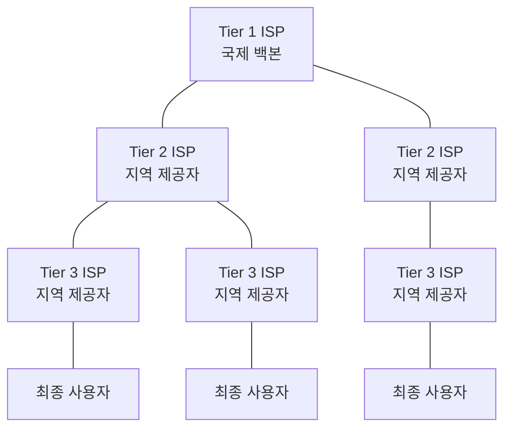
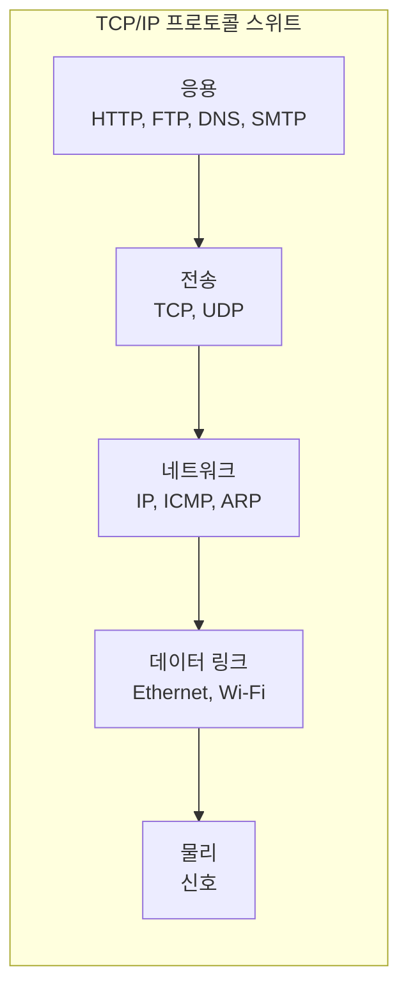
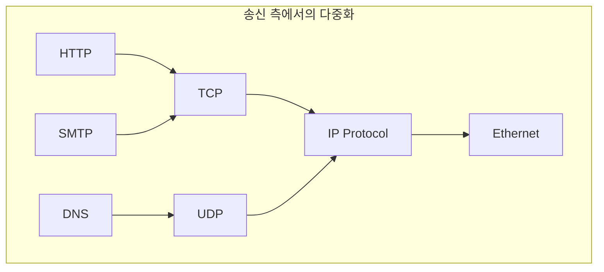

# Chapter 01-02 — 인터넷과 네트워크 모델 개론

> **최종 수정일:** 2026-04-01
>
> Forouzan, TCP/IP Protocol Suite 4th Ed. Ch 1-2

> **선수 지식**: [컴퓨터네트워크] 네트워크 사전 지식 불필요.
>
> **학습 목표**:
> 1. OSI 및 TCP/IP 네트워크 계층 모델을 설명할 수 있다
> 2. 크기별로 네트워크를 분류할 수 있다(LAN, MAN, WAN)
> 3. 프로토콜 계층화와 캡슐화 개념을 설명할 수 있다

---

## 목차

- [1. 인터넷 개론](#1-인터넷-개론)
  - [1.1 오늘날의 인터넷](#11-오늘날의-인터넷)
  - [1.2 인터넷 서비스 제공자 (ISP)](#12-인터넷-서비스-제공자-isp)
  - [1.3 프로토콜과 표준](#13-프로토콜과-표준)
- [2. 네트워크 모델](#2-네트워크-모델)
  - [2.1 OSI 모델](#21-osi-모델)
  - [2.2 TCP/IP 프로토콜 스위트](#22-tcpip-프로토콜-스위트)
  - [2.3 OSI와 TCP/IP 비교](#23-osi와-tcpip-비교)
  - [2.4 TCP/IP에서의 주소 지정](#24-tcpip에서의-주소-지정)
- [3. 캡슐화와 역캡슐화](#3-캡슐화와-역캡슐화)
- [4. 다중화와 역다중화](#4-다중화와-역다중화)
- [요약](#요약)
- [부록](#부록)

---

<br>

## 1. 인터넷 개론

### 1.1 오늘날의 인터넷

인터넷은 전 세계 수십억 대의 컴퓨팅 장치를 상호 연결하는 구조화된 통신 네트워크이다. 인터넷은 단일 네트워크가 아니라 표준화된 프로토콜을 통해 근거리 통신망(LAN), 광역 통신망(WAN), 도시권 통신망(MAN)을 연결하는 **네트워크의 네트워크** 이다.

인터넷의 주요 특징:
- **패킷 교환(Packet-switched)**: 데이터를 패킷으로 분할하여 독립적으로 라우팅
- **분산형(Decentralized)**: 단일 제어 지점이 없음
- **확장성(Scalable)**: 근본적인 재설계 없이 성장할 수 있도록 설계됨
- **이질적(Heterogeneous)**: 다양한 하드웨어 및 소프트웨어 플랫폼을 지원

> **핵심 개념:** 인터넷은 근본적으로 TCP/IP 프로토콜 스위트를 공통 언어로 사용하는 패킷 교환 네트워크이다.

### 1.2 인터넷 서비스 제공자 (ISP)

인터넷은 계층적 ISP 구조를 통해 운영된다:



| ISP 계층 | 범위 | 예시 |
|----------|------|------|
| Tier 1 | 국제 백본 | AT&T, NTT |
| Tier 2 | 지역/국가 | 지역 통신사 |
| Tier 3 | 지역 접속 | 지역 ISP |

- **피어링(Peering)**: Tier 1 ISP 간에 비용 정산 없이 트래픽을 교환 (무정산 피어링)
- **트랜짓(Transit)**: 하위 계층 ISP가 상위 계층 ISP에 비용을 지불하고 더 넓은 인터넷에 접속
- **IXP (Internet Exchange Point)**: ISP 간에 트래픽을 교환하는 물리적 인프라

### 1.3 프로토콜과 표준

**프로토콜** 은 엔티티 간의 통신을 지배하는 규칙을 정의한다. 프로토콜은 다음을 정의한다:
- **구문(Syntax)**: 데이터의 구조 또는 형식 (필드 크기, 순서)
- **의미(Semantics)**: 각 비트 섹션의 의미
- **타이밍(Timing)**: 데이터를 전송하는 시점과 속도

**표준화 기관:**
- **IETF (Internet Engineering Task Force)**: RFC를 통해 인터넷 표준 개발
- **IEEE (Institute of Electrical and Electronics Engineers)**: LAN/MAN 표준 (802.x)
- **ISO (International Organization for Standardization)**: OSI 참조 모델
- **ITU-T**: 통신 표준

> **핵심 개념:** 표준은 서로 다른 벤더와 시스템 간의 상호운용성을 보장한다. RFC (Request for Comments) 프로세스는 인터넷 표준이 제안, 논의, 채택되는 과정이다.

---

<br>

## 2. 네트워크 모델

### 2.1 OSI 모델

**개방형 시스템 상호 연결(Open Systems Interconnection, OSI)** 모델은 7개 계층으로 구성된 개념적 프레임워크이다:

```
+-------------------+
| 7. 응용 계층       |  -- 네트워크 프로세스와 응용 프로그램
+-------------------+
| 6. 표현 계층       |  -- 데이터 표현 및 암호화
+-------------------+
| 5. 세션 계층       |  -- 호스트 간 통신 관리
+-------------------+
| 4. 전송 계층       |  -- 종단 간 연결 및 신뢰성
+-------------------+
| 3. 네트워크 계층    |  -- 경로 결정 및 논리적 주소 지정
+-------------------+
| 2. 데이터 링크 계층  |  -- 물리적 주소 지정 및 매체 접근
+-------------------+
| 1. 물리 계층       |  -- 매체, 신호 및 이진 전송
+-------------------+
```

각 계층은 특정 역할을 담당한다:

| 계층 | 단위 | 기능 |
|------|------|------|
| 응용(Application) | 데이터/메시지 | 사용자 인터페이스, 파일 전송, 이메일 |
| 표현(Presentation) | 데이터 | 암호화, 압축, 변환 |
| 세션(Session) | 데이터 | 대화 제어, 동기화 |
| 전송(Transport) | 세그먼트 | 신뢰성 있는 전달, 흐름 제어 |
| 네트워크(Network) | 패킷/데이터그램 | 논리적 주소 지정, 라우팅 |
| 데이터 링크(Data Link) | 프레임 | 물리적 주소 지정, 오류 검출 |
| 물리(Physical) | 비트 | 전기적/광학적 신호 전송 |

### 2.2 TCP/IP 프로토콜 스위트

**TCP/IP 모델** 은 인터넷에서 사용되는 실용적인 프로토콜 스위트이다. 5개 계층으로 구성된다 (물리 계층과 데이터 링크 계층을 합쳐 4개 계층으로 표현하기도 한다):

```
+-------------------+  응용 계층
| HTTP, FTP, SMTP,  |  (OSI 5-7계층 통합)
| DNS, DHCP, SNMP   |
+-------------------+
| TCP, UDP, SCTP    |  전송 계층
+-------------------+
| IP, ICMP, IGMP,   |  네트워크 계층
| ARP               |
+-------------------+
| Ethernet, Wi-Fi,  |  데이터 링크 계층
| PPP               |
+-------------------+
| 케이블, 신호       |  물리 계층
+-------------------+
```



### 2.3 OSI와 TCP/IP 비교

| 관점 | OSI 모델 | TCP/IP 모델 |
|------|----------|-------------|
| 계층 수 | 7개 계층 | 5개 계층 (또는 4개) |
| 개발 | ISO 표준 | DARPA/IETF |
| 접근 방식 | 이론 우선, 구현 후 | 구현 우선, 모델 후 |
| 세션/표현 계층 | 별도 계층 | 응용 계층에 통합 |
| 사용 | 참조/교육용 | 실제 인터넷 프로토콜 |
| 프로토콜 독립성 | 모델 독립적 | 특정 프로토콜에 종속 |

> **핵심 개념:** OSI 모델은 주로 개념적 교육 도구인 반면, TCP/IP 모델은 인터넷의 실제 프로토콜 아키텍처를 반영한다.

### 2.4 TCP/IP에서의 주소 지정

TCP/IP 프로토콜 스위트는 4단계의 주소 지정 방식을 사용한다:

```
+--------------------------------------------------+
| 응용 계층       -->  이름 (예: www.ku.ac.kr)        |
+--------------------------------------------------+
| 전송 계층       -->  포트 번호 (예: 80)              |
+--------------------------------------------------+
| 네트워크 계층    -->  논리적/IP 주소                  |
|                      (예: 192.168.1.1)             |
+--------------------------------------------------+
| 데이터 링크 계층  -->  물리적/MAC 주소               |
|                      (예: AA:BB:CC:DD:EE:FF)       |
+--------------------------------------------------+
```

| 주소 유형 | 계층 | 크기 | 범위 |
|-----------|------|------|------|
| 물리적(MAC) 주소 | 데이터 링크 | 48비트 (6바이트) | 로컬 링크 |
| 논리적(IP) 주소 | 네트워크 | 32비트 (IPv4) | 전역 |
| 포트 번호 | 전송 | 16비트 | 로컬 호스트 |
| 응용 이름 | 응용 | 가변 | 전역 (DNS) |

---

<br>

## 3. 캡슐화와 역캡슐화

**캡슐화(Encapsulation)** 는 데이터가 프로토콜 스택을 아래로 이동할 때 각 계층에서 프로토콜 정보(헤더/트레일러)를 추가하는 과정이다.

```
응용 계층:       [        데이터        ]
                         |
전송 계층:       [ H_t |    데이터      ]     --> 세그먼트 (TCP) / 데이터그램 (UDP)
                         |
네트워크 계층:    [ H_n | H_t | 데이터   ]     --> 패킷 / 데이터그램
                         |
데이터 링크 계층: [ H_d | H_n | H_t | 데이터 | T_d ]  --> 프레임
                         |
물리 계층:       101010011101...             --> 비트
```

**역캡슐화(Decapsulation)** 는 수신 측에서 각 계층이 자신의 헤더를 제거하고 나머지 데이터를 상위 계층으로 전달하는 역과정이다.

> **핵심 개념:** 캡슐화는 모듈성을 제공한다 — 각 계층은 자신의 헤더 형식만 이해하면 되므로, 각 계층의 프로토콜이 독립적으로 발전할 수 있다.

---

<br>

## 4. 다중화와 역다중화

**다중화(Multiplexing)** 는 여러 상위 계층 프로토콜이 하나의 하위 계층 프로토콜을 공유할 수 있게 한다. **역다중화(Demultiplexing)** 는 수신 측에서의 역과정이다.



각 계층 헤더의 프로토콜 필드(또는 타입 필드)는 어떤 상위 계층 프로토콜이 데이터를 수신해야 하는지 식별한다:
- **Ethernet 프레임**: 타입 필드 (0x0800 = IPv4, 0x0806 = ARP)
- **IP 데이터그램**: 프로토콜 필드 (6 = TCP, 17 = UDP, 1 = ICMP)
- **TCP/UDP**: 포트 번호 (80 = HTTP, 25 = SMTP, 53 = DNS)

---

<br>

## 요약

| 개념 | 핵심 포인트 |
|------|------------|
| 인터넷 | TCP/IP를 사용하는 네트워크의 네트워크, 패킷 교환 및 분산형 |
| ISP 계층 구조 | Tier 1 (백본), Tier 2 (지역), Tier 3 (지역 접속) |
| 프로토콜 | 통신을 지배하는 규칙: 구문, 의미, 타이밍 |
| OSI 모델 | 7계층 개념적 참조 모델 |
| TCP/IP 모델 | 인터넷에서 사용되는 5계층 실용 모델 |
| 캡슐화 | 데이터가 하향 이동할 때 각 계층에서 헤더 추가 |
| 주소 지정 | MAC (링크), IP (네트워크), 포트 (전송), 이름 (응용) |
| 다중화 | 여러 프로토콜이 공통 하위 계층을 공유 |

---

<br>

## 부록

### A. RFC 프로세스

인터넷 표준 프로세스는 다음과 같은 성숙도 수준을 따른다:
1. **Internet Draft** — 작업 진행 중, 공식적인 지위 없음
2. **Proposed Standard** — 안정적이고 충분히 검토된 명세
3. **Internet Standard** — 상당한 구현 경험을 갖춘 성숙한 명세

### B. 잘 알려진 포트 번호

| 포트 | 프로토콜 | 서비스 |
|------|----------|--------|
| 20/21 | TCP | FTP (데이터/제어) |
| 22 | TCP | SSH |
| 23 | TCP | Telnet |
| 25 | TCP | SMTP |
| 53 | TCP/UDP | DNS |
| 67/68 | UDP | DHCP |
| 80 | TCP | HTTP |
| 110 | TCP | POP3 |
| 143 | TCP | IMAP |
| 443 | TCP | HTTPS |

### C. 실전 예시: 웹 페이지 요청

브라우저에 `http://www.example.com`을 입력하면:
1. **DNS 해석**: 응용 계층에서 도메인 이름을 IP 주소로 변환
2. **TCP 연결**: 전송 계층에서 3-way 핸드셰이크를 통해 연결 설정
3. **HTTP 요청**: 응용 계층에서 GET 요청 전송
4. **IP 라우팅**: 네트워크 계층에서 홉 단위로 패킷을 라우팅
5. **프레임 전달**: 데이터 링크 계층에서 각 링크에서 프레임을 전달
6. **응답**: 서버가 요청을 처리하고 역경로를 통해 웹 페이지를 반환
