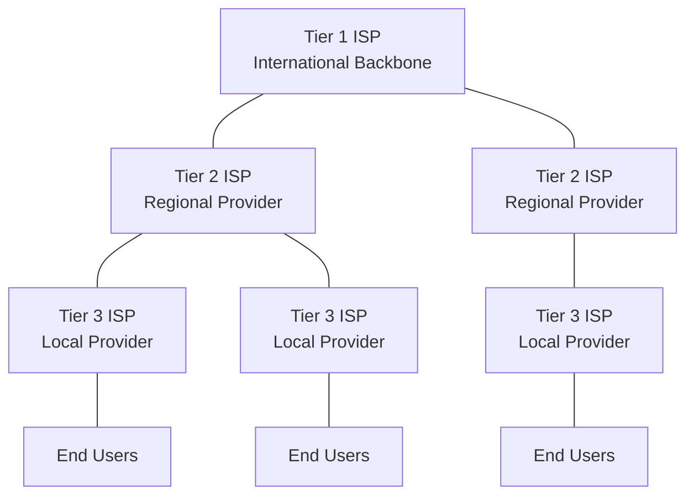
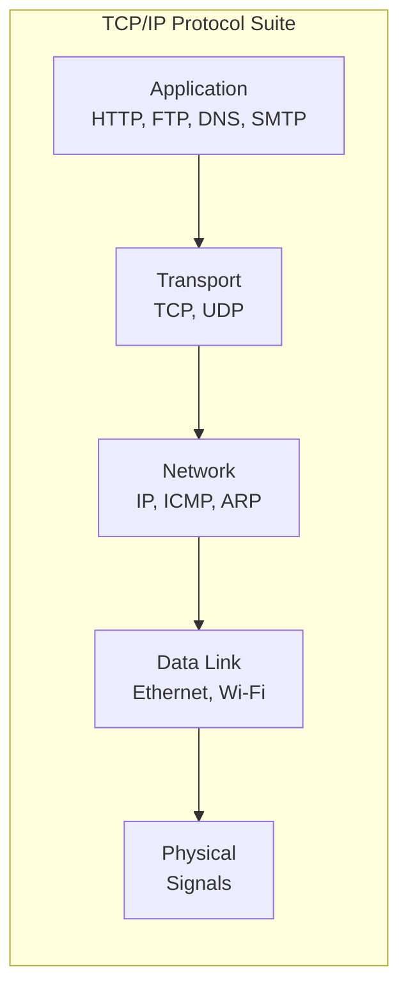
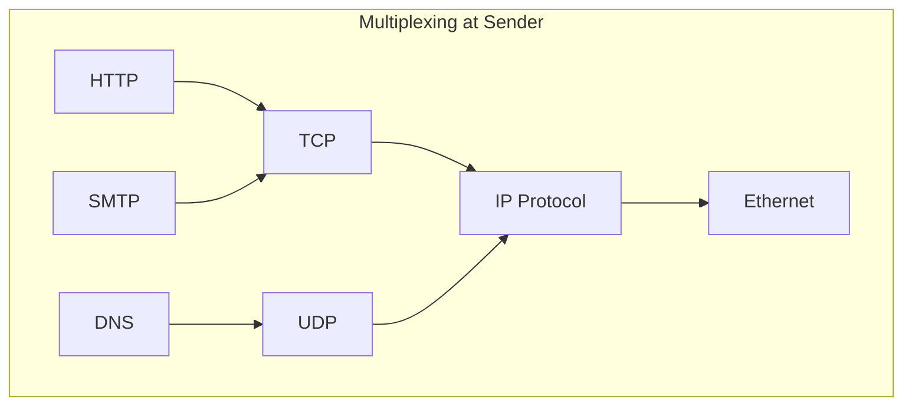

# Chapter 01-02 -- Introduction to the Internet and Network Models

> **Last Updated:** 2026-03-21

---

## Table of Contents

- [1. Introduction to the Internet](#1-introduction-to-the-internet)
  - [1.1 The Internet Today](#11-the-internet-today)
  - [1.2 Internet Service Providers (ISPs)](#12-internet-service-providers-isps)
  - [1.3 Protocol and Standards](#13-protocol-and-standards)
- [2. Network Models](#2-network-models)
  - [2.1 The OSI Model](#21-the-osi-model)
  - [2.2 The TCP/IP Protocol Suite](#22-the-tcpip-protocol-suite)
  - [2.3 Comparison of OSI and TCP/IP](#23-comparison-of-osi-and-tcpip)
  - [2.4 Addressing in TCP/IP](#24-addressing-in-tcpip)
- [3. Encapsulation and Decapsulation](#3-encapsulation-and-decapsulation)
- [4. Multiplexing and Demultiplexing](#4-multiplexing-and-demultiplexing)
- [Summary](#summary)
- [Appendix](#appendix)

---

## 1. Introduction to the Internet

### 1.1 The Internet Today

The Internet is a structured communication network that interconnects billions of computing devices worldwide. It is not a single network but a **network of networks**, connecting local area networks (LANs), wide area networks (WANs), and metropolitan area networks (MANs) through standardized protocols.

Key characteristics of the Internet:
- **Packet-switched**: Data is divided into packets and independently routed
- **Decentralized**: No single point of control
- **Scalable**: Designed to grow without fundamental redesign
- **Heterogeneous**: Supports diverse hardware and software platforms

> **Key Point:** The Internet is fundamentally a packet-switched network using the TCP/IP protocol suite as its common language.

### 1.2 Internet Service Providers (ISPs)

The Internet operates through a hierarchical structure of ISPs:



| ISP Tier | Coverage | Example |
|----------|----------|---------|
| Tier 1 | International backbone | AT&T, NTT |
| Tier 2 | Regional/National | Regional carriers |
| Tier 3 | Local access | Local ISPs |

- **Peering**: Tier 1 ISPs exchange traffic without payment (settlement-free peering)
- **Transit**: Lower-tier ISPs pay higher-tier ISPs for access to the broader Internet
- **IXP (Internet Exchange Point)**: Physical infrastructure where ISPs exchange traffic

### 1.3 Protocol and Standards

A **protocol** defines the rules governing communication between entities. Protocols define:
- **Syntax**: The structure or format of data (field sizes, ordering)
- **Semantics**: The meaning of each section of bits
- **Timing**: When data should be sent and how fast

**Standards Organizations:**
- **IETF (Internet Engineering Task Force)**: Develops Internet standards through RFCs
- **IEEE (Institute of Electrical and Electronics Engineers)**: LAN/MAN standards (802.x)
- **ISO (International Organization for Standardization)**: OSI reference model
- **ITU-T**: Telecommunications standards

> **Key Point:** Standards ensure interoperability between different vendors and systems. The RFC (Request for Comments) process is how Internet standards are proposed, discussed, and adopted.

---

## 2. Network Models

### 2.1 The OSI Model

The **Open Systems Interconnection (OSI)** model is a conceptual framework with seven layers:

```
+-------------------+
| 7. Application    |  -- Network process to application
+-------------------+
| 6. Presentation   |  -- Data representation and encryption
+-------------------+
| 5. Session        |  -- Interhost communication management
+-------------------+
| 4. Transport      |  -- End-to-end connections and reliability
+-------------------+
| 3. Network        |  -- Path determination and logical addressing
+-------------------+
| 2. Data Link      |  -- Physical addressing and media access
+-------------------+
| 1. Physical       |  -- Media, signal, and binary transmission
+-------------------+
```

Each layer has a specific responsibility:

| Layer | Unit | Function |
|-------|------|----------|
| Application | Data/Message | User interface, file transfer, email |
| Presentation | Data | Encryption, compression, translation |
| Session | Data | Dialog control, synchronization |
| Transport | Segment | Reliable delivery, flow control |
| Network | Packet/Datagram | Logical addressing, routing |
| Data Link | Frame | Physical addressing, error detection |
| Physical | Bit | Electrical/optical signal transmission |

### 2.2 The TCP/IP Protocol Suite

The **TCP/IP model** is the practical protocol suite used by the Internet. It has five layers (sometimes presented as four by combining physical and data link):

```
+-------------------+  Application Layer
| HTTP, FTP, SMTP,  |  (OSI layers 5-7 combined)
| DNS, DHCP, SNMP   |
+-------------------+
| TCP, UDP, SCTP    |  Transport Layer
+-------------------+
| IP, ICMP, IGMP,   |  Network Layer
| ARP               |
+-------------------+
| Ethernet, Wi-Fi,  |  Data Link Layer
| PPP               |
+-------------------+
| Cables, Signals   |  Physical Layer
+-------------------+
```



### 2.3 Comparison of OSI and TCP/IP

| Aspect | OSI Model | TCP/IP Model |
|--------|-----------|-------------|
| Layers | 7 layers | 5 layers (or 4) |
| Development | ISO standard | DARPA/IETF |
| Approach | Theory first, then implementation | Implementation first, then model |
| Session/Presentation | Separate layers | Merged into Application |
| Usage | Reference/teaching | Actual Internet protocol |
| Protocol independence | Model-independent | Tied to specific protocols |

> **Key Point:** The OSI model is primarily a conceptual teaching tool, while the TCP/IP model reflects the actual protocol architecture of the Internet.

### 2.4 Addressing in TCP/IP

The TCP/IP protocol suite uses four levels of addressing:

```
+--------------------------------------------------+
| Application Layer  -->  Names (e.g., www.ku.ac.kr)|
+--------------------------------------------------+
| Transport Layer    -->  Port Numbers (e.g., 80)   |
+--------------------------------------------------+
| Network Layer      -->  Logical/IP Addresses      |
|                        (e.g., 192.168.1.1)        |
+--------------------------------------------------+
| Data Link Layer    -->  Physical/MAC Addresses    |
|                        (e.g., AA:BB:CC:DD:EE:FF)  |
+--------------------------------------------------+
```

| Address Type | Layer | Size | Scope |
|-------------|-------|------|-------|
| Physical (MAC) | Data Link | 48 bits (6 bytes) | Local link |
| Logical (IP) | Network | 32 bits (IPv4) | Global |
| Port Number | Transport | 16 bits | Local host |
| Application Name | Application | Variable | Global (DNS) |

---

## 3. Encapsulation and Decapsulation

**Encapsulation** is the process of adding protocol information (headers/trailers) at each layer as data moves down the protocol stack.

```
Application:    [        Data        ]
                         |
Transport:      [ H_t |    Data      ]     --> Segment (TCP) / Datagram (UDP)
                         |
Network:        [ H_n | H_t | Data   ]     --> Packet / Datagram
                         |
Data Link:      [ H_d | H_n | H_t | Data | T_d ]  --> Frame
                         |
Physical:       101010011101...             --> Bits
```

**Decapsulation** is the reverse process at the receiving end, where each layer strips its header and passes the remaining data upward.

> **Key Point:** Encapsulation provides modularity -- each layer only needs to understand its own header format, enabling independent evolution of protocols at each layer.

---

## 4. Multiplexing and Demultiplexing

**Multiplexing** allows multiple higher-layer protocols to share a single lower-layer protocol. **Demultiplexing** is the reverse process at the receiver.



The protocol field (or type field) in each layer's header identifies which upper-layer protocol should receive the data:
- **Ethernet frame**: Type field (0x0800 = IPv4, 0x0806 = ARP)
- **IP datagram**: Protocol field (6 = TCP, 17 = UDP, 1 = ICMP)
- **TCP/UDP**: Port number (80 = HTTP, 25 = SMTP, 53 = DNS)

---

## Summary

| Concept | Key Point |
|---------|-----------|
| Internet | A network of networks using TCP/IP, packet-switched and decentralized |
| ISP Hierarchy | Tier 1 (backbone), Tier 2 (regional), Tier 3 (local access) |
| Protocol | Rules governing communication: syntax, semantics, timing |
| OSI Model | 7-layer conceptual reference model |
| TCP/IP Model | 5-layer practical model used by the Internet |
| Encapsulation | Adding headers at each layer as data flows downward |
| Addressing | MAC (link), IP (network), Port (transport), Name (application) |
| Multiplexing | Multiple protocols sharing a common lower layer |

---

## Appendix

### A. RFC Process

The Internet standards process follows these maturity levels:
1. **Internet Draft** -- Work in progress, no official status
2. **Proposed Standard** -- Stable, well-reviewed specification
3. **Internet Standard** -- Mature specification with significant implementation experience

### B. Well-Known Port Numbers

| Port | Protocol | Service |
|------|----------|---------|
| 20/21 | TCP | FTP (data/control) |
| 22 | TCP | SSH |
| 23 | TCP | Telnet |
| 25 | TCP | SMTP |
| 53 | TCP/UDP | DNS |
| 67/68 | UDP | DHCP |
| 80 | TCP | HTTP |
| 110 | TCP | POP3 |
| 143 | TCP | IMAP |
| 443 | TCP | HTTPS |

### C. Real-World Example: Web Page Request

When you type `http://www.example.com` in a browser:
1. **DNS resolution**: Application layer resolves domain name to IP address
2. **TCP connection**: Transport layer establishes a three-way handshake
3. **HTTP request**: Application layer sends GET request
4. **IP routing**: Network layer routes packets hop-by-hop
5. **Frame delivery**: Data link layer delivers frames on each link
6. **Response**: Server processes and returns the web page through the reverse path
