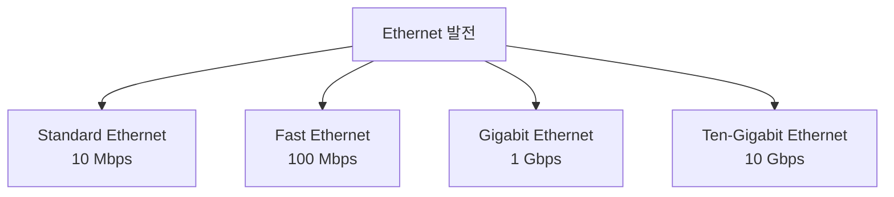
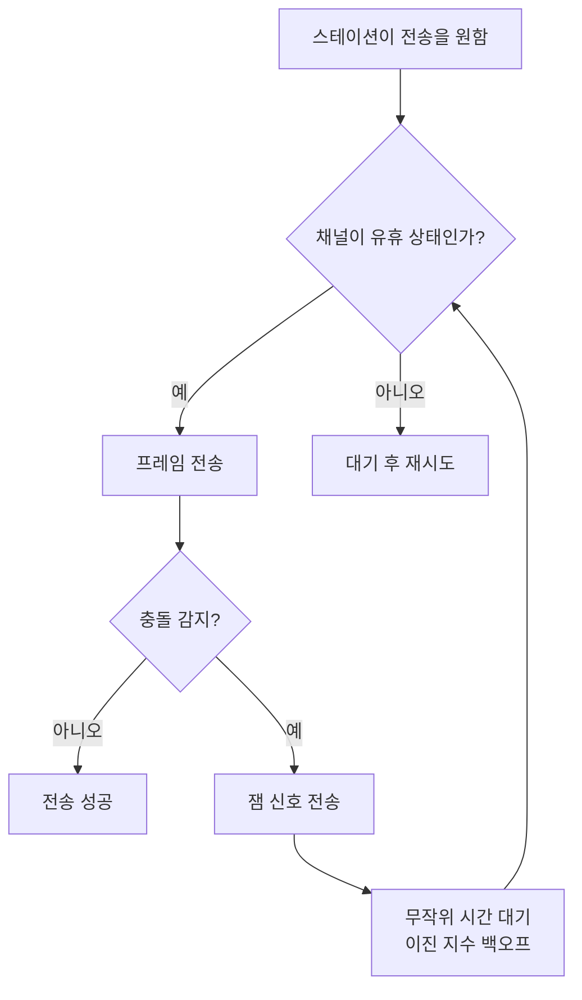

# Chapter 03 — 기반 기술

> **최종 수정일:** 2026-04-01
>
> Forouzan, TCP/IP Protocol Suite 4th Ed. Ch 3

> **선수 지식**: [컴퓨터네트워크] 네트워크 모델과 계층화 (제1-2장).
>
> **학습 목표**:
> 1. 이더넷과 Wi-Fi를 포함한 LAN 기술을 설명할 수 있다
> 2. MAC 주소 체계와 프레임 포맷을 설명할 수 있다
> 3. 연결 지향과 비연결 서비스를 비교할 수 있다

---

## 목차

- [1. 근거리 통신망 (LAN)](#1-근거리-통신망-lan)
  - [1.1 LAN에 대한 IEEE 표준](#11-lan에-대한-ieee-표준)
  - [1.2 Ethernet 프레임 형식](#12-ethernet-프레임-형식)
  - [1.3 Ethernet 주소 지정](#13-ethernet-주소-지정)
  - [1.4 Ethernet의 발전](#14-ethernet의-발전)
- [2. CSMA/CD 접근 방법](#2-csmacd-접근-방법)
  - [2.1 충돌 감지 메커니즘](#21-충돌-감지-메커니즘)
  - [2.2 최소 프레임 크기](#22-최소-프레임-크기)
- [3. 브리지 및 스위치 Ethernet](#3-브리지-및-스위치-ethernet)
  - [3.1 브리지](#31-브리지)
  - [3.2 스위치](#32-스위치)
  - [3.3 VLAN](#33-vlan)
- [4. 무선 LAN](#4-무선-lan)
  - [4.1 IEEE 802.11 (Wi-Fi)](#41-ieee-80211-wi-fi)
  - [4.2 Bluetooth](#42-bluetooth)
- [5. 광역 통신망 (WAN)](#5-광역-통신망-wan)
  - [5.1 점대점 WAN](#51-점대점-wan)
  - [5.2 교환 WAN](#52-교환-wan)
- [6. 연결 장치](#6-연결-장치)
- [요약](#요약)
- [부록](#부록)

---

<br>

## 1. 근거리 통신망 (LAN)

**근거리 통신망(LAN)**은 건물이나 캠퍼스와 같이 제한된 지리적 영역을 위해 설계된 컴퓨터 네트워크이다. LAN은 조직 내 자원 공유를 위한 독립 네트워크로 사용될 수 있지만, 오늘날 대부분의 LAN은 광역 통신망(WAN)이나 인터넷에 연결되어 있다.

### 1.1 LAN에 대한 IEEE 표준

IEEE는 데이터 링크 계층을 두 개의 부계층으로 분할하여 LAN 표준을 정의하였다:

```
+------------------------------+
|         LLC (Logical          |
|       Link Control)           |  -- 모든 LAN 유형에 공통
+-----+--------+--------+------+
| Eth | Token  | Token  | ...  |  -- MAC 부계층
| MAC | Ring   | Bus    |      |     (매체별 특화)
+-----+--------+--------+------+
| Eth | Token  | Token  | ...  |  -- 물리 계층
| PHY | Ring   | Bus    |      |     (매체별 특화)
+-----+--------+--------+------+
```

- **LLC (Logical Link Control)**: 네트워크 계층에 대한 공통 인터페이스로, 흐름 제어와 오류 제어를 담당
- **MAC (Media Access Control)**: LAN 프로토콜에 특화된 부계층으로, 매체 접근과 주소 지정을 담당

> **핵심 개념:** IEEE 802 프로젝트는 데이터 링크 계층을 LLC와 MAC 부계층으로 분리하여, 서로 다른 물리/MAC 구현이 공통 LLC 인터페이스를 공유할 수 있도록 한다.

### 1.2 Ethernet 프레임 형식

Ethernet 프레임(IEEE 802.3)은 다음과 같은 구조를 가진다:

```
+----------+-----+-------------+-------------+--------+---------------+-----+
| Preamble | SFD | Destination | Source      | Length | Data and      | CRC |
|          |     | Address     | Address     | /Type  | Padding       |     |
+----------+-----+-------------+-------------+--------+---------------+-----+
  7 bytes  1 byte   6 bytes      6 bytes     2 bytes  46-1500 bytes  4 bytes
  |________|
  물리 계층
  헤더
```

| 필드 | 크기 | 설명 |
|------|------|------|
| Preamble | 7바이트 | 동기화를 위한 1과 0의 교대 패턴 56비트 |
| SFD (Start Frame Delimiter) | 1바이트 | 프레임 시작을 알리는 플래그 패턴 `10101011` |
| 목적지 주소 | 6바이트 | 다음 홉의 MAC 주소 |
| 출발지 주소 | 6바이트 | 송신자의 MAC 주소 |
| 길이/유형 | 2바이트 | 프레임 길이 또는 상위 계층 프로토콜 유형 |
| 데이터 및 패딩 | 46--1500바이트 | 상위 계층 데이터 (46바이트 미만이면 패딩) |
| CRC | 4바이트 | 오류 검출을 위한 순환 중복 검사 |

**프레임 크기 제약:**
- 최소 페이로드: **46바이트** (필요시 패딩)
- 최대 페이로드: **1500바이트** (최대 전송 단위, MTU)
- 최소 프레임: **64바이트** (512비트)
- 최대 프레임: **1518바이트** (12,144비트)

### 1.3 Ethernet 주소 지정

각 Ethernet 인터페이스는 고유한 **48비트(6바이트) MAC 주소**를 가지며, 일반적으로 16진수 표기법으로 표현된다:

```
d1d2 : d3d4 : d5d6 : d7d8 : d9d10 : d11d12

예: A4:6E:F4:59:83:AB
```

- 6바이트 = 16진수 12자리 = 48비트
- 주소는 제조사에 의해 NIC의 ROM에 기록됨
- **유니캐스트(Unicast)**: 단일 목적지 (첫 번째 비트 = 0)
- **멀티캐스트(Multicast)**: 목적지 그룹 (첫 번째 비트 = 1)
- **브로드캐스트(Broadcast)**: 모든 스테이션 (`FF:FF:FF:FF:FF:FF`)

### 1.4 Ethernet의 발전

Ethernet은 네 세대를 거쳐 발전하였다:



| 세대 | 속도 | 매체 | 표준 |
|------|------|------|------|
| Standard Ethernet | 10 Mbps | 동축 케이블, 트위스티드 페어 | IEEE 802.3 |
| Fast Ethernet | 100 Mbps | 트위스티드 페어, 광섬유 | IEEE 802.3u |
| Gigabit Ethernet | 1 Gbps | 트위스티드 페어, 광섬유 | IEEE 802.3z/ab |
| Ten-Gigabit Ethernet | 10 Gbps | 광섬유, 트위스티드 페어 | IEEE 802.3ae |

---

<br>

## 2. CSMA/CD 접근 방법

**반송파 감지 다중 접속/충돌 감지(Carrier Sense Multiple Access with Collision Detection, CSMA/CD)**는 Standard Ethernet에서 사용되는 접근 방법이다. 원칙은 **"전송 전에 들어라(listen before talk)"**이다.

### 2.1 충돌 감지 메커니즘

CSMA/CD 과정:



1. 스테이션은 전송 전에 채널을 감지한다
2. 유휴 상태이면 전송을 시작한다
3. 전송 중에 충돌을 감시한다
4. 충돌이 감지되면 **잼 신호(jam signal)**를 보내고 전송을 중단한다
5. 스테이션은 **이진 지수 백오프(binary exponential backoff)**를 사용하여 무작위 시간 대기 후 재시도한다

**이진 지수 백오프**: k번째 충돌 후 (k <= 10), 스테이션은 {0, 1, ..., 2^k - 1}에서 무작위 수 R을 선택하고 R x 슬롯 시간만큼 대기 후 재시도한다.

### 2.2 최소 프레임 크기

CSMA/CD가 올바르게 동작하려면, 프레임 전송 시간이 최소한 **최대 전파 시간의 2배** 이상이어야 한다:

```
T_frame >= 2 x T_propagation
```

> **핵심 개념:** 최소 프레임 길이를 전송 속도로 나눈 값은 충돌 도메인을 전파 속도로 나눈 값에 비례해야 한다.

**예시:** 최대 전파 시간 T_p = 25.6 us인 Standard Ethernet의 경우:
- T_frame = 2 x T_p = 51.2 us
- 최소 프레임 크기 = 10 Mbps x 51.2 us = **512비트 = 64바이트**

이것이 Ethernet 최소 프레임 크기가 64바이트인 이유이다.

---

<br>

## 3. 브리지 및 스위치 Ethernet

### 3.1 브리지

**브리지(bridge)**는 데이터 링크 계층에서 동작하며 두 개 이상의 LAN 세그먼트를 연결한다:
- MAC 주소를 사용하여 트래픽을 필터링
- MAC 주소를 포트에 매핑하는 **포워딩 테이블**을 유지
- **자가 학습 알고리즘(self-learning algorithm)**을 통해 주소를 학습
- 충돌 도메인을 축소

### 3.2 스위치

**스위치(switch)**는 본질적으로 포트당 전용 대역폭을 가진 다중 포트 브리지이다:
- 각 포트가 별도의 충돌 도메인
- **전이중(full-duplex)** 통신을 지원 (충돌 없음)
- **저장 후 전달(store-and-forward)** 또는 **컷스루(cut-through)** 스위칭 사용
- MAC 주소 테이블을 유지

| 특성 | 허브 | 브리지 | 스위치 |
|------|------|--------|--------|
| 계층 | 물리 | 데이터 링크 | 데이터 링크 |
| 충돌 도메인 | 단일 | 포트별 분리 | 포트별 분리 |
| 대역폭 | 공유 | 세그먼트별 공유 | 포트별 전용 |
| 포워딩 | 모두 브로드캐스트 | 선택적 | 선택적 |

### 3.3 VLAN

**가상 LAN(Virtual LAN, VLAN)**은 여러 물리적 스위치에 걸쳐 스테이션을 논리적으로 그룹화한 것이다:
- 물리적 배선이 아닌 소프트웨어로 구성
- 브로드캐스트 트래픽 감소
- 그룹 격리를 통한 보안 향상
- VLAN 멤버십 식별을 위해 IEEE 802.1Q 태깅 사용

---

<br>

## 4. 무선 LAN

### 4.1 IEEE 802.11 (Wi-Fi)

IEEE 802.11은 무선 Ethernet 표준을 정의한다:

| 표준 | 주파수 | 최대 속도 | 범위 |
|------|--------|-----------|------|
| 802.11a | 5 GHz | 54 Mbps | ~35 m |
| 802.11b | 2.4 GHz | 11 Mbps | ~38 m |
| 802.11g | 2.4 GHz | 54 Mbps | ~38 m |
| 802.11n | 2.4/5 GHz | 600 Mbps | ~70 m |
| 802.11ac | 5 GHz | 6.9 Gbps | ~35 m |

무선 LAN은 CSMA/CD 대신 **CSMA/CA (Collision Avoidance)**를 사용하는데, 그 이유는:
- 무선 매체에서 충돌 감지가 어려움 (숨겨진 터미널 문제)
- 스테이션이 같은 주파수에서 동시에 전송과 수신을 할 수 없음

**CSMA/CA 과정:**
1. 채널 감지
2. 유휴 상태이면 DIFS (Distributed Inter-Frame Space) 대기
3. RTS (Request to Send) 전송
4. CTS (Clear to Send) 수신
5. 프레임 전송
6. ACK 수신

### 4.2 Bluetooth

Bluetooth는 소규모 무선 LAN(WPAN)을 위한 무선 기술이다:
- 단거리 통신 (일반적으로 10 m 미만)
- 2.4 GHz ISM 대역 사용
- 주파수 호핑 확산 스펙트럼(FHSS) 방식
- 피코넷(최대 8대의 장치)과 스캐터넷 지원

---

<br>

## 5. 광역 통신망 (WAN)

### 5.1 점대점 WAN

점대점 WAN은 두 개의 원격 장치를 직접 연결한다:
- **전용 회선(Leased lines)**: 두 지점 간의 전용 연결
- **PPP (Point-to-Point Protocol)**: 점대점 링크를 위한 표준 프로토콜
- **HDLC (High-Level Data Link Control)**: WAN을 위한 비트 지향 프로토콜

### 5.2 교환 WAN

교환 WAN은 스위칭 장치를 통해 여러 지점을 연결한다:
- **X.25**: 초기 패킷 교환 WAN
- **Frame Relay**: 오버헤드를 줄인 간소화된 X.25
- **ATM (Asynchronous Transfer Mode)**: 고정 53바이트 셀 기반의 셀 스위칭

---

<br>

## 6. 연결 장치

프로토콜 스택의 각 계층에 위치하는 장치:

| 장치 | 계층 | 기능 |
|------|------|------|
| 리피터/허브 | 물리 | 신호 재생 및 분배 |
| 브리지/스위치 | 데이터 링크 | MAC에 의한 프레임 필터링 및 포워딩 |
| 라우터 | 네트워크 | IP 주소에 의한 패킷 포워딩 |
| 게이트웨이 | 응용 | 네트워크 간 프로토콜 변환 |


---

<br>

## 요약

| 개념 | 핵심 포인트 |
|------|------------|
| LAN | 제한된 지리적 영역을 위한 네트워크; IEEE 802 표준 |
| Ethernet 프레임 | Preamble + SFD + DA + SA + Type + Data + CRC; 64-1518바이트 |
| MAC 주소 | NIC에 부여된 48비트 고유 물리적 주소 |
| CSMA/CD | 전송 전 감지; 이진 지수 백오프를 사용한 충돌 감지 |
| 최소 프레임 | 전파 시간 내 충돌 감지를 보장하기 위한 64바이트 |
| 스위치 | 다중 포트 브리지; 전용 대역폭; 별도 충돌 도메인 |
| VLAN | 802.1Q 태깅을 통한 논리적 LAN 그룹화 |
| Wi-Fi (802.11) | CSMA/CD 대신 CSMA/CA를 사용하는 무선 LAN |
| WAN | 지리적으로 떨어진 사이트를 연결하는 광역 통신망 |

---

<br>

## 부록

### A. Ethernet 프레임 크기 계산

주어진 조건:
- 최대 전파 시간: T_p = 25.6 us
- 데이터 전송률: 10 Mbps

최소 프레임 전송 시간:
- T_frame = 2 x T_p = 2 x 25.6 = 51.2 us

최소 프레임 크기:
- Size = Rate x Time = 10 x 10^6 x 51.2 x 10^-6 = 512비트 = **64바이트**

### B. MAC 주소 할당

48비트 MAC 주소는 다음과 같이 나뉜다:
- **OUI (Organizationally Unique Identifier)**: 처음 24비트, IEEE가 제조사에 할당
- **장치 식별자(Device Identifier)**: 나머지 24비트, 제조사가 할당

### C. 실전 예시: 가정용 네트워크

일반적인 가정용 네트워크는 기반 기술 개념을 잘 보여준다:
- **Wi-Fi 라우터**: 라우터(L3), 스위치(L2), 무선 AP 기능을 결합
- **Ethernet 케이블 (Cat 5e/6)**: 100/1000 Mbps의 물리 계층 연결
- **DHCP**: 연결된 장치에 자동으로 IP 주소를 할당
- **NAT**: 여러 장치가 하나의 공인 IP 주소를 공유할 수 있게 함
