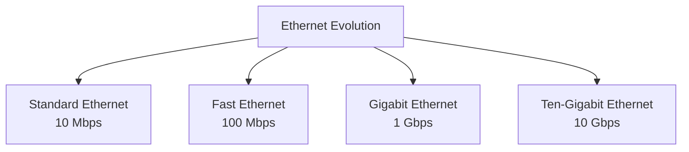
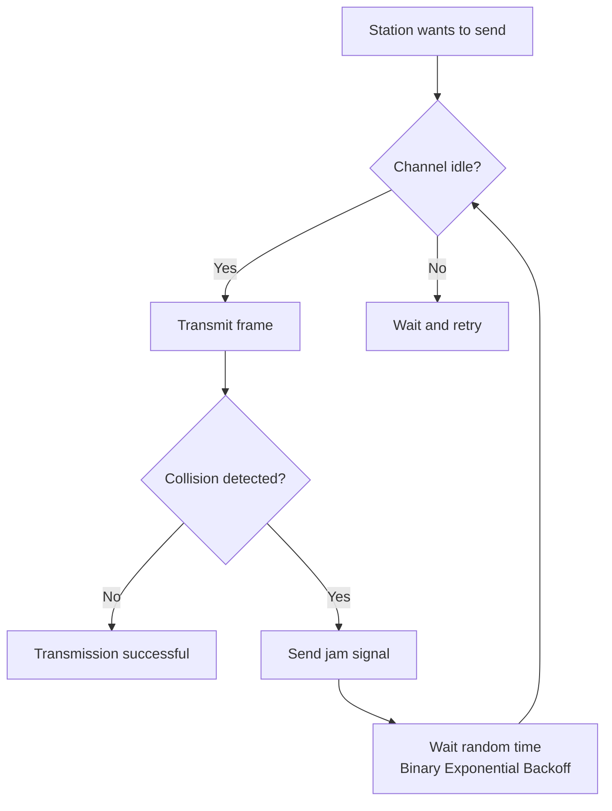
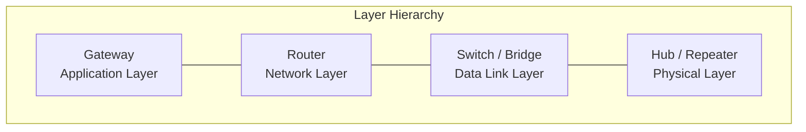

# Chapter 03 — Underlying Technology

> **Last Updated:** 2026-03-21

---

## Table of Contents

- [1. Local Area Networks (LANs)](#1-local-area-networks-lans)
  - [1.1 IEEE Standards for LANs](#11-ieee-standards-for-lans)
  - [1.2 Ethernet Frame Format](#12-ethernet-frame-format)
  - [1.3 Ethernet Addressing](#13-ethernet-addressing)
  - [1.4 Ethernet Evolution](#14-ethernet-evolution)
- [2. CSMA/CD Access Method](#2-csmacd-access-method)
  - [2.1 Collision Detection Mechanism](#21-collision-detection-mechanism)
  - [2.2 Minimum Frame Size](#22-minimum-frame-size)
- [3. Bridged and Switched Ethernet](#3-bridged-and-switched-ethernet)
  - [3.1 Bridges](#31-bridges)
  - [3.2 Switches](#32-switches)
  - [3.3 VLANs](#33-vlans)
- [4. Wireless LANs](#4-wireless-lans)
  - [4.1 IEEE 802.11 (Wi-Fi)](#41-ieee-80211-wi-fi)
  - [4.2 Bluetooth](#42-bluetooth)
- [5. Wide Area Networks (WANs)](#5-wide-area-networks-wans)
  - [5.1 Point-to-Point WANs](#51-point-to-point-wans)
  - [5.2 Switched WANs](#52-switched-wans)
- [6. Connecting Devices](#6-connecting-devices)
- [Summary](#summary)
- [Appendix](#appendix)

---

## 1. Local Area Networks (LANs)

A **local area network (LAN)** is a computer network designed for a limited geographic area, such as a building or a campus. Although a LAN can be used as an isolated network to connect computers in an organization for sharing resources, most LANs today are linked to a wide area network (WAN) or the Internet.

### 1.1 IEEE Standards for LANs

The IEEE has defined the standards for LANs, dividing the data link layer into two sublayers:

```
+------------------------------+
|         LLC (Logical          |
|       Link Control)           |  -- Common to all LAN types
+-----+--------+--------+------+
| Eth | Token  | Token  | ...  |  -- MAC sublayer
| MAC | Ring   | Bus    |      |     (media-specific)
+-----+--------+--------+------+
| Eth | Token  | Token  | ...  |  -- Physical layer
| PHY | Ring   | Bus    |      |     (media-specific)
+-----+--------+--------+------+
```

- **LLC (Logical Link Control)**: Common interface to the network layer, handles flow and error control
- **MAC (Media Access Control)**: Specific to the LAN protocol, handles media access and addressing

> **Key Point:** The IEEE 802 project separates the data link layer into LLC and MAC sublayers, allowing different physical/MAC implementations to share a common LLC interface.

### 1.2 Ethernet Frame Format

The Ethernet frame (IEEE 802.3) has the following structure:

```
+----------+-----+-------------+-------------+--------+---------------+-----+
| Preamble | SFD | Destination | Source      | Length | Data and      | CRC |
|          |     | Address     | Address     | /Type  | Padding       |     |
+----------+-----+-------------+-------------+--------+---------------+-----+
  7 bytes  1 byte   6 bytes      6 bytes     2 bytes  46-1500 bytes  4 bytes
  |________|
  Physical layer
  header
```

| Field | Size | Description |
|-------|------|-------------|
| Preamble | 7 bytes | 56 bits of alternating 1s and 0s for synchronization |
| SFD (Start Frame Delimiter) | 1 byte | Flag pattern `10101011` signaling frame start |
| Destination Address | 6 bytes | MAC address of the next hop |
| Source Address | 6 bytes | MAC address of the sender |
| Length/Type | 2 bytes | Frame length or upper-layer protocol type |
| Data and Padding | 46--1500 bytes | Upper-layer data (padded if < 46 bytes) |
| CRC | 4 bytes | Cyclic Redundancy Check for error detection |

**Frame size constraints:**
- Minimum payload: **46 bytes** (padded if necessary)
- Maximum payload: **1500 bytes** (Maximum Transmission Unit)
- Minimum frame: **64 bytes** (512 bits)
- Maximum frame: **1518 bytes** (12,144 bits)

### 1.3 Ethernet Addressing

Each Ethernet interface has a unique **48-bit (6-byte) MAC address**, typically expressed in hexadecimal notation:

```
d1d2 : d3d4 : d5d6 : d7d8 : d9d10 : d11d12

Example: A4:6E:F4:59:83:AB
```

- 6 bytes = 12 hexadecimal digits = 48 bits
- The address is burned into the NIC's ROM by the manufacturer
- **Unicast**: Single destination (first bit = 0)
- **Multicast**: Group of destinations (first bit = 1)
- **Broadcast**: All stations (`FF:FF:FF:FF:FF:FF`)

### 1.4 Ethernet Evolution

Ethernet has evolved through four generations:



| Generation | Speed | Medium | Standard |
|-----------|-------|--------|----------|
| Standard Ethernet | 10 Mbps | Coax, Twisted Pair | IEEE 802.3 |
| Fast Ethernet | 100 Mbps | Twisted Pair, Fiber | IEEE 802.3u |
| Gigabit Ethernet | 1 Gbps | Twisted Pair, Fiber | IEEE 802.3z/ab |
| Ten-Gigabit Ethernet | 10 Gbps | Fiber, Twisted Pair | IEEE 802.3ae |

---

## 2. CSMA/CD Access Method

**Carrier Sense Multiple Access with Collision Detection (CSMA/CD)** is the access method used by Standard Ethernet. The principle is **"listen before talk"**.

### 2.1 Collision Detection Mechanism

The CSMA/CD process:



1. A station senses the channel before transmitting
2. If idle, it begins transmitting
3. During transmission, it monitors for collisions
4. If a collision is detected, it sends a **jam signal** and aborts
5. The station waits a random time using **binary exponential backoff** before retrying

**Binary Exponential Backoff**: After the k-th collision (k <= 10), the station chooses a random number R from {0, 1, ..., 2^k - 1} and waits R x slot time before retrying.

### 2.2 Minimum Frame Size

For CSMA/CD to work correctly, the frame transmission time must be at least **twice the maximum propagation time**:

```
T_frame >= 2 x T_propagation
```

> **Key Point:** The minimum frame length divided by the transmission rate must be proportional to the collision domain divided by the propagation speed.

**Example:** In Standard Ethernet with maximum propagation time T_p = 25.6 us:
- T_frame = 2 x T_p = 51.2 us
- Minimum frame size = 10 Mbps x 51.2 us = **512 bits = 64 bytes**

This is why the minimum Ethernet frame size is 64 bytes.

---

## 3. Bridged and Switched Ethernet

### 3.1 Bridges

A **bridge** operates at the data link layer and connects two or more LAN segments:
- Filters traffic using MAC addresses
- Maintains a **forwarding table** mapping MAC addresses to ports
- Learns addresses through the **self-learning algorithm**
- Reduces collision domains

### 3.2 Switches

A **switch** is essentially a multi-port bridge with dedicated bandwidth per port:
- Each port is a separate collision domain
- Supports **full-duplex** communication (no collisions)
- Uses **store-and-forward** or **cut-through** switching
- Maintains a MAC address table

| Feature | Hub | Bridge | Switch |
|---------|-----|--------|--------|
| Layer | Physical | Data Link | Data Link |
| Collision Domain | Single | Separate per port | Separate per port |
| Bandwidth | Shared | Shared per segment | Dedicated per port |
| Forwarding | Broadcast all | Selective | Selective |

### 3.3 VLANs

A **Virtual LAN (VLAN)** is a logical grouping of stations that can span multiple physical switches:
- Configured by software rather than physical wiring
- Reduces broadcast traffic
- Improves security by isolating groups
- Uses IEEE 802.1Q tagging to identify VLAN membership

---

## 4. Wireless LANs

### 4.1 IEEE 802.11 (Wi-Fi)

IEEE 802.11 defines wireless Ethernet standards:

| Standard | Frequency | Max Speed | Range |
|----------|-----------|-----------|-------|
| 802.11a | 5 GHz | 54 Mbps | ~35 m |
| 802.11b | 2.4 GHz | 11 Mbps | ~38 m |
| 802.11g | 2.4 GHz | 54 Mbps | ~38 m |
| 802.11n | 2.4/5 GHz | 600 Mbps | ~70 m |
| 802.11ac | 5 GHz | 6.9 Gbps | ~35 m |

Wireless LANs use **CSMA/CA (Collision Avoidance)** instead of CSMA/CD because:
- Collision detection is difficult in wireless media (hidden terminal problem)
- A station cannot transmit and listen simultaneously on the same frequency

**CSMA/CA process:**
1. Sense the channel
2. If idle, wait DIFS (Distributed Inter-Frame Space)
3. Send RTS (Request to Send)
4. Receive CTS (Clear to Send)
5. Transmit the frame
6. Receive ACK

### 4.2 Bluetooth

Bluetooth is a wireless technology for small wireless LANs (WPANs):
- Short-range communication (typically < 10 m)
- Uses the 2.4 GHz ISM band
- Frequency hopping spread spectrum (FHSS)
- Supports piconets (up to 8 devices) and scatternets

---

## 5. Wide Area Networks (WANs)

### 5.1 Point-to-Point WANs

Point-to-point WANs connect two remote devices directly:
- **Leased lines**: Dedicated connections between two points
- **PPP (Point-to-Point Protocol)**: Standard protocol for point-to-point links
- **HDLC (High-Level Data Link Control)**: Bit-oriented protocol for WANs

### 5.2 Switched WANs

Switched WANs connect multiple points through switching devices:
- **X.25**: Early packet-switched WAN
- **Frame Relay**: Simplified X.25 with reduced overhead
- **ATM (Asynchronous Transfer Mode)**: Cell-based switching with fixed 53-byte cells

---

## 6. Connecting Devices

Devices at different layers of the protocol stack:

| Device | Layer | Function |
|--------|-------|----------|
| Repeater/Hub | Physical | Signal regeneration and distribution |
| Bridge/Switch | Data Link | Frame filtering and forwarding by MAC |
| Router | Network | Packet forwarding by IP address |
| Gateway | Application | Protocol translation between networks |



---

## Summary

| Concept | Key Point |
|---------|-----------|
| LAN | Network for limited geographic area; IEEE 802 standards |
| Ethernet Frame | Preamble + SFD + DA + SA + Type + Data + CRC; 64-1518 bytes |
| MAC Address | 48-bit unique physical address on NIC |
| CSMA/CD | Listen before talk; collision detection with binary exponential backoff |
| Minimum Frame | 64 bytes to ensure collision detection within propagation time |
| Switch | Multi-port bridge; dedicated bandwidth; separate collision domains |
| VLAN | Logical LAN grouping via 802.1Q tagging |
| Wi-Fi (802.11) | Wireless LAN using CSMA/CA instead of CSMA/CD |
| WAN | Wide area network connecting geographically distant sites |

---

## Appendix

### A. Ethernet Frame Size Calculation

Given:
- Maximum propagation time: T_p = 25.6 us
- Data rate: 10 Mbps

Minimum frame transmission time:
- T_frame = 2 x T_p = 2 x 25.6 = 51.2 us

Minimum frame size:
- Size = Rate x Time = 10 x 10^6 x 51.2 x 10^-6 = 512 bits = **64 bytes**

### B. MAC Address Assignment

The 48-bit MAC address is divided into:
- **OUI (Organizationally Unique Identifier)**: First 24 bits, assigned by IEEE to manufacturers
- **Device Identifier**: Last 24 bits, assigned by the manufacturer

### C. Real-World Example: Home Network

A typical home network illustrates underlying technology concepts:
- **Wi-Fi router**: Combines router (L3), switch (L2), and wireless AP functions
- **Ethernet cables (Cat 5e/6)**: Physical layer connections at 100/1000 Mbps
- **DHCP**: Automatically assigns IP addresses to connected devices
- **NAT**: Allows multiple devices to share a single public IP address
