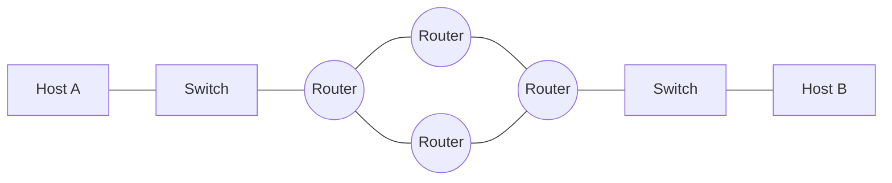
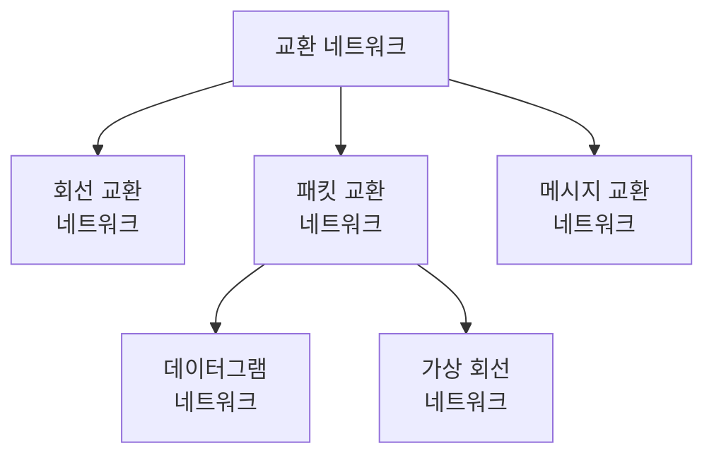
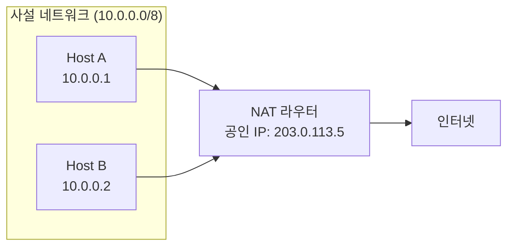

# Chapter 04 — 네트워크 계층 개론

> **최종 수정일:** 2026-04-01
>
> Forouzan, TCP/IP Protocol Suite 4th Ed. Ch 4

> **선수 지식**: [컴퓨터네트워크] 기반 기술 (제1-3장).
>
> **학습 목표**:
> 1. TCP/IP에서 네트워크 계층의 역할을 설명할 수 있다
> 2. 교환 기술(회선, 패킷)을 구분할 수 있다
> 3. 네트워크 계층 서비스 모델을 설명할 수 있다

---

## 목차

- [1. 서론](#1-서론)
  - [1.1 네트워크 계층 서비스](#11-네트워크-계층-서비스)
  - [1.2 네트워크의 결합으로서의 인터넷](#12-네트워크의-결합으로서의-인터넷)
- [2. 교환 방식](#2-교환-방식)
  - [2.1 회선 교환](#21-회선-교환)
  - [2.2 패킷 교환](#22-패킷-교환)
  - [2.3 메시지 교환](#23-메시지-교환)
  - [2.4 교환 방식 비교](#24-교환-방식-비교)
- [3. 패킷 교환의 상세](#3-패킷-교환의-상세)
  - [3.1 데이터그램 네트워크 (비연결형)](#31-데이터그램-네트워크-비연결형)
  - [3.2 가상 회선 네트워크 (연결형)](#32-가상-회선-네트워크-연결형)
- [4. 네트워크 계층 성능](#4-네트워크-계층-성능)
  - [4.1 지연](#41-지연)
  - [4.2 처리량](#42-처리량)
  - [4.3 패킷 손실](#43-패킷-손실)
- [5. NAT (네트워크 주소 변환)](#5-nat-네트워크-주소-변환)
  - [5.1 NAT 개념과 동기](#51-nat-개념과-동기)
  - [5.2 NAT 동작 방식](#52-nat-동작-방식)
  - [5.3 NAT의 유형](#53-nat의-유형)
  - [5.4 NAT의 한계](#54-nat의-한계)
- [요약](#요약)
- [부록](#부록)

---

<br>

## 1. 서론

### 1.1 네트워크 계층 서비스

개념적 수준에서 글로벌 인터넷은 전 세계 수백만(아니 수십억) 대의 컴퓨터를 연결하는 블랙박스 네트워크로 볼 수 있다. 우리는 한 컴퓨터의 응용 계층에서 보낸 메시지가 다른 컴퓨터의 응용 계층에 도달하는 것에만 관심이 있다.

```
Application  [===]                          [===]  Application
Transport    [===]                          [===]  Transport
Network      [===]                          [===]  Network
Data link    [===]      (Internet)          [===]  Data link
Physical     [===] ---- cloud of routers ---[===]  Physical
             Host A                         Host B
```

네트워크 계층은 다음을 담당한다:
- **패킷화(Packetizing)**: 전송 계층의 페이로드를 패킷으로 캡슐화
- **라우팅(Routing)**: 출발지에서 목적지까지의 최적 경로 결정
- **포워딩(Forwarding)**: 라우터의 입력에서 적절한 출력으로 패킷 이동
- **오류 제어(Error control)**: 제한된 오류 처리 (헤더 체크섬)
- **흐름 제어(Flow control)**: 제한된 혼잡 방지

### 1.2 네트워크의 결합으로서의 인터넷

인터넷은 **연결 장치(라우터)**를 통해 서로 연결된 **다수의 네트워크(또는 링크)**로 구성되어 있다. 근본적으로 LAN과 WAN의 결합체이다.



> **핵심 개념:** 각 라우터는 최소 두 개의 네트워크(링크)에 연결된다. 라우터는 목적지 IP 주소를 검사하고 패킷을 적절한 다음 홉으로 전달한다.

---

<br>

## 2. 교환 방식

여러 장치가 있을 때, 일대일 통신이 가능하도록 **어떻게 연결**할 것인가의 문제가 발생한다. 교환(switching)이 이 해결책을 제공한다.



### 2.1 회선 교환

**회선 교환 네트워크(circuit-switched network)**는 물리적 링크로 연결된 스위치의 집합으로 구성되며, 각 링크는 n개의 채널로 나뉜다.

주요 특성:
- 자원이 **설정 단계에서 예약**됨
- 자원은 해제 단계까지 데이터 전송 **전체 기간 동안 전용**으로 유지됨
- 전체 메시지가 **패킷으로 분할되지 않고** 전송됨

**세 단계:**
1. **설정(Setup)**: 송신자와 수신자 간에 전용 경로가 설정됨
2. **데이터 전송(Data Transfer)**: 설정된 경로를 따라 데이터가 흐름
3. **해제(Teardown)**: 통신 종료 후 회선이 해제됨

**예시:** 초기 전화 시스템 — 번호를 다이얼하면 발신자와 수신자 사이에 경로가 설정되었다. 한쪽이 전화를 끊을 때까지 회선이 전용으로 유지되었다.

### 2.2 패킷 교환

네트워크 계층은 **패킷 교환 네트워크(packet-switched network)**로 설계되어 있다:
- 출발지의 메시지가 **데이터그램(datagram)**이라는 관리 가능한 패킷으로 분할됨
- 개별 데이터그램이 출발지에서 목적지까지 독립적으로 전송됨
- 목적지에서 데이터그램이 재조립되어 원래 메시지가 복원됨
- 인터넷의 네트워크 계층은 원래 **비연결형 서비스(connectionless service)**로 설계됨

### 2.3 메시지 교환

메시지 교환에서는:
- 전체 메시지가 하나의 단위로 스위치에서 스위치로 전송됨
- 각 스위치가 전체 메시지를 저장한 후 전달 (저장 후 전달)
- 전용 경로가 설정되지 않음
- 스위치에서의 대용량 저장 요구로 인해 현재는 거의 사용되지 않음

### 2.4 교환 방식 비교

| 특성 | 회선 교환 | 패킷 교환 | 메시지 교환 |
|------|-----------|-----------|-------------|
| 설정 | 필요 | 불필요 (데이터그램) | 불필요 |
| 전용 경로 | 있음 | 없음 | 없음 |
| 저장 후 전달 | 없음 | 있음 (패킷 단위) | 있음 (전체 메시지) |
| 대역폭 | 예약 | 공유 | 공유 |
| 지연 | 낮음 (설정 후) | 가변적 | 높음 |
| 예시 | 전화 | 인터넷 | 이메일 중계 (역사적) |

---

<br>

## 3. 패킷 교환의 상세

### 3.1 데이터그램 네트워크 (비연결형)

**비연결형 패킷 교환 네트워크(connectionless packet-switched network)**에서는 각 패킷이 독립적으로 처리된다:

- 메시지의 패킷들이 목적지까지 **같은 경로**로 이동할 수도, 아닐 수도 있음
- 이 유형의 네트워크에서 스위치를 **라우터**라고 함
- 각 패킷은 헤더의 정보(출발지 주소, 목적지 주소)에 기반하여 라우팅됨

```
송신자                                              수신자
  [4|3|2|1] --> R1 --> R2 --> [2]                   [1|3|4|2]
                 |              \                    순서 불일치
                 v               v
                R3 --> R4 --> R5
                  [3]    [4]    [1]
```

**포워딩 과정**: 각 라우터는 패킷의 **목적지 주소**를 검사하고, **라우팅 테이블**을 참조하여 적절한 출력 인터페이스로 패킷을 전달한다.

```
+-----------+--------+
| Dest Addr | Output |
|           | Iface  |
+-----------+--------+
|     A     |   1    |
|     B     |   2    |
|    ...    |  ...   |
|     H     |   3    |
+-----------+--------+
```

> **핵심 개념:** 비연결형 패킷 교환 네트워크에서 포워딩 결정은 패킷의 목적지 주소에 기반한다.

### 3.2 가상 회선 네트워크 (연결형)

**연결형(connection-oriented)** 접근 방식에서는 데이터 전송 전에 가상 경로가 설정된다:
- 모든 패킷이 **같은 경로**를 따름
- 패킷이 **순서대로** 도착
- 각 패킷은 전체 목적지 주소 대신 **가상 회선 식별자(VCI)**를 운반
- 경로를 따라 자원이 할당될 수 있음

| 특성 | 데이터그램 | 가상 회선 |
|------|-----------|-----------|
| 연결 설정 | 없음 | 있음 |
| 패킷 순서 보장 | 미보장 | 보장 |
| 라우팅 결정 | 패킷 단위 | 연결 단위 |
| 패킷 헤더 | 전체 목적지 주소 | VCI |
| 장애 내성 | 높음 | 낮음 (경로 장애 시) |

---

<br>

## 4. 네트워크 계층 성능

### 4.1 지연

네트워크를 통과하는 패킷의 총 지연:

```
D_total = D_processing + D_queuing + D_transmission + D_propagation
```

| 지연 유형 | 원인 | 공식 |
|-----------|------|------|
| 처리 지연(Processing) | 헤더 검사, 출력 결정 | 무시 가능 |
| 큐잉 지연(Queuing) | 출력 큐에서의 대기 | 트래픽에 의존 |
| 전송 지연(Transmission) | 비트를 링크에 밀어넣는 시간 | L / R (패킷 길이 / 링크 속도) |
| 전파 지연(Propagation) | 매체를 통한 신호 이동 | d / s (거리 / 속도) |

### 4.2 처리량

**처리량(Throughput)**은 데이터가 실제로 전달되는 속도이다:
- **순간 처리량**: 특정 순간의 속도
- **평균 처리량**: 더 긴 기간에 걸친 속도
- 병목 링크가 전체 처리량을 결정

### 4.3 패킷 손실

패킷은 다음과 같은 이유로 손실될 수 있다:
- 라우터에서의 버퍼 오버플로 (혼잡)
- 비트 오류로 인한 체크섬 실패
- TTL 만료

---

<br>

## 5. NAT (네트워크 주소 변환)

*학생 발표 자료의 NAT 내용을 통합*

### 5.1 NAT 개념과 동기

**네트워크 주소 변환(Network Address Translation, NAT)**은 사설 네트워크의 여러 장치가 하나의 공인 IP 주소를 공유하여 인터넷에 접속할 수 있게 한다.

**동기:**
- IPv4 주소 고갈 (43억 개의 주소만 존재)
- 보안: 내부 네트워크 토폴로지가 은닉됨
- 유연성: 외부 연결에 영향을 주지 않고 내부 주소를 변경할 수 있음

### 5.2 NAT 동작 방식



**변환 과정:**
1. 내부 호스트가 사설 출발지 IP로 패킷을 전송
2. NAT 라우터가 사설 출발지 IP를 공인 IP로 대체
3. NAT 라우터가 **NAT 변환 테이블**에 내부 IP:포트와 외부 포트의 매핑 항목을 생성
4. 응답이 도착하면 NAT 라우터가 테이블을 조회하여 올바른 내부 호스트로 전달

**NAT 변환 테이블:**

| 내부 IP:포트 | 외부 포트 | 목적지 |
|-------------|-----------|--------|
| 10.0.0.1:3345 | 5001 | 128.119.40.186:80 |
| 10.0.0.2:3346 | 5002 | 64.233.167.99:80 |

### 5.3 NAT의 유형

| 유형 | 설명 |
|------|------|
| 정적 NAT (Static NAT) | 사설 IP와 공인 IP 간의 일대일 매핑 |
| 동적 NAT (Dynamic NAT) | 공인 IP 풀에서 요청 시 할당 |
| PAT/NAPT | 포트 번호를 사용하여 여러 사설 IP가 하나의 공인 IP를 공유 |

**PAT (Port Address Translation)**가 가장 일반적인 형태이며, **NAT 오버로딩(NAT overloading)** 또는 **NAPT (Network Address Port Translation)**라고도 불린다.

### 5.4 NAT의 한계

- 인터넷의 종단 간(end-to-end) 원칙을 위반
- P2P 응용 프로그램을 복잡하게 만듦
- 페이로드에 IP 주소를 내장하는 프로토콜(FTP, SIP)에 문제 발생
- 수신 연결을 위한 특별한 처리 필요 (포트 포워딩)

---

<br>

## 요약

| 개념 | 핵심 포인트 |
|------|------------|
| 네트워크 계층 | 네트워크 간 패킷의 라우팅과 포워딩을 담당 |
| 회선 교환 | 전용 경로, 자원 예약, 세 단계 |
| 패킷 교환 | 독립적 패킷, 공유 자원, 라우터 |
| 데이터그램 네트워크 | 비연결형, 패킷별 라우팅, 순서 미보장 |
| 가상 회선 | 연결형, VCI 기반, 순서 보장 전달 |
| 포워딩 | 목적지 주소와 라우팅 테이블에 기반한 패킷별 결정 |
| 지연 | 처리 + 큐잉 + 전송 + 전파 |
| NAT | 사설 IP를 공인 IP로 변환; IPv4 고갈 문제 해결 |

---

<br>

## 부록

### A. 사설 IP 주소 범위 (RFC 1918)

| 클래스 | 범위 | CIDR | 주소 수 |
|--------|------|------|---------|
| A | 10.0.0.0--10.255.255.255 | 10.0.0.0/8 | 16,777,216 |
| B | 172.16.0.0--172.31.255.255 | 172.16.0.0/12 | 1,048,576 |
| C | 192.168.0.0--192.168.255.255 | 192.168.0.0/16 | 65,536 |

### B. NAT 통과 기법

NAT를 통한 수신 연결이 필요한 응용 프로그램을 위한 기법:
- **포트 포워딩(Port Forwarding)**: NAT 라우터에서 특정 포트를 수동으로 전달하도록 설정
- **UPnP (Universal Plug and Play)**: 자동 포트 매핑
- **STUN (Session Traversal Utilities for NAT)**: 공인 IP와 포트 매핑을 발견
- **TURN (Traversal Using Relays around NAT)**: 직접 연결이 실패할 때 릴레이 서버 사용
- **ICE (Interactive Connectivity Establishment)**: STUN과 TURN을 결합

### C. 실전 예시: 가정용 라우터 NAT

가정용 컴퓨터(192.168.1.100)가 google.com에 접속할 때:
1. PC가 패킷 전송: src=192.168.1.100:50000, dst=142.250.196.46:443
2. 라우터가 대체: src=public_IP:12345, dst=142.250.196.46:443
3. Google이 응답: dst=public_IP:12345
4. 라우터가 테이블을 조회하여 전달: dst=192.168.1.100:50000
