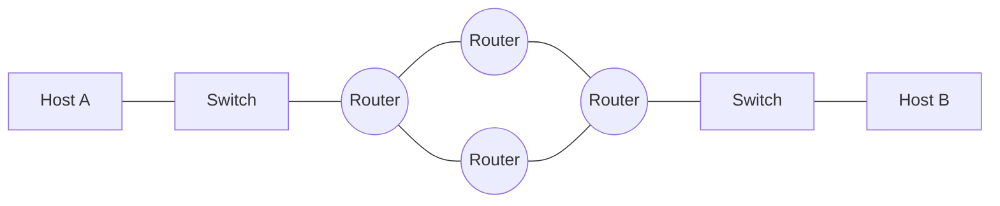
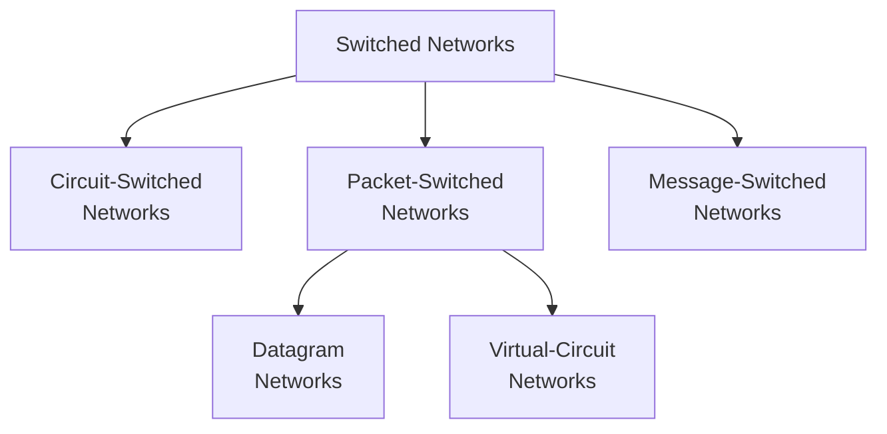
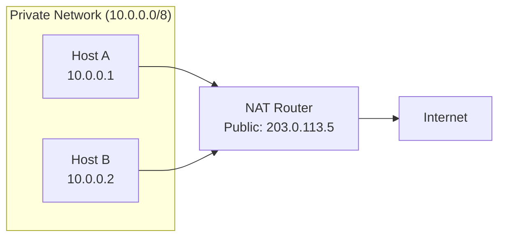

# Chapter 04 — Introduction to Network Layer

> **Last Updated:** 2026-03-21

---

## Table of Contents

- [1. Introduction](#1-introduction)
  - [1.1 Network Layer Services](#11-network-layer-services)
  - [1.2 The Internet as a Combination of Networks](#12-the-internet-as-a-combination-of-networks)
- [2. Switching](#2-switching)
  - [2.1 Circuit Switching](#21-circuit-switching)
  - [2.2 Packet Switching](#22-packet-switching)
  - [2.3 Message Switching](#23-message-switching)
  - [2.4 Comparison of Switching Methods](#24-comparison-of-switching-methods)
- [3. Packet Switching in Detail](#3-packet-switching-in-detail)
  - [3.1 Datagram Networks (Connectionless)](#31-datagram-networks-connectionless)
  - [3.2 Virtual-Circuit Networks (Connection-Oriented)](#32-virtual-circuit-networks-connection-oriented)
- [4. Network Layer Performance](#4-network-layer-performance)
  - [4.1 Delay](#41-delay)
  - [4.2 Throughput](#42-throughput)
  - [4.3 Packet Loss](#43-packet-loss)
- [5. NAT (Network Address Translation)](#5-nat-network-address-translation)
  - [5.1 NAT Concept and Motivation](#51-nat-concept-and-motivation)
  - [5.2 NAT Operation](#52-nat-operation)
  - [5.3 Types of NAT](#53-types-of-nat)
  - [5.4 NAT Limitations](#54-nat-limitations)
- [Summary](#summary)
- [Appendix](#appendix)

---

## 1. Introduction

### 1.1 Network Layer Services

At the conceptual level, the global Internet can be viewed as a black box network that connects millions (if not billions) of computers worldwide. We are only concerned that a message from the application layer in one computer reaches the application layer in another computer.

```
Application  [===]                          [===]  Application
Transport    [===]                          [===]  Transport
Network      [===]                          [===]  Network
Data link    [===]      (Internet)          [===]  Data link
Physical     [===] ---- cloud of routers ---[===]  Physical
             Host A                         Host B
```

The network layer is responsible for:
- **Packetizing**: Encapsulating payload from transport layer into packets
- **Routing**: Determining the best path from source to destination
- **Forwarding**: Moving packets from router input to appropriate router output
- **Error control**: Limited error handling (header checksum)
- **Flow control**: Limited congestion avoidance

### 1.2 The Internet as a Combination of Networks

The Internet is made of **many networks (or links) connected together** through **connecting devices** (routers). It is fundamentally a combination of LANs and WANs.



> **Key Point:** Each router connects to at least two networks (links). The router examines the destination IP address and forwards the packet to the appropriate next hop.

---

## 2. Switching

Whenever we have multiple devices, we have the problem of **how to connect** them to make one-to-one communication possible. Switching provides the solution.



### 2.1 Circuit Switching

A **circuit-switched network** is made of a set of switches connected by physical links, in which each link is divided into n channels.

Key characteristics:
- Resources are **reserved during the setup phase**
- Resources remain **dedicated for the entire duration** of data transfer until the teardown phase
- The whole message is sent **without being divided into packets**

**Three phases:**
1. **Setup**: A dedicated path is established between sender and receiver
2. **Data Transfer**: Data flows along the established path
3. **Teardown**: The circuit is released after communication ends

**Example:** The early telephone system — a path was established between caller and callee when the number was dialed. The circuit remained dedicated until one party hung up.

### 2.2 Packet Switching

The network layer is designed as a **packet-switched network**:
- The message at the source is divided into manageable packets called **datagrams**
- Individual datagrams are transferred independently from source to destination
- Datagrams are reassembled at the destination to recreate the original message
- The Internet's network layer was originally designed as a **connectionless service**

### 2.3 Message Switching

In message switching:
- The entire message is sent as a single unit from switch to switch
- Each switch stores the entire message before forwarding (store-and-forward)
- No dedicated path is established
- Not commonly used today due to large storage requirements at switches

### 2.4 Comparison of Switching Methods

| Feature | Circuit Switching | Packet Switching | Message Switching |
|---------|-------------------|-----------------|-------------------|
| Setup | Required | Not required (datagram) | Not required |
| Dedicated path | Yes | No | No |
| Store-and-forward | No | Yes (per packet) | Yes (entire message) |
| Bandwidth | Reserved | Shared | Shared |
| Delay | Low (after setup) | Variable | High |
| Example | Telephone | Internet | Email relay (historical) |

---

## 3. Packet Switching in Detail

### 3.1 Datagram Networks (Connectionless)

In a **connectionless packet-switched network**, each packet is treated independently:

- Packets in a message may or may not travel the **same path** to their destination
- The switches in this type of network are called **routers**
- Each packet is routed based on the information in its header (source address, destination address)

```
Sender                                              Receiver
  [4|3|2|1] --> R1 --> R2 --> [2]                   [1|3|4|2]
                 |              \                    Out of order
                 v               v
                R3 --> R4 --> R5
                  [3]    [4]    [1]
```

**Forwarding process**: Each router examines the **destination address** of the packet, consults its **routing table**, and forwards the packet to the appropriate output interface.

```
+-----------+--------+
| Dest Addr | Output |
|           | Iface  |
+-----------+--------+
|     A     |   1    |
|     B     |   2    |
|    ...    |  ...   |
|     H     |   3    |
+-----------+--------+
```

> **Key Point:** In a connectionless packet-switched network, the forwarding decision is based on the destination address of the packet.

### 3.2 Virtual-Circuit Networks (Connection-Oriented)

In a **connection-oriented** approach, a virtual path is established before data transfer:
- All packets follow the **same path**
- Packets arrive **in order**
- Each packet carries a **virtual circuit identifier (VCI)** instead of the full destination address
- Resources can be allocated along the path

| Feature | Datagram | Virtual Circuit |
|---------|----------|----------------|
| Connection setup | No | Yes |
| Packet ordering | Not guaranteed | Guaranteed |
| Routing decision | Per packet | Per connection |
| Packet header | Full destination address | VCI |
| Fault tolerance | High | Low (if path fails) |

---

## 4. Network Layer Performance

### 4.1 Delay

Total delay for a packet traversing a network:

```
D_total = D_processing + D_queuing + D_transmission + D_propagation
```

| Delay Type | Cause | Formula |
|-----------|-------|---------|
| Processing | Examining header, determining output | Negligible |
| Queuing | Waiting in output queue | Depends on traffic |
| Transmission | Pushing bits onto the link | L / R (packet length / link rate) |
| Propagation | Signal traveling through medium | d / s (distance / speed) |

### 4.2 Throughput

**Throughput** is the rate at which data is actually delivered:
- **Instantaneous throughput**: Rate at a specific moment
- **Average throughput**: Rate over a longer period
- Bottleneck link determines the overall throughput

### 4.3 Packet Loss

Packets can be lost due to:
- Buffer overflow at routers (congestion)
- Bit errors causing checksum failures
- TTL expiration

---

## 5. NAT (Network Address Translation)

*Integrated from student presentation materials on NAT*

### 5.1 NAT Concept and Motivation

**Network Address Translation (NAT)** allows multiple devices on a private network to share a single public IP address for accessing the Internet.

**Motivation:**
- IPv4 address exhaustion (only 4.3 billion addresses)
- Security: Internal network topology is hidden
- Flexibility: Internal addressing can be changed without affecting external connections

### 5.2 NAT Operation



**Translation process:**
1. Internal host sends a packet with private source IP
2. NAT router replaces the private source IP with its public IP
3. NAT router creates an entry in the **NAT translation table** mapping internal IP:port to external port
4. When a response arrives, the NAT router looks up the table and forwards to the correct internal host

**NAT Translation Table:**

| Internal IP:Port | External Port | Destination |
|-----------------|---------------|-------------|
| 10.0.0.1:3345 | 5001 | 128.119.40.186:80 |
| 10.0.0.2:3346 | 5002 | 64.233.167.99:80 |

### 5.3 Types of NAT

| Type | Description |
|------|-------------|
| Static NAT | One-to-one mapping between private and public IPs |
| Dynamic NAT | Pool of public IPs assigned on demand |
| PAT/NAPT | Multiple private IPs share one public IP using port numbers |

**PAT (Port Address Translation)** is the most common form, also called **NAT overloading** or **NAPT (Network Address Port Translation)**.

### 5.4 NAT Limitations

- Breaks the end-to-end principle of the Internet
- Complicates peer-to-peer applications
- Issues with protocols that embed IP addresses in the payload (FTP, SIP)
- Requires special handling for incoming connections (port forwarding)

---

## Summary

| Concept | Key Point |
|---------|-----------|
| Network Layer | Responsible for routing and forwarding packets across networks |
| Circuit Switching | Dedicated path, resource reservation, three phases |
| Packet Switching | Independent packets, shared resources, routers |
| Datagram Network | Connectionless, per-packet routing, no guaranteed order |
| Virtual Circuit | Connection-oriented, VCI-based, in-order delivery |
| Forwarding | Per-packet decision based on destination address and routing table |
| Delay | Processing + queuing + transmission + propagation |
| NAT | Translates private IPs to public IP; solves IPv4 exhaustion |

---

## Appendix

### A. Private IP Address Ranges (RFC 1918)

| Class | Range | CIDR | Number of Addresses |
|-------|-------|------|-------------------|
| A | 10.0.0.0–10.255.255.255 | 10.0.0.0/8 | 16,777,216 |
| B | 172.16.0.0–172.31.255.255 | 172.16.0.0/12 | 1,048,576 |
| C | 192.168.0.0–192.168.255.255 | 192.168.0.0/16 | 65,536 |

### B. NAT Traversal Techniques

For applications that need incoming connections through NAT:
- **Port Forwarding**: Manually configure the NAT router to forward specific ports
- **UPnP (Universal Plug and Play)**: Automatic port mapping
- **STUN (Session Traversal Utilities for NAT)**: Discovers public IP and port mapping
- **TURN (Traversal Using Relays around NAT)**: Relay server when direct connection fails
- **ICE (Interactive Connectivity Establishment)**: Combines STUN and TURN

### C. Real-World Example: Home Router NAT

When a home computer (192.168.1.100) visits google.com:
1. PC sends packet: src=192.168.1.100:50000, dst=142.250.196.46:443
2. Router replaces: src=public_IP:12345, dst=142.250.196.46:443
3. Google responds to: dst=public_IP:12345
4. Router looks up table, forwards to: dst=192.168.1.100:50000
