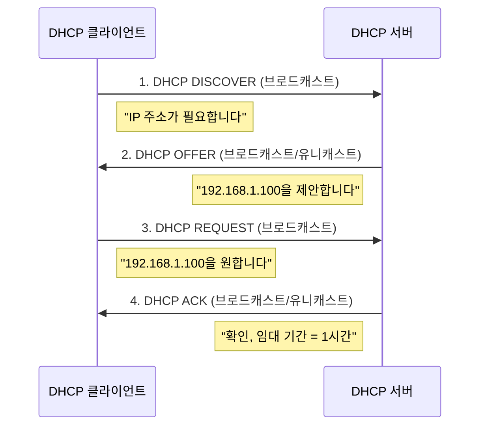

# Chapter 05 — IPv4 주소

> **최종 수정일:** 2026-03-21

---

## 목차

- [1. 서론](#1-서론)
- [2. 주소 표기법](#2-주소-표기법)
  - [2.1 이진 표기법](#21-이진-표기법)
  - [2.2 점-십진 표기법](#22-점-십진-표기법)
  - [2.3 16진수 표기법](#23-16진수-표기법)
- [3. 클래스 기반 주소 지정](#3-클래스-기반-주소-지정)
  - [3.1 클래스 A에서 E까지](#31-클래스-a에서-e까지)
  - [3.2 클래스 기반 주소 지정의 문제점](#32-클래스-기반-주소-지정의-문제점)
- [4. 클래스리스 주소 지정 (CIDR)](#4-클래스리스-주소-지정-cidr)
  - [4.1 CIDR 표기법](#41-cidr-표기법)
  - [4.2 네트워크 주소와 마스크](#42-네트워크-주소와-마스크)
  - [4.3 서브넷팅](#43-서브넷팅)
  - [4.4 슈퍼넷팅](#44-슈퍼넷팅)
- [5. IP 주소 지정을 위한 비트 연산](#5-ip-주소-지정을-위한-비트-연산)
  - [5.1 NOT 연산](#51-not-연산)
  - [5.2 AND 연산](#52-and-연산)
  - [5.3 OR 연산](#53-or-연산)
- [6. 특수 주소](#6-특수-주소)
- [7. DHCP (동적 호스트 구성 프로토콜)](#7-dhcp-동적-호스트-구성-프로토콜)
  - [7.1 DHCP 개요](#71-dhcp-개요)
  - [7.2 DHCP 동작 방식](#72-dhcp-동작-방식)
  - [7.3 DHCP 메시지 형식](#73-dhcp-메시지-형식)
  - [7.4 DHCP 보안 우려](#74-dhcp-보안-우려)
- [요약](#요약)
- [부록](#부록)

---

## 1. 서론

TCP/IP 프로토콜 스위트의 IP 계층에서 인터넷에 연결된 각 장치를 식별하기 위해 사용되는 식별자를 **인터넷 주소** 또는 **IP 주소**라고 한다.

IPv4 주소는 인터넷에 대한 호스트 또는 라우터의 연결을 고유하고 보편적으로 정의하는 **32비트** 주소이다. IP 주소는 (장치 자체가 아닌) **인터페이스**의 주소이다.

> **핵심 개념:** IPv4 주소는 고유하고 보편적이다. IPv4의 주소 공간은 2^32 = 4,294,967,296개의 주소이다.

---

## 2. 주소 표기법

### 2.1 이진 표기법

IPv4 주소는 32비트로 표현되며, 일반적으로 4개의 옥텟(바이트)으로 그룹화된다:

```
10000000 00001011 00000011 00011111
```

### 2.2 점-십진 표기법

각 옥텟을 십진수(0-255)로 변환하고 점으로 구분한다:

```
이진:     10000000  00001011  00000011  00011111
십진:        128   .   11   .    3    .    31
```

**변환 예시:**
- `10000001 00001011 00001011 11101111` = 129.11.11.239
- `11000001 10000011 00011011 11111111` = 193.131.27.255

**점-십진 표기법의 오류 검출:**
- 선행 0 불허 (예: 045는 유효하지 않음)
- 정확히 네 개의 숫자를 점으로 구분
- 각 숫자는 0-255 범위여야 함
- 이진과 십진 표기법의 혼용 불가

### 2.3 16진수 표기법

4비트씩 그룹화하여 16진수로 표현한다:

```
이진:  0111 0101  1001 0101  0001 1101  1110 1010
16진:   7    5     9    5     1    D     E    A
결과:  0x75951DEA
```

---

## 3. 클래스 기반 주소 지정

### 3.1 클래스 A에서 E까지

클래스 기반 주소 지정에서 주소 공간은 5개의 클래스로 나뉜다:

```
Class A:  0|  NetID (7)  |     HostID (24)     |   0.0.0.0 - 127.255.255.255
Class B: 10|  NetID (14)      |   HostID (16)   |   128.0.0.0 - 191.255.255.255
Class C: 110| NetID (21)           | HostID (8) |   192.0.0.0 - 223.255.255.255
Class D: 1110|      Multicast Address (28)       |   224.0.0.0 - 239.255.255.255
Class E: 1111|      Reserved (28)                |   240.0.0.0 - 255.255.255.255
```

| 클래스 | 시작 비트 | 네트워크 비트 | 호스트 비트 | 네트워크 수 | 네트워크당 호스트 수 |
|--------|-----------|--------------|------------|------------|-------------------|
| A | 0 | 8 | 24 | 126 | 16,777,214 |
| B | 10 | 16 | 16 | 16,384 | 65,534 |
| C | 110 | 24 | 8 | 2,097,152 | 254 |
| D | 1110 | -- | -- | 멀티캐스트 | -- |
| E | 1111 | -- | -- | 예약 | -- |

### 3.2 클래스 기반 주소 지정의 문제점

- **주소 고갈**: 대규모 블록의 낭비 (Class A는 네트워크당 1600만 개의 호스트)
- **유연성 부족**: 세 가지 크기만 사용 가능 (Class A, B, C)
- **라우팅 테이블 폭증**: Class C 네트워크가 너무 많음

---

## 4. 클래스리스 주소 지정 (CIDR)

### 4.1 CIDR 표기법

**무클래스 도메인 간 라우팅(Classless Inter-Domain Routing, CIDR)**은 접두사 길이를 사용하여 네트워크 부분을 지정한다:

```
IP 주소 / 접두사 길이
예: 192.168.1.0/24
```

접두사 길이(n)는 네트워크 접두사가 몇 비트인지를 나타낸다:
- `/8` = 255.0.0.0 (Class A 동등)
- `/16` = 255.255.0.0 (Class B 동등)
- `/24` = 255.255.255.0 (Class C 동등)

### 4.2 네트워크 주소와 마스크

**서브넷 마스크**는 처음 n비트가 1이고 나머지 비트가 0인 32비트 값이다:

```
/24 마스크: 11111111.11111111.11111111.00000000 = 255.255.255.0
```

**네트워크 주소 구하기**: IP 주소와 마스크 간에 AND 연산을 적용한다:

```
IP 주소:      192.168.1.100  = 11000000.10101000.00000001.01100100
서브넷 마스크: 255.255.255.0  = 11111111.11111111.11111111.00000000
네트워크 주소: 192.168.1.0    = 11000000.10101000.00000001.00000000
```

**브로드캐스트 주소 구하기**: IP 주소와 마스크의 보수 간에 OR 연산을 적용한다.

### 4.3 서브넷팅

**서브넷팅(Subnetting)**은 호스트 부분에서 비트를 차용하여 네트워크를 더 작은 서브네트워크로 분할한다:

```
원본: 192.168.1.0/24   (256개 주소)
         |
    /26으로 서브넷팅 (4개 서브넷, 각 64개 주소):
         |
    +----+----+----+----+
    |    |    |    |    |
 .0/26 .64/26 .128/26 .192/26
```

| 서브넷 | 네트워크 주소 | 첫 번째 호스트 | 마지막 호스트 | 브로드캐스트 |
|--------|--------------|---------------|--------------|-------------|
| 1 | 192.168.1.0 | 192.168.1.1 | 192.168.1.62 | 192.168.1.63 |
| 2 | 192.168.1.64 | 192.168.1.65 | 192.168.1.126 | 192.168.1.127 |
| 3 | 192.168.1.128 | 192.168.1.129 | 192.168.1.190 | 192.168.1.191 |
| 4 | 192.168.1.192 | 192.168.1.193 | 192.168.1.254 | 192.168.1.255 |

### 4.4 슈퍼넷팅

**슈퍼넷팅(Supernetting)** (경로 집약)은 여러 연속된 네트워크를 하나의 더 큰 블록으로 결합한다:

```
4개의 /24 네트워크를 하나의 /22로 결합:
192.168.0.0/24
192.168.1.0/24   -->  192.168.0.0/22 (1024개 주소)
192.168.2.0/24
192.168.3.0/24
```

> **핵심 개념:** 슈퍼넷팅은 라우팅 테이블 항목을 줄이며, 인터넷의 확장성에 필수적이다.

---

## 5. IP 주소 지정을 위한 비트 연산

### 5.1 NOT 연산

NOT 연산은 각 비트를 반전시킨다:

| 입력 | 출력 |
|------|------|
| 0 | 1 |
| 1 | 0 |

브로드캐스트 주소 계산을 위한 **마스크의 보수**를 구하는 데 사용된다.

### 5.2 AND 연산

AND 연산은 두 입력이 모두 1일 때만 1을 반환한다:

| A | B | A AND B |
|---|---|---------|
| 0 | 0 | 0 |
| 0 | 1 | 0 |
| 1 | 0 | 0 |
| 1 | 1 | 1 |

**네트워크 주소**를 구하는 데 사용된다: IP AND 마스크 = 네트워크 주소.

### 5.3 OR 연산

OR 연산은 하나 이상의 입력이 1이면 1을 반환한다:

| A | B | A OR B |
|---|---|--------|
| 0 | 0 | 0 |
| 0 | 1 | 1 |
| 1 | 0 | 1 |
| 1 | 1 | 1 |

**브로드캐스트 주소**를 구하는 데 사용된다: IP OR (NOT 마스크) = 브로드캐스트 주소.

---

## 6. 특수 주소

| 주소 | 의미 |
|------|------|
| 0.0.0.0 | 이 네트워크의 이 호스트 |
| 255.255.255.255 | 제한된 브로드캐스트 (현재 네트워크만) |
| 127.0.0.0/8 | 루프백 (localhost) |
| 10.0.0.0/8 | 사설 (RFC 1918) |
| 172.16.0.0/12 | 사설 (RFC 1918) |
| 192.168.0.0/16 | 사설 (RFC 1918) |
| 169.254.0.0/16 | 링크-로컬 (APIPA) |

---

## 7. DHCP (동적 호스트 구성 프로토콜)

*학생 발표 자료의 DHCP 내용을 통합*

### 7.1 DHCP 개요

**동적 호스트 구성 프로토콜(Dynamic Host Configuration Protocol, DHCP)**은 네트워크의 호스트에 IP 주소와 기타 구성 매개변수를 자동으로 할당하는 응용 계층 프로토콜이다.

DHCP가 제공하는 정보:
- IP 주소 할당
- 서브넷 마스크
- 기본 게이트웨이
- DNS 서버 주소
- 임대 기간

> **핵심 개념:** DHCP는 UDP (서버 포트 67, 클라이언트 포트 68) 위에서 동작하며, 클라이언트가 초기에 IP 주소를 가지고 있지 않기 때문에 브로드캐스트 통신을 사용한다.

### 7.2 DHCP 동작 방식

DHCP 과정은 **DORA** (Discover, Offer, Request, Acknowledge) 패턴을 따른다:



**상세 과정:**
1. **DISCOVER**: 클라이언트가 IP 구성 요청을 브로드캐스트 (src: 0.0.0.0, dst: 255.255.255.255)
2. **OFFER**: 서버가 사용 가능한 IP 주소와 구성 매개변수로 응답
3. **REQUEST**: 클라이언트가 하나의 제안을 선택하고 수락을 브로드캐스트
4. **ACK**: 선택된 서버가 할당과 임대 기간을 확인

**임대 갱신:**
- 임대 시간의 50% (T1) 시점: 클라이언트가 원래 서버에 유니캐스트로 갱신 요청
- 임대 시간의 87.5% (T2) 시점: 클라이언트가 모든 서버에 브로드캐스트로 갱신 요청
- 100% 시점: 임대 만료, 클라이언트는 DORA 과정을 다시 시작해야 함

### 7.3 DHCP 메시지 형식

| 필드 | 크기 | 설명 |
|------|------|------|
| op | 1바이트 | 메시지 유형 (1=요청, 2=응답) |
| htype | 1바이트 | 하드웨어 유형 (1=Ethernet) |
| hlen | 1바이트 | 하드웨어 주소 길이 (MAC의 경우 6) |
| xid | 4바이트 | 트랜잭션 ID |
| ciaddr | 4바이트 | 클라이언트 IP 주소 (알려진 경우) |
| yiaddr | 4바이트 | "당신의" IP 주소 (서버가 할당) |
| siaddr | 4바이트 | 서버 IP 주소 |
| chaddr | 16바이트 | 클라이언트 하드웨어 주소 |
| options | 가변 | 구성 옵션 |

### 7.4 DHCP 보안 우려

**DHCP 스푸핑 / 불법 DHCP 서버:**
- 공격자가 네트워크에 가짜 DHCP 서버를 설치
- 불법 서버가 자신을 기본 게이트웨이로 할당 가능 (중간자 공격)
- DNS를 악성 서버로 리다이렉트 가능

**DHCP 고갈 공격(Starvation Attack):**
- 공격자가 위조된 MAC 주소로 다수의 DHCP 요청을 전송
- 서버의 주소 풀을 고갈시킴
- 정상 클라이언트가 IP 주소를 받을 수 없음 (서비스 거부)

**대응 방안:**
- **DHCP 스누핑(DHCP Snooping)**: 신뢰할 수 없는 DHCP 메시지를 필터링하는 스위치 기능
- **포트 보안(Port Security)**: 포트당 MAC 주소 수를 제한
- **802.1X 인증**: 네트워크 접속 전 인증 필요

---

## 요약

| 개념 | 핵심 포인트 |
|------|------------|
| IPv4 주소 | 32비트 주소; 고유하고 보편적; 인터페이스를 식별 |
| 점-십진 표기법 | 점으로 구분된 4개의 십진수 (0-255) |
| 클래스 기반 주소 지정 | 5개 클래스 (A-E); 유연성 부족, 주소 낭비 초래 |
| CIDR | 가변 접두사 길이를 사용한 클래스리스 주소 지정 (/n 표기법) |
| 서브넷 마스크 | 네트워크와 호스트 부분을 식별; IP와 AND 연산으로 네트워크 주소 도출 |
| 서브넷팅 | 호스트 비트를 차용하여 네트워크를 작은 서브넷으로 분할 |
| 슈퍼넷팅 | 연속된 네트워크를 결합하여 라우팅 테이블 크기 축소 |
| DHCP | DORA 과정을 통한 자동 IP 구성 (Discover, Offer, Request, Ack) |

---

## 부록

### A. 범위 내 주소 수 계산

첫 번째 주소 146.102.29.0, 마지막 주소 146.102.32.255가 주어질 때:

```
차이 = (0 x 256^3 + 0 x 256^2 + 3 x 256^1 + 255 x 256^0) + 1
     = (0 + 0 + 768 + 255) + 1
     = 1024개 주소
```

### B. 첫 번째 주소와 개수로 마지막 주소 구하기

첫 번째 주소 14.11.45.96, 개수 = 32가 주어질 때:

```
개수 - 1 = 31 (256진법) = 0.0.0.31
마지막 주소 = (14.11.45.96 + 0.0.0.31)_256 = 14.11.45.127
```

### C. CIDR 빠른 참조표

| 접두사 | 마스크 | 주소 수 | 사용 가능한 호스트 수 |
|--------|--------|---------|---------------------|
| /8 | 255.0.0.0 | 16,777,216 | 16,777,214 |
| /16 | 255.255.0.0 | 65,536 | 65,534 |
| /24 | 255.255.255.0 | 256 | 254 |
| /25 | 255.255.255.128 | 128 | 126 |
| /26 | 255.255.255.192 | 64 | 62 |
| /27 | 255.255.255.224 | 32 | 30 |
| /28 | 255.255.255.240 | 16 | 14 |
| /29 | 255.255.255.248 | 8 | 6 |
| /30 | 255.255.255.252 | 4 | 2 |
| /31 | 255.255.255.254 | 2 | 2 (점대점) |
| /32 | 255.255.255.255 | 1 | 1 (호스트 경로) |
