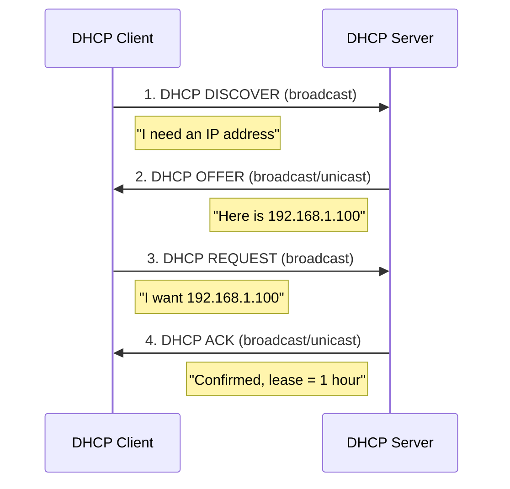

# Chapter 05 — IPv4 Addresses

> **Last Updated:** 2026-03-21

---

## Table of Contents

- [1. Introduction](#1-introduction)
- [2. Address Notation](#2-address-notation)
  - [2.1 Binary Notation](#21-binary-notation)
  - [2.2 Dotted-Decimal Notation](#22-dotted-decimal-notation)
  - [2.3 Hexadecimal Notation](#23-hexadecimal-notation)
- [3. Classful Addressing](#3-classful-addressing)
  - [3.1 Classes A through E](#31-classes-a-through-e)
  - [3.2 Problems with Classful Addressing](#32-problems-with-classful-addressing)
- [4. Classless Addressing (CIDR)](#4-classless-addressing-cidr)
  - [4.1 CIDR Notation](#41-cidr-notation)
  - [4.2 Network Address and Mask](#42-network-address-and-mask)
  - [4.3 Subnetting](#43-subnetting)
  - [4.4 Supernetting](#44-supernetting)
- [5. Bitwise Operations for IP Addressing](#5-bitwise-operations-for-ip-addressing)
  - [5.1 NOT Operation](#51-not-operation)
  - [5.2 AND Operation](#52-and-operation)
  - [5.3 OR Operation](#53-or-operation)
- [6. Special Addresses](#6-special-addresses)
- [7. DHCP (Dynamic Host Configuration Protocol)](#7-dhcp-dynamic-host-configuration-protocol)
  - [7.1 DHCP Overview](#71-dhcp-overview)
  - [7.2 DHCP Operation](#72-dhcp-operation)
  - [7.3 DHCP Message Format](#73-dhcp-message-format)
  - [7.4 DHCP Security Concerns](#74-dhcp-security-concerns)
- [Summary](#summary)
- [Appendix](#appendix)

---

## 1. Introduction

The identifier used in the IP layer of the TCP/IP protocol suite to identify each device connected to the Internet is called the **Internet address** or **IP address**.

An IPv4 address is a **32-bit** address that uniquely and universally defines the connection of a host or a router to the Internet. An IP address is the address of the **interface** (not the device itself).

> **Key Point:** IPv4 addresses are unique and universal. The address space of IPv4 is 2^32 = 4,294,967,296 addresses.

---

## 2. Address Notation

### 2.1 Binary Notation

An IPv4 address is represented as 32 bits, typically grouped into 4 octets (bytes):

```
10000000 00001011 00000011 00011111
```

### 2.2 Dotted-Decimal Notation

Each octet is converted to its decimal equivalent (0-255), separated by dots:

```
Binary:   10000000  00001011  00000011  00011111
Decimal:     128   .   11   .    3    .    31
```

**Conversion examples:**
- `10000001 00001011 00001011 11101111` = 129.11.11.239
- `11000001 10000011 00011011 11111111` = 193.131.27.255

**Error detection in dotted-decimal:**
- No leading zeros (e.g., 045 is invalid)
- Exactly four numbers separated by dots
- Each number must be 0-255
- No mixing of binary and decimal notation

### 2.3 Hexadecimal Notation

Each group of 4 bits is represented as a hexadecimal digit:

```
Binary: 0111 0101  1001 0101  0001 1101  1110 1010
Hex:     7    5     9    5     1    D     E    A
Result: 0x75951DEA
```

---

## 3. Classful Addressing

### 3.1 Classes A through E

In classful addressing, the address space is divided into five classes:

```
Class A:  0|  NetID (7)  |     HostID (24)     |   0.0.0.0 - 127.255.255.255
Class B: 10|  NetID (14)      |   HostID (16)   |   128.0.0.0 - 191.255.255.255
Class C: 110| NetID (21)           | HostID (8) |   192.0.0.0 - 223.255.255.255
Class D: 1110|      Multicast Address (28)       |   224.0.0.0 - 239.255.255.255
Class E: 1111|      Reserved (28)                |   240.0.0.0 - 255.255.255.255
```

| Class | First Bits | Network Bits | Host Bits | Networks | Hosts/Network |
|-------|-----------|-------------|-----------|----------|---------------|
| A | 0 | 8 | 24 | 126 | 16,777,214 |
| B | 10 | 16 | 16 | 16,384 | 65,534 |
| C | 110 | 24 | 8 | 2,097,152 | 254 |
| D | 1110 | -- | -- | Multicast | -- |
| E | 1111 | -- | -- | Reserved | -- |

### 3.2 Problems with Classful Addressing

- **Address depletion**: Large blocks wasted (Class A has 16 million hosts per network)
- **Inflexibility**: Only three sizes available (Class A, B, C)
- **Routing table explosion**: Too many Class C networks

---

## 4. Classless Addressing (CIDR)

### 4.1 CIDR Notation

**Classless Inter-Domain Routing (CIDR)** uses a prefix length to specify the network portion:

```
IP Address / Prefix Length
Example: 192.168.1.0/24
```

The prefix length (n) indicates how many bits are the network prefix:
- `/8` = 255.0.0.0 (Class A equivalent)
- `/16` = 255.255.0.0 (Class B equivalent)
- `/24` = 255.255.255.0 (Class C equivalent)

### 4.2 Network Address and Mask

The **subnet mask** is a 32-bit value where the first n bits are 1 and the remaining bits are 0:

```
/24 mask: 11111111.11111111.11111111.00000000 = 255.255.255.0
```

**Finding the network address**: Apply AND operation between IP address and mask:

```
IP Address:      192.168.1.100  = 11000000.10101000.00000001.01100100
Subnet Mask:     255.255.255.0  = 11111111.11111111.11111111.00000000
Network Address: 192.168.1.0    = 11000000.10101000.00000001.00000000
```

**Finding the broadcast address**: Apply OR operation between IP address and the complement of the mask.

### 4.3 Subnetting

**Subnetting** divides a network into smaller subnetworks by borrowing bits from the host portion:

```
Original: 192.168.1.0/24   (256 addresses)
         |
    Subnet into /26 (4 subnets, 64 addresses each):
         |
    +----+----+----+----+
    |    |    |    |    |
 .0/26 .64/26 .128/26 .192/26
```

| Subnet | Network Address | First Host | Last Host | Broadcast |
|--------|----------------|------------|-----------|-----------|
| 1 | 192.168.1.0 | 192.168.1.1 | 192.168.1.62 | 192.168.1.63 |
| 2 | 192.168.1.64 | 192.168.1.65 | 192.168.1.126 | 192.168.1.127 |
| 3 | 192.168.1.128 | 192.168.1.129 | 192.168.1.190 | 192.168.1.191 |
| 4 | 192.168.1.192 | 192.168.1.193 | 192.168.1.254 | 192.168.1.255 |

### 4.4 Supernetting

**Supernetting** (route aggregation) combines multiple contiguous networks into a single larger block:

```
Four /24 networks combined into one /22:
192.168.0.0/24
192.168.1.0/24   -->  192.168.0.0/22 (1024 addresses)
192.168.2.0/24
192.168.3.0/24
```

> **Key Point:** Supernetting reduces routing table entries and is essential for Internet scalability.

---

## 5. Bitwise Operations for IP Addressing

### 5.1 NOT Operation

The NOT operation inverts each bit:

| Input | Output |
|-------|--------|
| 0 | 1 |
| 1 | 0 |

Used to find the **complement of the mask** for calculating broadcast addresses.

### 5.2 AND Operation

The AND operation returns 1 only when both inputs are 1:

| A | B | A AND B |
|---|---|---------|
| 0 | 0 | 0 |
| 0 | 1 | 0 |
| 1 | 0 | 0 |
| 1 | 1 | 1 |

Used to find the **network address**: IP AND Mask = Network Address.

### 5.3 OR Operation

The OR operation returns 1 when at least one input is 1:

| A | B | A OR B |
|---|---|--------|
| 0 | 0 | 0 |
| 0 | 1 | 1 |
| 1 | 0 | 1 |
| 1 | 1 | 1 |

Used to find the **broadcast address**: IP OR (NOT Mask) = Broadcast Address.

---

## 6. Special Addresses

| Address | Meaning |
|---------|---------|
| 0.0.0.0 | This host on this network |
| 255.255.255.255 | Limited broadcast (current network only) |
| 127.0.0.0/8 | Loopback (localhost) |
| 10.0.0.0/8 | Private (RFC 1918) |
| 172.16.0.0/12 | Private (RFC 1918) |
| 192.168.0.0/16 | Private (RFC 1918) |
| 169.254.0.0/16 | Link-local (APIPA) |

---

## 7. DHCP (Dynamic Host Configuration Protocol)

*Integrated from student presentation materials on DHCP*

### 7.1 DHCP Overview

**Dynamic Host Configuration Protocol (DHCP)** is an application-layer protocol that automatically assigns IP addresses and other configuration parameters to hosts on a network.

DHCP provides:
- IP address assignment
- Subnet mask
- Default gateway
- DNS server addresses
- Lease duration

> **Key Point:** DHCP operates on UDP (server port 67, client port 68) and uses broadcast communication since the client has no IP address initially.

### 7.2 DHCP Operation

The DHCP process follows the **DORA** (Discover, Offer, Request, Acknowledge) pattern:



**Detailed process:**
1. **DISCOVER**: Client broadcasts a request for IP configuration (src: 0.0.0.0, dst: 255.255.255.255)
2. **OFFER**: Server(s) respond with available IP address and configuration parameters
3. **REQUEST**: Client selects one offer and broadcasts acceptance
4. **ACK**: Selected server confirms the assignment and lease duration

**Lease renewal:**
- At 50% of lease time (T1): Client unicasts renewal request to the original server
- At 87.5% of lease time (T2): Client broadcasts renewal request to any server
- At 100%: Lease expires, client must restart DORA process

### 7.3 DHCP Message Format

| Field | Size | Description |
|-------|------|-------------|
| op | 1 byte | Message type (1=request, 2=reply) |
| htype | 1 byte | Hardware type (1=Ethernet) |
| hlen | 1 byte | Hardware address length (6 for MAC) |
| xid | 4 bytes | Transaction ID |
| ciaddr | 4 bytes | Client IP address (if known) |
| yiaddr | 4 bytes | "Your" IP address (assigned by server) |
| siaddr | 4 bytes | Server IP address |
| chaddr | 16 bytes | Client hardware address |
| options | Variable | Configuration options |

### 7.4 DHCP Security Concerns

**DHCP Spoofing / Rogue DHCP Server:**
- An attacker sets up a fake DHCP server on the network
- The rogue server can assign itself as the default gateway (man-in-the-middle attack)
- Can redirect DNS to malicious servers

**DHCP Starvation Attack:**
- Attacker sends many DHCP requests with spoofed MAC addresses
- Exhausts the server's address pool
- Legitimate clients cannot obtain IP addresses (denial of service)

**Countermeasures:**
- **DHCP Snooping**: Switch feature that filters untrusted DHCP messages
- **Port Security**: Limits MAC addresses per port
- **802.1X Authentication**: Requires authentication before network access

---

## Summary

| Concept | Key Point |
|---------|-----------|
| IPv4 Address | 32-bit address; unique and universal; identifies an interface |
| Dotted-Decimal | Four decimal numbers (0-255) separated by dots |
| Classful Addressing | Five classes (A-E); inflexible, leads to address waste |
| CIDR | Classless addressing with variable prefix length (/n notation) |
| Subnet Mask | Identifies network vs. host portion; AND with IP gives network address |
| Subnetting | Divides network into smaller subnets by borrowing host bits |
| Supernetting | Combines contiguous networks to reduce routing table size |
| DHCP | Automatic IP configuration via DORA process (Discover, Offer, Request, Ack) |

---

## Appendix

### A. Calculating Number of Addresses in a Range

Given first address 146.102.29.0 and last address 146.102.32.255:

```
Difference = (0 x 256^3 + 0 x 256^2 + 3 x 256^1 + 255 x 256^0) + 1
           = (0 + 0 + 768 + 255) + 1
           = 1024 addresses
```

### B. Finding the Last Address Given First Address and Count

Given first address 14.11.45.96 and count = 32:

```
Count - 1 = 31 in base 256 = 0.0.0.31
Last address = (14.11.45.96 + 0.0.0.31)_256 = 14.11.45.127
```

### C. Quick CIDR Reference Table

| Prefix | Mask | Addresses | Usable Hosts |
|--------|------|-----------|-------------|
| /8 | 255.0.0.0 | 16,777,216 | 16,777,214 |
| /16 | 255.255.0.0 | 65,536 | 65,534 |
| /24 | 255.255.255.0 | 256 | 254 |
| /25 | 255.255.255.128 | 128 | 126 |
| /26 | 255.255.255.192 | 64 | 62 |
| /27 | 255.255.255.224 | 32 | 30 |
| /28 | 255.255.255.240 | 16 | 14 |
| /29 | 255.255.255.248 | 8 | 6 |
| /30 | 255.255.255.252 | 4 | 2 |
| /31 | 255.255.255.254 | 2 | 2 (point-to-point) |
| /32 | 255.255.255.255 | 1 | 1 (host route) |
