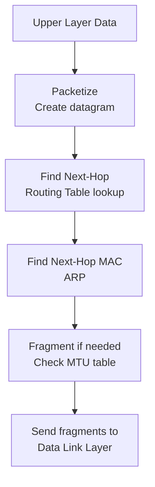
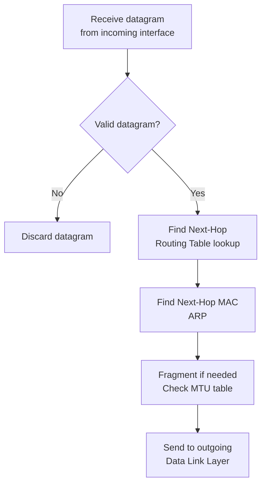
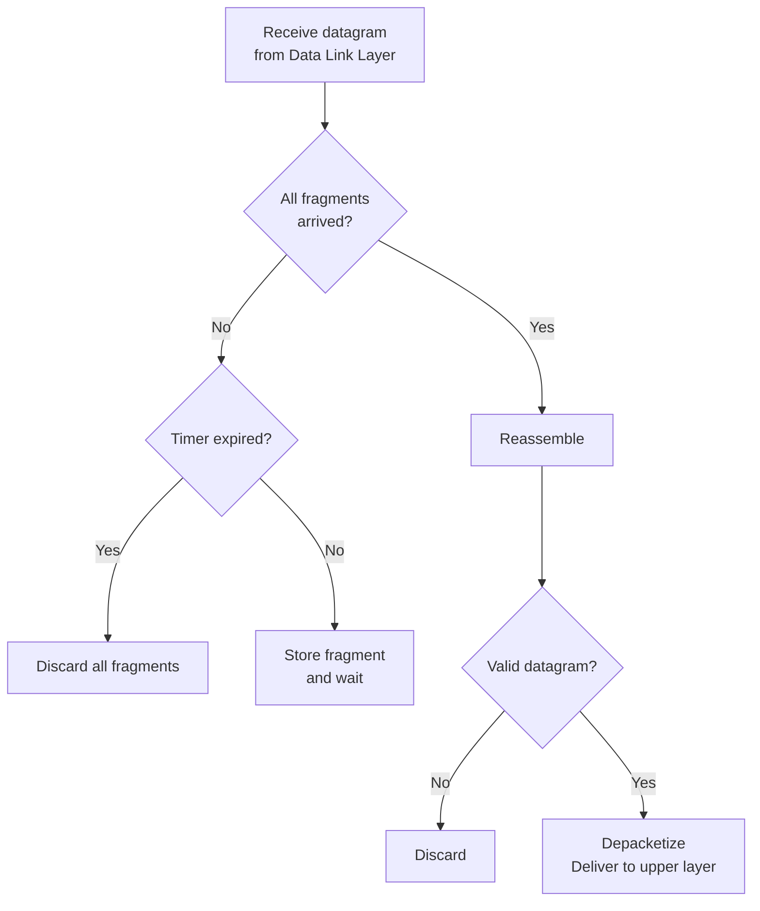

# Chapter 07 — 인터넷 프로토콜 버전 4 (IPv4)

> **최종 수정일:** 2026-04-01
>
> Forouzan, TCP/IP Protocol Suite 4th Ed. Ch 7

> **선수 지식**: [컴퓨터네트워크] 전달과 포워딩 (제5-6장).
>
> **학습 목표**:
> 1. IPv4 패킷 헤더 필드와 목적을 분석할 수 있다
> 2. IP 단편화와 재조립을 설명할 수 있다
> 3. IPv4 옵션과 용도를 설명할 수 있다

---

## 목차

- [1. 개요](#1-개요)
- [2. 데이터그램](#2-데이터그램)
  - [2.1 데이터그램 구조](#21-데이터그램-구조)
  - [2.2 헤더 필드](#22-헤더-필드)
- [3. 단편화](#3-단편화)
  - [3.1 최대 전송 단위 (MTU)](#31-최대-전송-단위-mtu)
  - [3.2 단편화 관련 필드](#32-단편화-관련-필드)
  - [3.3 단편화 예제](#33-단편화-예제)
  - [3.4 재조립](#34-재조립)
- [4. 옵션](#4-옵션)
- [5. 체크섬](#5-체크섬)
- [6. IP 처리](#6-ip-처리)
  - [6.1 출발지에서](#61-출발지에서)
  - [6.2 각 라우터에서](#62-각-라우터에서)
  - [6.3 목적지에서](#63-목적지에서)
- [요약](#요약)
- [부록](#부록)

---

<br>

## 1. 개요

**인터넷 프로토콜(IP)** 은 TCP/IP 프로토콜이 사용하는 전송 메커니즘이다. IP는 네트워크 계층에 위치한다.

주요 특성:
- **비신뢰적(Unreliable)**: 전달 보장 없음; 패킷이 손실, 중복되거나 순서가 바뀔 수 있음
- **비연결형(Connectionless)**: 각 데이터그램은 독립적으로 처리됨; 연결 설정 없음
- **최선형 전달(Best-effort delivery)**: IP는 전달을 위해 최선을 다하지만 보장하지는 않음

```
+-------------------+
| Application Layer |  SMTP, FTP, DNS, SNMP, DHCP
+-------------------+
| Transport Layer   |  SCTP, TCP, UDP
+---+-------+-------+
|IGMP|ICMP |   IP    |  ARP
+---+-------+---------+
| Data Link Layer   |  Underlying LAN or WAN
+-------------------+
| Physical Layer    |
+-------------------+
```

> **핵심 포인트:** IP는 모든 인터넷 통신의 기반을 제공한다. 그 단순함과 비연결형 특성 덕분에 인터넷이 확장될 수 있으며, 상위 계층 프로토콜(TCP)이 필요 시 신뢰성을 추가한다.

---

<br>

## 2. 데이터그램

### 2.1 데이터그램 구조

IP 계층의 패킷을 **데이터그램** 이라 한다. 데이터그램은 **헤더**(20-60바이트)와 **데이터** 두 부분으로 구성된 가변 길이 패킷이다.

```
+------ 20-65,535 bytes total ------+
| Header (20-60 bytes) |    Data    |
+---------------------+------------+
```

### 2.2 헤더 필드

IPv4 헤더 형식 (최소 20바이트, 최대 60바이트):

```
 0                   1                   2                   3
 0 1 2 3 4 5 6 7 8 9 0 1 2 3 4 5 6 7 8 9 0 1 2 3 4 5 6 7 8 9 0 1
+-+-+-+-+-+-+-+-+-+-+-+-+-+-+-+-+-+-+-+-+-+-+-+-+-+-+-+-+-+-+-+-+
| VER   | HLEN  | Service Type  |         Total Length          |
+-+-+-+-+-+-+-+-+-+-+-+-+-+-+-+-+-+-+-+-+-+-+-+-+-+-+-+-+-+-+-+-+
|        Identification         |Flags|   Fragmentation Offset  |
+-+-+-+-+-+-+-+-+-+-+-+-+-+-+-+-+-+-+-+-+-+-+-+-+-+-+-+-+-+-+-+-+
| Time to Live  |   Protocol    |       Header Checksum         |
+-+-+-+-+-+-+-+-+-+-+-+-+-+-+-+-+-+-+-+-+-+-+-+-+-+-+-+-+-+-+-+-+
|                    Source IP Address                           |
+-+-+-+-+-+-+-+-+-+-+-+-+-+-+-+-+-+-+-+-+-+-+-+-+-+-+-+-+-+-+-+-+
|                 Destination IP Address                         |
+-+-+-+-+-+-+-+-+-+-+-+-+-+-+-+-+-+-+-+-+-+-+-+-+-+-+-+-+-+-+-+-+
|                  Options + Padding (0-40 bytes)                |
+-+-+-+-+-+-+-+-+-+-+-+-+-+-+-+-+-+-+-+-+-+-+-+-+-+-+-+-+-+-+-+-+
```

| 필드 | 비트 | 설명 |
|-------|------|-------------|
| VER (Version) | 4 | IP 프로토콜 버전 (IPv4의 경우 4) |
| HLEN (Header Length) | 4 | 4바이트 워드 단위의 헤더 길이 (최소 5 = 20바이트, 최대 15 = 60바이트) |
| Service Type | 8 | 차별화 서비스 (DSCP + ECN) |
| Total Length | 16 | 헤더를 포함한 전체 데이터그램 길이 (최대 65,535바이트) |
| Identification | 16 | 단편화/재조립을 위한 고유 식별자 |
| Flags | 3 | 단편화 제어 비트 |
| Fragmentation Offset | 13 | 원래 데이터그램에서 단편의 위치 (8바이트 단위) |
| Time to Live (TTL) | 8 | 폐기되기 전 최대 홉 수 |
| Protocol | 8 | 상위 계층 프로토콜 식별자 |
| Header Checksum | 16 | 헤더 전용 오류 검출 |
| Source Address | 32 | 송신자의 IP 주소 |
| Destination Address | 32 | 수신자의 IP 주소 |

**서비스 유형 (차별화 서비스):**

```
+---+---+---+---+---+---+---+---+
|     Codepoint (6 bits)  | ECN (Explicit Congestion Notification)|
+---+---+---+---+---+---+---+---+
```

| 범주 | Codepoint | 할당 기관 |
|----------|-----------|-------------------|
| 1 | XXXXX0 | Internet |
| 2 | XXXX11 | Local |
| 3 | XXXX01 | Temporary/Experimental |

**Protocol 필드 값 (다중화):**

| 값 | 프로토콜 |
|-------|----------|
| 1 | ICMP |
| 2 | IGMP |
| 6 | TCP |
| 17 | UDP |
| 89 | OSPF |

**Total Length와 MTU:**
- Total Length 필드는 **헤더를 포함한** 데이터그램의 전체 길이를 정의함
- 데이터의 길이 = Total Length - Header Length (HLEN x 4)
- 최대 전체 길이: 65,535바이트 (2^16 - 1)
- Ethernet 프레임 데이터 필드: 46-1500바이트
- 데이터가 46바이트 미만이면 Ethernet 프레임 수준에서 패딩이 추가됨

**TTL (Time to Live):**
- 방문하는 **홉**(라우터)의 최대 수를 제어
- 각 라우터가 TTL을 1만큼 감소시킴
- TTL이 0에 도달하면 라우터가 데이터그램을 **폐기** 하고 ICMP Time Exceeded 메시지를 전송
- 대략 두 호스트 간 최대 라우터 수의 두 배
- TTL을 1로 설정하면 패킷이 **로컬 네트워크** 로 제한됨

**출발지 및 목적지 주소:**
- 둘 다 32비트로, 출발지와 목적지의 IP 주소를 정의
- 이 주소들은 출발지에서 목적지까지의 전체 여정 동안 **변경되지 않음**

---

<br>

## 3. 단편화

### 3.1 최대 전송 단위 (MTU)

각 네트워크 기술은 **최대 전송 단위(MTU)** — 프레임에 캡슐화될 수 있는 최대 데이터 크기를 가진다:

| 네트워크 | MTU (바이트) |
|---------|-------------|
| Ethernet | 1500 |
| PPP | 296-1500 |
| FDDI | 4352 |
| Token Ring | 4464 |

데이터그램이 나가는 링크의 MTU보다 크면 **단편화** 되어야 한다.

### 3.2 단편화 관련 필드

세 개의 헤더 필드가 단편화를 처리한다:

**1. Identification (16비트):**
- 동일한 원본 데이터그램의 모든 단편에 대해 동일
- 목적지에서 재조립을 위해 단편을 그룹화하는 데 사용됨

**2. Flags (3비트):**

| 비트 | 이름 | 의미 |
|-----|------|---------|
| 0 | Reserved | 항상 0 |
| 1 | DF (Don't Fragment) | 0 = 단편화 가능, 1 = 단편화 금지 |
| 2 | MF (More Fragments) | 0 = 마지막 단편, 1 = 더 많은 단편이 뒤따름 |

**3. Fragmentation Offset (13비트):**
- 원본 데이터그램에 대한 단편 데이터의 위치를 지정
- **8바이트 단위** 로 측정 (바이트 오프셋을 얻으려면 8을 곱함)
- 이는 단편들(마지막 제외)의 데이터 크기가 **8바이트의 배수** 여야 함을 의미

### 3.3 단편화 예제

원본 데이터그램: 총 4000바이트 (20바이트 헤더 + 3980바이트 데이터), MTU = 1500:

```
Maximum data per fragment = MTU - header = 1500 - 20 = 1480 bytes
Number of fragments = ceil(3980 / 1480) = 3
```

| 단편 | Total Length | 데이터 크기 | Offset | MF | Identification |
|----------|-------------|-----------|--------|-----|---------------|
| 1 | 1500 | 1480 | 0 | 1 | x |
| 2 | 1500 | 1480 | 185 (1480/8) | 1 | x |
| 3 | 1040 | 1020 | 370 (2960/8) | 0 | x |

### 3.4 재조립

재조립은 **목적지에서만** 수행된다 (중간 라우터에서는 수행되지 않음):
- 단편들이 서로 다른 경로를 취해 순서가 바뀌어 도착할 수 있음
- 목적지는 Identification 필드를 사용하여 단편을 그룹화
- Offset 필드가 순서를 결정
- MF 플래그가 마지막 단편을 표시
- **재조립 타이머** 가 단편들이 무한정 대기하지 않도록 보장
- 모든 단편이 도착하기 전에 타이머가 만료되면 수집된 모든 단편이 **폐기** 됨

> **핵심 포인트:** 단편화는 나가는 MTU가 데이터그램보다 작은 모든 라우터에서 발생하지만, 재조립은 최종 목적지에서만 수행된다.

---

<br>

## 4. 옵션

IP 옵션은 추가 기능을 제공하지만 거의 사용되지 않는다. 표준 20바이트 헤더 뒤에 나타난다:

| 옵션 | 설명 |
|--------|-------------|
| No Operation | 1바이트 패딩 |
| End of Options | 옵션 목록의 끝을 표시 |
| Record Route | 데이터그램이 지나간 경로를 기록 |
| Strict Source Route | 따라야 할 정확한 경로를 지정 |
| Loose Source Route | 반드시 방문해야 할 중간 라우터를 지정 |
| Timestamp | 각 라우터에서 타임스탬프를 기록 |

---

<br>

## 5. 체크섬

**헤더 체크섬** 은 전송 중 IP 헤더의 손상을 방지한다:
- 패킷에 추가되는 **중복 정보** 임
- 수신자가 계산을 반복하여 비교
- 결과가 만족스럽지 않으면 패킷은 **거부** 됨
- 체크섬은 **헤더만** 포함하고 데이터는 포함하지 않음
- TTL이 변경되므로 **각 라우터에서 체크섬을 재계산** 해야 함

**체크섬 계산:**
1. 헤더를 16비트 워드로 분할
2. 체크섬 필드를 0으로 설정
3. 1의 보수 산술을 사용하여 모든 16비트 워드를 합산
4. 합계의 1의 보수를 취함

---

<br>

## 6. IP 처리

### 6.1 출발지에서



### 6.2 각 라우터에서



### 6.3 목적지에서



---

<br>

## 요약

| 개념 | 핵심 포인트 |
|---------|-----------|
| IPv4 | 비신뢰적, 비연결형, 최선형 전달 프로토콜 |
| 데이터그램 | 가변 길이 패킷: 헤더 (20-60바이트) + 데이터 |
| TTL | 홉 카운터; 각 라우터에서 1 감소; 0이 되면 폐기 |
| Protocol 필드 | 상위 계층 프로토콜 식별 (1=ICMP, 6=TCP, 17=UDP) |
| 체크섬 | 헤더만 포함; 각 홉에서 재계산 |
| 단편화 | 데이터그램이 MTU보다 클 때 분할; 오프셋은 8바이트 단위 |
| 재조립 | 목적지에서만 수행; ID, 오프셋, MF 플래그 사용 |
| Source/Dest IP | 전체 전송 과정에서 변경되지 않음 |

---

<br>

## 부록

### A. HLEN 계산

- HLEN 값 5 (이진수 0101): 5 x 4 = **20바이트** (최소, 옵션 없음)
- HLEN 값 15 (이진수 1111): 15 x 4 = **60바이트** (최대, 옵션 포함)

### B. 단편화 계산 단계

주어진 조건: 원본 데이터그램 = 4000바이트, MTU = 1400

1. 원본 데이터 = 4000 - 20 = 3980바이트
2. 단편당 최대 데이터 = 1400 - 20 = 1380바이트
3. 8의 배수로 내림: 1380 -> 1376바이트 (1376 / 8 = 172)
4. 완전한 단편 수: floor(3980 / 1376) = 2
5. 마지막 단편 데이터: 3980 - 2 x 1376 = 1228바이트

| 단편 | 데이터 크기 | Offset | MF |
|----------|-----------|--------|-----|
| 1 | 1376 | 0 | 1 |
| 2 | 1376 | 172 | 1 |
| 3 | 1228 | 344 | 0 |

### C. 경로 MTU 탐색

**경로 MTU 탐색(Path MTU Discovery, PMTUD)** 은 전체 경로에서 가장 작은 MTU를 결정한다:
1. 출발지가 DF (Don't Fragment) 플래그를 설정하여 데이터그램을 전송
2. 라우터가 데이터그램보다 작은 MTU를 만나면 패킷을 폐기하고 ICMP "Fragmentation Needed" 메시지를 전송
3. 출발지가 데이터그램 크기를 줄이고 재시도
4. 데이터그램이 단편화 없이 전체 경로를 통과할 수 있을 때까지 과정을 반복
