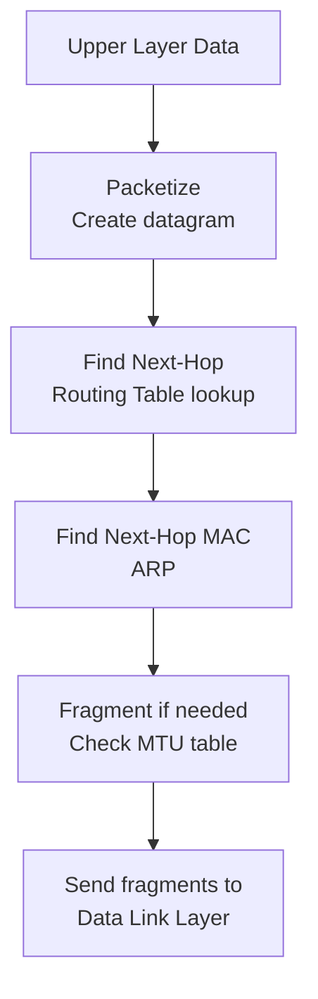
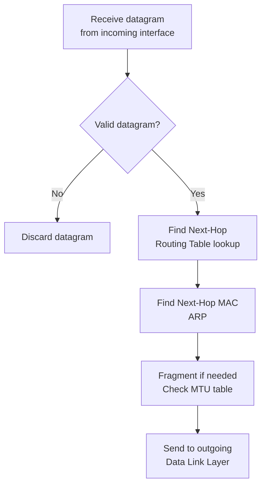
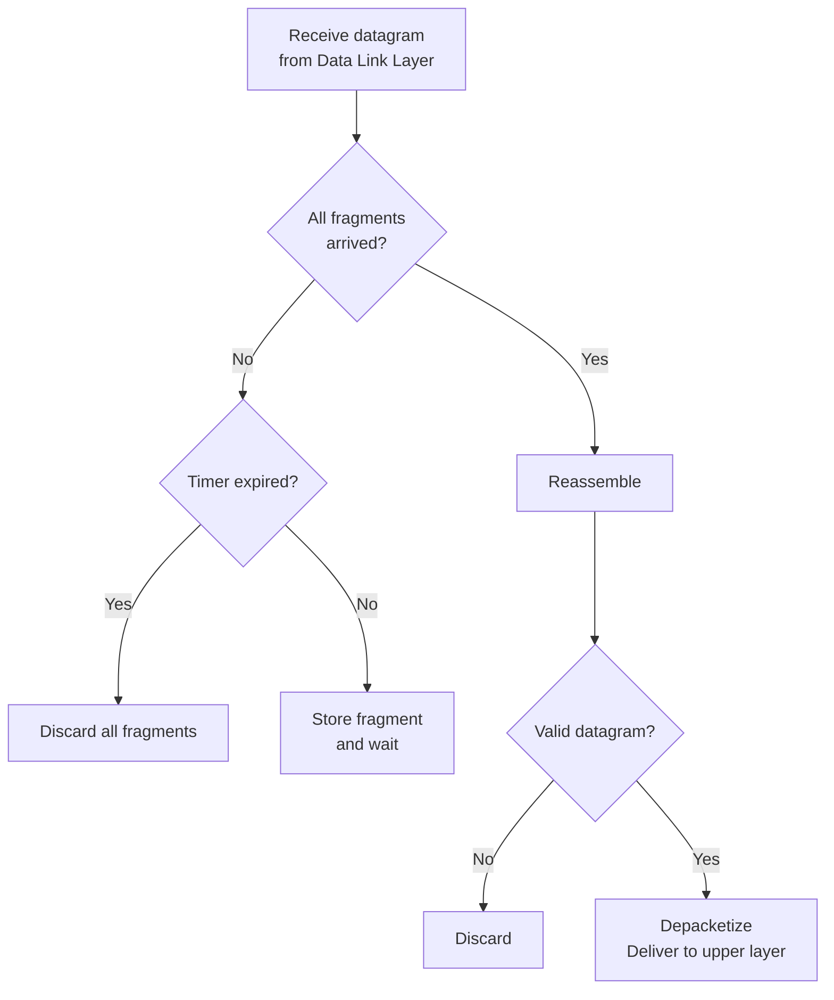

# Chapter 07 — Internet Protocol Version 4 (IPv4)

> **Last Updated:** 2026-03-21

---

## Table of Contents

- [1. Introduction](#1-introduction)
- [2. Datagram](#2-datagram)
  - [2.1 Datagram Structure](#21-datagram-structure)
  - [2.2 Header Fields](#22-header-fields)
- [3. Fragmentation](#3-fragmentation)
  - [3.1 Maximum Transfer Unit (MTU)](#31-maximum-transfer-unit-mtu)
  - [3.2 Fragmentation Fields](#32-fragmentation-fields)
  - [3.3 Fragmentation Example](#33-fragmentation-example)
  - [3.4 Reassembly](#34-reassembly)
- [4. Options](#4-options)
- [5. Checksum](#5-checksum)
- [6. IP Processing](#6-ip-processing)
  - [6.1 At the Source](#61-at-the-source)
  - [6.2 At Each Router](#62-at-each-router)
  - [6.3 At the Destination](#63-at-the-destination)
- [Summary](#summary)
- [Appendix](#appendix)

---

## 1. Introduction

The **Internet Protocol (IP)** is the transmission mechanism used by the TCP/IP protocols. IP is located at the network layer.

Key characteristics:
- **Unreliable**: No guarantee of delivery; packets may be lost, duplicated, or delivered out of order
- **Connectionless**: Each datagram is treated independently; no connection setup
- **Best-effort delivery**: IP makes its best effort to deliver but does not guarantee it

```
+-------------------+
| Application Layer |  SMTP, FTP, DNS, SNMP, DHCP
+-------------------+
| Transport Layer   |  SCTP, TCP, UDP
+---+-------+-------+
|IGMP|ICMP |   IP    |  ARP
+---+-------+---------+
| Data Link Layer   |  Underlying LAN or WAN
+-------------------+
| Physical Layer    |
+-------------------+
```

> **Key Point:** IP provides the foundation for all Internet communication. Its simplicity and connectionless nature allow the Internet to scale, while upper-layer protocols (TCP) add reliability when needed.

---

## 2. Datagram

### 2.1 Datagram Structure

Packets in the IP layer are called **datagrams**. A datagram is a variable-length packet consisting of two parts: **header** (20-60 bytes) and **data**.

```
+------ 20-65,535 bytes total ------+
| Header (20-60 bytes) |    Data    |
+---------------------+------------+
```

### 2.2 Header Fields

The IPv4 header format (minimum 20 bytes, maximum 60 bytes):

```
 0                   1                   2                   3
 0 1 2 3 4 5 6 7 8 9 0 1 2 3 4 5 6 7 8 9 0 1 2 3 4 5 6 7 8 9 0 1
+-+-+-+-+-+-+-+-+-+-+-+-+-+-+-+-+-+-+-+-+-+-+-+-+-+-+-+-+-+-+-+-+
| VER   | HLEN  | Service Type  |         Total Length          |
+-+-+-+-+-+-+-+-+-+-+-+-+-+-+-+-+-+-+-+-+-+-+-+-+-+-+-+-+-+-+-+-+
|        Identification         |Flags|   Fragmentation Offset  |
+-+-+-+-+-+-+-+-+-+-+-+-+-+-+-+-+-+-+-+-+-+-+-+-+-+-+-+-+-+-+-+-+
| Time to Live  |   Protocol    |       Header Checksum         |
+-+-+-+-+-+-+-+-+-+-+-+-+-+-+-+-+-+-+-+-+-+-+-+-+-+-+-+-+-+-+-+-+
|                    Source IP Address                           |
+-+-+-+-+-+-+-+-+-+-+-+-+-+-+-+-+-+-+-+-+-+-+-+-+-+-+-+-+-+-+-+-+
|                 Destination IP Address                         |
+-+-+-+-+-+-+-+-+-+-+-+-+-+-+-+-+-+-+-+-+-+-+-+-+-+-+-+-+-+-+-+-+
|                  Options + Padding (0-40 bytes)                |
+-+-+-+-+-+-+-+-+-+-+-+-+-+-+-+-+-+-+-+-+-+-+-+-+-+-+-+-+-+-+-+-+
```

| Field | Bits | Description |
|-------|------|-------------|
| VER (Version) | 4 | IP protocol version (4 for IPv4) |
| HLEN (Header Length) | 4 | Header length in 4-byte words (min 5 = 20 bytes, max 15 = 60 bytes) |
| Service Type | 8 | Differentiated services (DSCP + ECN) |
| Total Length | 16 | Total datagram length including header (max 65,535 bytes) |
| Identification | 16 | Unique identifier for fragmentation/reassembly |
| Flags | 3 | Fragmentation control bits |
| Fragmentation Offset | 13 | Position of fragment in original datagram (in 8-byte units) |
| Time to Live (TTL) | 8 | Maximum number of hops before discard |
| Protocol | 8 | Upper-layer protocol identifier |
| Header Checksum | 16 | Error detection for the header only |
| Source Address | 32 | IP address of the sender |
| Destination Address | 32 | IP address of the receiver |

**Service Type (Differentiated Services):**

```
+---+---+---+---+---+---+---+---+
|     Codepoint (6 bits)  | ECN (Explicit Congestion Notification)|
+---+---+---+---+---+---+---+---+
```

| Category | Codepoint | Assigning Authority |
|----------|-----------|-------------------|
| 1 | XXXXX0 | Internet |
| 2 | XXXX11 | Local |
| 3 | XXXX01 | Temporary/Experimental |

**Protocol field values (multiplexing):**

| Value | Protocol |
|-------|----------|
| 1 | ICMP |
| 2 | IGMP |
| 6 | TCP |
| 17 | UDP |
| 89 | OSPF |

**Total Length and MTU:**
- The total length field defines the total length of the datagram **including the header**
- Length of data = Total Length - Header Length (HLEN x 4)
- Maximum total length: 65,535 bytes (2^16 - 1)
- Ethernet frame data field: 46-1500 bytes
- If data < 46 bytes, padding is added at the Ethernet frame level

**TTL (Time to Live):**
- Controls the maximum number of **hops** (routers) visited
- Each router decrements TTL by one
- If TTL reaches zero, the router **discards** the datagram and sends an ICMP Time Exceeded message
- Approximately twice the maximum number of routers between any two hosts
- Setting TTL to 1 limits the packet to the **local network**

**Source and Destination Addresses:**
- Both are 32 bits, defining the IP addresses of source and destination
- These addresses remain **unchanged** during the entire journey from source to destination

---

## 3. Fragmentation

### 3.1 Maximum Transfer Unit (MTU)

Each network technology has a **Maximum Transfer Unit (MTU)** -- the maximum data size that can be encapsulated in a frame:

| Network | MTU (bytes) |
|---------|-------------|
| Ethernet | 1500 |
| PPP | 296-1500 |
| FDDI | 4352 |
| Token Ring | 4464 |

When a datagram is larger than the MTU of the outgoing link, it must be **fragmented**.

### 3.2 Fragmentation Fields

Three header fields handle fragmentation:

**1. Identification (16 bits):**
- Same for all fragments of the same original datagram
- Used by the destination to group fragments for reassembly

**2. Flags (3 bits):**

| Bit | Name | Meaning |
|-----|------|---------|
| 0 | Reserved | Always 0 |
| 1 | DF (Don't Fragment) | 0 = may fragment, 1 = do not fragment |
| 2 | MF (More Fragments) | 0 = last fragment, 1 = more fragments follow |

**3. Fragmentation Offset (13 bits):**
- Specifies the position of the fragment's data relative to the original datagram
- Measured in **8-byte units** (multiply by 8 to get byte offset)
- This means fragments (except the last) must have a data size that is a **multiple of 8 bytes**

### 3.3 Fragmentation Example

Original datagram: 4000 bytes total (20-byte header + 3980 bytes data), MTU = 1500:

```
Maximum data per fragment = MTU - header = 1500 - 20 = 1480 bytes
Number of fragments = ceil(3980 / 1480) = 3
```

| Fragment | Total Length | Data Size | Offset | MF | Identification |
|----------|-------------|-----------|--------|-----|---------------|
| 1 | 1500 | 1480 | 0 | 1 | x |
| 2 | 1500 | 1480 | 185 (1480/8) | 1 | x |
| 3 | 1040 | 1020 | 370 (2960/8) | 0 | x |

### 3.4 Reassembly

Reassembly is performed **only at the destination** (not at intermediate routers):
- Fragments may take different paths and arrive out of order
- The destination uses the Identification field to group fragments
- The Offset field determines the order
- The MF flag indicates the last fragment
- A **reassembly timer** ensures fragments do not wait indefinitely
- If the timer expires before all fragments arrive, all collected fragments are **discarded**

> **Key Point:** Fragmentation occurs at any router where the outgoing MTU is smaller than the datagram, but reassembly occurs only at the final destination.

---

## 4. Options

IP options provide additional functionality but are rarely used. They appear after the standard 20-byte header:

| Option | Description |
|--------|-------------|
| No Operation | 1-byte padding |
| End of Options | Marks the end of options list |
| Record Route | Records the route taken by the datagram |
| Strict Source Route | Specifies the exact route to follow |
| Loose Source Route | Specifies intermediate routers that must be visited |
| Timestamp | Records timestamps at each router |

---

## 5. Checksum

The **header checksum** protects against corruption of the IP header during transmission:
- It is **redundant information** added to the packet
- The receiver repeats the calculation and compares
- If the result is not satisfactory, the packet is **rejected**
- The checksum covers **only the header**, not the data
- The checksum must be **recalculated at each router** because TTL changes

**Checksum calculation:**
1. Divide the header into 16-bit words
2. Set the checksum field to zero
3. Add all 16-bit words using one's complement arithmetic
4. Take the one's complement of the sum

---

## 6. IP Processing

### 6.1 At the Source



### 6.2 At Each Router



### 6.3 At the Destination



---

## Summary

| Concept | Key Point |
|---------|-----------|
| IPv4 | Unreliable, connectionless, best-effort delivery protocol |
| Datagram | Variable-length packet: header (20-60 bytes) + data |
| TTL | Hop counter; each router decrements by 1; discard at 0 |
| Protocol Field | Identifies upper-layer protocol (1=ICMP, 6=TCP, 17=UDP) |
| Checksum | Covers header only; recalculated at each hop |
| Fragmentation | Split datagram when > MTU; offset in 8-byte units |
| Reassembly | Only at destination; uses ID, offset, MF flag |
| Source/Dest IP | Remain unchanged during entire transit |

---

## Appendix

### A. HLEN Calculation

- HLEN value 5 (binary 0101): 5 x 4 = **20 bytes** (minimum, no options)
- HLEN value 15 (binary 1111): 15 x 4 = **60 bytes** (maximum, with options)

### B. Fragmentation Calculation Steps

Given: Original datagram = 4000 bytes, MTU = 1400

1. Original data = 4000 - 20 = 3980 bytes
2. Max data per fragment = 1400 - 20 = 1380 bytes
3. Round down to multiple of 8: 1380 -> 1376 bytes (1376 / 8 = 172)
4. Number of full fragments: floor(3980 / 1376) = 2
5. Last fragment data: 3980 - 2 x 1376 = 1228 bytes

| Fragment | Data Size | Offset | MF |
|----------|-----------|--------|-----|
| 1 | 1376 | 0 | 1 |
| 2 | 1376 | 172 | 1 |
| 3 | 1228 | 344 | 0 |

### C. Path MTU Discovery

**Path MTU Discovery (PMTUD)** determines the smallest MTU along the entire path:
1. Source sends datagrams with DF (Don't Fragment) flag set
2. If a router encounters MTU smaller than datagram, it drops the packet and sends ICMP "Fragmentation Needed" message
3. Source reduces datagram size and retries
4. Process repeats until the datagram can traverse the entire path without fragmentation
