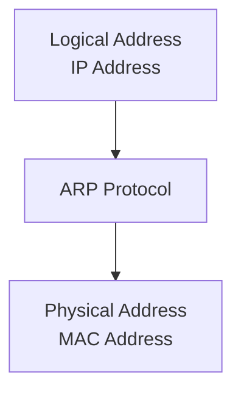
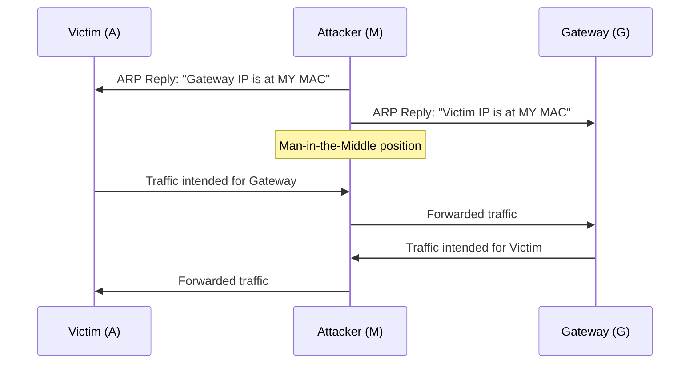

# Chapter 08 — 주소 결정 프로토콜 (ARP)

> **최종 수정일:** 2026-04-01
>
> Forouzan, TCP/IP Protocol Suite 4th Ed. Ch 8

> **선수 지식**: [컴퓨터네트워크] IPv4 프로토콜 (제5-7장).
>
> **학습 목표**:
> 1. 주소 결정 프로토콜(ARP) 과정을 설명할 수 있다
> 2. ARP 캐시 관리와 타임아웃을 설명할 수 있다
> 3. ARP와 RARP, 프록시 ARP를 구분할 수 있다

---

## 목차

- [1. 주소 매핑](#1-주소-매핑)
  - [1.1 정적 매핑](#11-정적-매핑)
  - [1.2 동적 매핑](#12-동적-매핑)
- [2. ARP 프로토콜](#2-arp-프로토콜)
  - [2.1 ARP 동작](#21-arp-동작)
  - [2.2 ARP 패킷 형식](#22-arp-패킷-형식)
  - [2.3 ARP 캡슐화](#23-arp-캡슐화)
  - [2.4 ARP 캐시](#24-arp-캐시)
- [3. ARP를 사용하는 네 가지 경우](#3-arp를-사용하는-네-가지-경우)
- [4. 프록시 ARP](#4-프록시-arp)
- [5. ARP 보안](#5-arp-보안)
  - [5.1 ARP 스푸핑](#51-arp-스푸핑)
  - [5.2 대응 방안](#52-대응-방안)
- [요약](#요약)
- [부록](#부록)

---

<br>

## 1. 주소 매핑

패킷을 호스트나 라우터에 전달하려면 **두 수준의 주소 지정** 이 필요하다: **논리적(IP) 주소** 와 **물리적(MAC) 주소**.

논리적 주소를 해당하는 물리적 주소로, 그리고 그 반대로 매핑할 수 있어야 한다. 이는 **정적** 또는 **동적** 매핑을 사용하여 수행할 수 있다.

### 1.1 정적 매핑

- 논리적 주소와 물리적 주소를 연결하는 테이블을 생성
- 이 테이블은 네트워크의 각 장비에 저장됨
- 각 장비는 다른 장비의 IP 주소를 알고 있으며 해당 물리적 주소를 조회할 수 있음

**한계:**
- 물리적 주소가 변경될 수 있음 (NIC 교체, 모바일 컴퓨터 이동)
- 변경이 발생할 때마다 테이블을 수동으로 업데이트해야 함
- 네트워크 규모가 커지면 유지보수 부담이 증가

### 1.2 동적 매핑

- 장비가 두 주소 중 하나(논리적 또는 물리적)를 알고 있을 때마다 프로토콜을 사용하여 다른 주소를 찾을 수 있음
- **ARP (Address Resolution Protocol)**: 논리적 주소를 물리적 주소로 매핑
- 수동 테이블 유지보수의 필요성을 제거



> **핵심 포인트:** ARP는 IP 주소를 MAC 주소로 동적으로 매핑하여 정적 주소 테이블의 필요성을 제거한다.

---

<br>

## 2. ARP 프로토콜

### 2.1 ARP 동작

ARP는 IP 주소를 물리적(MAC) 주소와 연결한다. 일반적인 물리적 네트워크(LAN 등)에서 링크의 각 장치는 보통 NIC에 새겨져 있는 물리적 또는 스테이션 주소로 식별된다.

ARP는 IP 프로토콜로부터 논리적 주소를 받아들이고, 해당하는 물리적 주소로 매핑한 후 데이터 링크 계층에 전달한다.

```
            ICMP    IGMP
Network  +---+---+---------+
Layer    |       |   IP    |  Logical
         |       |         |  address
         |       +---------+    |
         |           |    +-----v-----+
         |           |    |    ARP    |
         +-----------+----+-----------+
                                |
                          Physical address
                                |
                          Data Link Layer
```

**ARP 동작 (호스트 A가 동일 LAN에 있는 호스트 B에게 전송하려는 경우):**

1. A가 B의 물리적 주소를 위해 **ARP 캐시** 를 확인
2. 발견되면 캐시된 주소를 사용
3. 발견되지 않으면 A가 **ARP 요청** 메시지를 생성하고 LAN의 모든 호스트에 **브로드캐스트** (목적지 MAC = `FF:FF:FF:FF:FF:FF`)
4. B가 ARP 요청을 수신하고, 자신의 IP 주소를 인식하여 물리적 주소를 포함하는 **ARP 응답** 을 생성
5. B가 A에게 직접 **유니캐스트** 로 ARP 응답을 전송
6. A가 B의 물리적 주소를 ARP 캐시에 저장 (일반적으로 **20분**)
7. 대상 IP 주소와 일치하지 않는 다른 모든 호스트는 요청을 **무시**

> **핵심 포인트:** ARP 요청은 **브로드캐스트** 이고, ARP 응답은 **유니캐스트** 이다.

### 2.2 ARP 패킷 형식

```
 0                   1                   2                   3
 0 1 2 3 4 5 6 7 8 9 0 1 2 3 4 5 6 7 8 9 0 1 2 3 4 5 6 7 8 9 0 1
+-+-+-+-+-+-+-+-+-+-+-+-+-+-+-+-+-+-+-+-+-+-+-+-+-+-+-+-+-+-+-+-+
|         Hardware Type         |         Protocol Type         |
+-+-+-+-+-+-+-+-+-+-+-+-+-+-+-+-+-+-+-+-+-+-+-+-+-+-+-+-+-+-+-+-+
| Hw Addr Len   | Proto Addr Len|          Operation            |
+-+-+-+-+-+-+-+-+-+-+-+-+-+-+-+-+-+-+-+-+-+-+-+-+-+-+-+-+-+-+-+-+
|                  Sender Hardware Address                       |
|                       (6 bytes for Ethernet)                  |
+-+-+-+-+-+-+-+-+-+-+-+-+-+-+-+-+-+-+-+-+-+-+-+-+-+-+-+-+-+-+-+-+
|                  Sender Protocol Address                       |
|                       (4 bytes for IPv4)                      |
+-+-+-+-+-+-+-+-+-+-+-+-+-+-+-+-+-+-+-+-+-+-+-+-+-+-+-+-+-+-+-+-+
|                  Target Hardware Address                       |
|            (6 bytes for Ethernet, unknown in request)         |
+-+-+-+-+-+-+-+-+-+-+-+-+-+-+-+-+-+-+-+-+-+-+-+-+-+-+-+-+-+-+-+-+
|                  Target Protocol Address                       |
|                       (4 bytes for IPv4)                      |
+-+-+-+-+-+-+-+-+-+-+-+-+-+-+-+-+-+-+-+-+-+-+-+-+-+-+-+-+-+-+-+-+
```

| 필드 | 설명 |
|-------|-------------|
| Hardware Type | 네트워크 유형 (Ethernet = 1) |
| Protocol Type | 정의 프로토콜 (IPv4 = 0x0800) |
| Hardware Length | 물리적 주소의 바이트 단위 길이 (Ethernet = 6) |
| Protocol Length | 논리적 주소의 바이트 단위 길이 (IPv4 = 4) |
| Operation | 패킷 유형: ARP Request (1), ARP Reply (2) |
| Sender Hardware Address | 송신자의 물리적(MAC) 주소 |
| Sender Protocol Address | 송신자의 논리적(IP) 주소 |
| Target Hardware Address | 수신자의 물리적 주소 (요청 시 미지, 0으로 채움) |
| Target Protocol Address | 수신자의 논리적(IP) 주소 |

### 2.3 ARP 캡슐화

ARP 패킷은 Ethernet 프레임에 직접 캡슐화된다:

```
+-----------+-------------+-------------+------+-------------------+-----+
| Preamble  | Destination | Source      | Type | ARP Request       | CRC |
| and SFD   | Address     | Address     |      | or Reply Packet   |     |
+-----------+-------------+-------------+------+-------------------+-----+
  8 bytes      6 bytes      6 bytes     2 bytes                    4 bytes
```

- **Type 필드**: `0x0806` (ARP 페이로드를 나타냄)
- ARP 요청의 경우: 목적지 MAC = `FF:FF:FF:FF:FF:FF` (브로드캐스트)
- ARP 응답의 경우: 목적지 MAC = 요청의 송신자 MAC (유니캐스트)

**ARP 캡슐화 단계:**
1. 송신자가 대상 IP 주소를 알고 있음
2. IP가 ARP에 ARP 요청 생성을 요청 (송신자 PHY 주소, IP 주소; 대상 IP 주소, PHY 주소 = 미지)
3. 데이터 링크 계층이 캡슐화: 송신자 주소 = 송신자 PHY, 대상 주소 = 브로드캐스트
4. 모든 호스트/라우터가 프레임을 수신하고 자신의 ARP에 전달
5. 대상 시스템이 자신의 PHY 주소를 포함하는 ARP 응답을 전송 (유니캐스트)
6. 송신자가 응답을 수신하고 대상의 PHY 주소를 학습
7. IP 데이터그램이 프레임에 캡슐화되어 유니캐스트로 대상에 전송

### 2.4 ARP 캐시

ARP 캐시는 최근에 해석된 주소 매핑을 저장한다:
- 항목에는 **유효 시간(Time-to-Live)** 이 있음 (일반적으로 20분)
- 만료된 항목은 제거됨
- 반복적인 ARP 요청을 피함으로써 네트워크 트래픽을 줄임

```
$ arp -a
? (192.168.1.1) at aa:bb:cc:dd:ee:ff on en0 [ethernet]
? (192.168.1.100) at 11:22:33:44:55:66 on en0 [ethernet]
```

---

<br>

## 3. ARP를 사용하는 네 가지 경우

ARP는 송신자와 수신자의 관계에 따라 네 가지 다른 시나리오에서 사용된다:

```mermaid
graph TD
    subgraph "Case 1: Host to Host (Same Network)"
        A1[Host] -->|Target IP = Dest IP in datagram| B1[Host]
    end
    subgraph "Case 2: Host to Host (Different Network)"
        A2[Host] -->|Target IP = Default Router IP| R2[Router]
        R2 -->|Other network| B2[Host]
    end
    subgraph "Case 3: Router to Router (Different Network)"
        R3a[Router] -->|Target IP = Next-hop Router IP| R3b[Router]
    end
    subgraph "Case 4: Router to Host (Same Network)"
        R4[Router] -->|Target IP = Dest IP in datagram| B4[Host]
    end
```



| 경우 | 송신자 | 수신자 | ARP의 대상 IP |
|------|--------|----------|-------------------|
| 1 | 호스트 | 호스트 (동일 네트워크) | 데이터그램의 목적지 IP |
| 2 | 호스트 | 호스트 (다른 네트워크) | **기본 게이트웨이/라우터** 의 IP 주소 |
| 3 | 라우터 | 라우터 (다른 네트워크) | **다음 홉 라우터** 의 IP 주소 |
| 4 | 라우터 | 호스트 (동일 네트워크) | 데이터그램의 목적지 IP |

> **핵심 포인트:** 목적지가 다른 네트워크에 있을 때 ARP는 최종 목적지 호스트가 아닌 다음 홉 라우터의 MAC 주소를 해석한다.

---

<br>

## 4. 프록시 ARP

**프록시 ARP** 는 라우터가 다른 네트워크에 있는 호스트를 대신하여 ARP 요청에 응답할 수 있게 한다:
- 라우터가 자신의 MAC 주소로 ARP 요청에 응답
- 송신 호스트는 목적지가 로컬 네트워크에 있다고 믿게 됨
- 호스트에 라우팅을 설정하지 않고도 서브넷을 연결하는 데 유용
- 오용 시 보안 문제를 일으킬 수 있음

---

<br>

## 5. ARP 보안

*ARP에 관한 학생 발표 자료에서 통합*

### 5.1 ARP 스푸핑

**ARP 스푸핑**(ARP 포이즈닝이라고도 함)은 악의적인 호스트가 위조된 ARP 응답을 보내는 공격이다:



**ARP 스푸핑으로 가능한 공격:**
- **중간자 공격(Man-in-the-Middle, MITM)**: 트래픽을 가로채고 잠재적으로 수정
- **세션 하이재킹(Session Hijacking)**: 인증된 세션을 탈취
- **서비스 거부(Denial of Service)**: 존재하지 않는 MAC 주소로 트래픽을 리다이렉트
- **트래픽 스니핑(Traffic Sniffing)**: 민감한 데이터(비밀번호, 자격 증명) 캡처

### 5.2 대응 방안

| 대응 방안 | 설명 |
|---------------|-------------|
| 정적 ARP 항목 | 중요한 매핑을 수동으로 설정 (확장성 부족) |
| Dynamic ARP Inspection (DAI) | 스위치가 DHCP 스누핑 데이터베이스에 대해 ARP 패킷을 검증 |
| ARP Watch | 이상 징후에 대해 ARP 트래픽을 모니터링하는 소프트웨어 |
| 802.1X | 포트 기반 네트워크 접근 제어 |
| 암호화 (TLS/SSL) | 트래픽이 가로채져도 읽을 수 없음 |
| VPN | 암호화된 터널이 ARP 공격을 무력화 |

---

<br>

## 요약

| 개념 | 핵심 포인트 |
|---------|-----------|
| 주소 매핑 | 두 수준 필요: 논리적(IP)과 물리적(MAC) |
| 정적 매핑 | 수동 테이블; 유연하지 않고 유지보수 부담이 큼 |
| 동적 매핑 (ARP) | 브로드캐스트/유니캐스트를 통한 자동 IP-to-MAC 해석 |
| ARP 요청 | LAN의 모든 호스트에 브로드캐스트 |
| ARP 응답 | 요청자에게 유니캐스트로 회신 |
| ARP 캐시 | 트래픽을 줄이기 위해 매핑을 약 20분간 저장 |
| 네 가지 ARP 경우 | 대상 IP는 목적지가 로컬인지 원격인지에 따라 달라짐 |
| ARP 스푸핑 | 위조된 ARP 응답으로 MITM 공격 가능 |

---

<br>

## 부록

### A. ARP vs. RARP

| 특징 | ARP | RARP |
|---------|-----|------|
| 방향 | IP --> MAC | MAC --> IP |
| 사용 사례 | 일반 통신 | 디스크 없는 워크스테이션 (구식) |
| 대체 | 여전히 사용 중 | BOOTP/DHCP로 대체됨 |

### B. 무상 ARP (Gratuitous ARP)

**무상 ARP** 는 송신자가 송신자와 대상 IP 모두를 자신의 주소로 설정하는 ARP 요청이다:
- IP 주소 충돌을 감지하는 데 사용
- 주소가 변경될 때 다른 호스트의 ARP 캐시를 업데이트
- 호스트가 부팅하거나 IP 주소를 변경할 때 발표됨

### C. ARP 명령 예제

```bash
# ARP 캐시 조회
arp -a

# 정적 ARP 항목 추가
arp -s 192.168.1.1 aa:bb:cc:dd:ee:ff

# ARP 항목 삭제
arp -d 192.168.1.1

# 전체 ARP 캐시 삭제 (Linux)
ip -s -s neigh flush all
```
