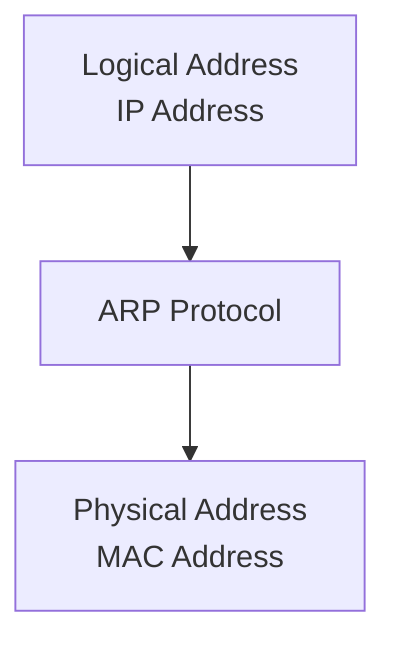
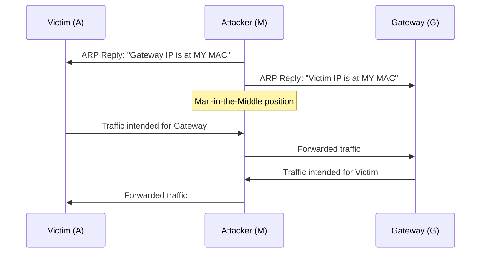

# Chapter 08 — Address Resolution Protocol (ARP)

> **Last Updated:** 2026-04-01
>
> Forouzan, TCP/IP Protocol Suite 4th Ed. Ch 8

> **Prerequisites**: [Computer Networks] IPv4 protocol (Ch 5-7).
>
> **Learning Objectives**:
> 1. Explain the Address Resolution Protocol (ARP) process
> 2. Describe ARP cache management and timeouts
> 3. Distinguish ARP from RARP and proxy ARP

---

## Table of Contents

- [1. Address Mapping](#1-address-mapping)
  - [1.1 Static Mapping](#11-static-mapping)
  - [1.2 Dynamic Mapping](#12-dynamic-mapping)
- [2. The ARP Protocol](#2-the-arp-protocol)
  - [2.1 ARP Operation](#21-arp-operation)
  - [2.2 ARP Packet Format](#22-arp-packet-format)
  - [2.3 ARP Encapsulation](#23-arp-encapsulation)
  - [2.4 ARP Cache](#24-arp-cache)
- [3. Four Cases Using ARP](#3-four-cases-using-arp)
- [4. Proxy ARP](#4-proxy-arp)
- [5. ARP Security](#5-arp-security)
  - [5.1 ARP Spoofing](#51-arp-spoofing)
  - [5.2 Countermeasures](#52-countermeasures)
- [Summary](#summary)
- [Appendix](#appendix)

---

<br>

## 1. Address Mapping

The delivery of packets to a host or a router requires **two levels of addressing**: **logical (IP) address** and **physical (MAC) address**.

We need to be able to map a logical address to its corresponding physical address and vice versa. This can be done using either **static** or **dynamic** mapping.

### 1.1 Static Mapping

- Creating a table that associates a logical address with a physical address
- This table is stored in each machine on the network
- Each machine knows the IP address of another machine and can look up its physical address

**Limitations:**
- Physical addresses may change (changing NIC, moving mobile computer)
- The table must be manually updated whenever a change occurs
- Maintenance overhead increases with network size

### 1.2 Dynamic Mapping

- Each time a machine knows one of the two addresses (logical or physical), it can use a protocol to find the other
- **ARP (Address Resolution Protocol)**: Maps logical address to physical address
- Eliminates the need for manual table maintenance



> **Key Point:** ARP dynamically maps IP addresses to MAC addresses, eliminating the need for static address tables.

---

<br>

## 2. The ARP Protocol

### 2.1 ARP Operation

ARP associates an IP address with its physical (MAC) address. On a typical physical network (such as a LAN), each device on a link is identified by a physical or station address that is usually imprinted on the NIC.

ARP accepts a logical address from the IP protocol, maps it to the corresponding physical address, and passes it to the data link layer.

```
            ICMP    IGMP
Network  +---+---+---------+
Layer    |       |   IP    |  Logical
         |       |         |  address
         |       +---------+    |
         |           |    +-----v-----+
         |           |    |    ARP    |
         +-----------+----+-----------+
                                |
                          Physical address
                                |
                          Data Link Layer
```

**ARP operation (Host A wants to send to Host B on the same LAN):**

1. A checks its **ARP cache** for B's physical address
2. If found, use the cached address
3. If not found, A creates an **ARP Request** message and **broadcasts** it to all hosts on the LAN (destination MAC = `FF:FF:FF:FF:FF:FF`)
4. B receives the ARP Request, recognizes its own IP address, and creates an **ARP Reply** containing its physical address
5. B sends the ARP Reply as a **unicast** directly back to A
6. A stores B's physical address in its ARP cache (typically for **20 minutes**)
7. All other hosts that do not match the target IP address **ignore** the request

> **Key Point:** An ARP request is **broadcast**; an ARP reply is **unicast**.

### 2.2 ARP Packet Format

```
 0                   1                   2                   3
 0 1 2 3 4 5 6 7 8 9 0 1 2 3 4 5 6 7 8 9 0 1 2 3 4 5 6 7 8 9 0 1
+-+-+-+-+-+-+-+-+-+-+-+-+-+-+-+-+-+-+-+-+-+-+-+-+-+-+-+-+-+-+-+-+
|         Hardware Type         |         Protocol Type         |
+-+-+-+-+-+-+-+-+-+-+-+-+-+-+-+-+-+-+-+-+-+-+-+-+-+-+-+-+-+-+-+-+
| Hw Addr Len   | Proto Addr Len|          Operation            |
+-+-+-+-+-+-+-+-+-+-+-+-+-+-+-+-+-+-+-+-+-+-+-+-+-+-+-+-+-+-+-+-+
|                  Sender Hardware Address                       |
|                       (6 bytes for Ethernet)                  |
+-+-+-+-+-+-+-+-+-+-+-+-+-+-+-+-+-+-+-+-+-+-+-+-+-+-+-+-+-+-+-+-+
|                  Sender Protocol Address                       |
|                       (4 bytes for IPv4)                      |
+-+-+-+-+-+-+-+-+-+-+-+-+-+-+-+-+-+-+-+-+-+-+-+-+-+-+-+-+-+-+-+-+
|                  Target Hardware Address                       |
|            (6 bytes for Ethernet, unknown in request)         |
+-+-+-+-+-+-+-+-+-+-+-+-+-+-+-+-+-+-+-+-+-+-+-+-+-+-+-+-+-+-+-+-+
|                  Target Protocol Address                       |
|                       (4 bytes for IPv4)                      |
+-+-+-+-+-+-+-+-+-+-+-+-+-+-+-+-+-+-+-+-+-+-+-+-+-+-+-+-+-+-+-+-+
```

| Field | Description |
|-------|-------------|
| Hardware Type | Type of network (Ethernet = 1) |
| Protocol Type | Defining protocol (IPv4 = 0x0800) |
| Hardware Length | Length of physical address in bytes (Ethernet = 6) |
| Protocol Length | Length of logical address in bytes (IPv4 = 4) |
| Operation | Type of packet: ARP Request (1), ARP Reply (2) |
| Sender Hardware Address | Sender's physical (MAC) address |
| Sender Protocol Address | Sender's logical (IP) address |
| Target Hardware Address | Receiver's physical address (unknown in request, filled to 0) |
| Target Protocol Address | Receiver's logical (IP) address |

### 2.3 ARP Encapsulation

An ARP packet is encapsulated directly in an Ethernet frame:

```
+-----------+-------------+-------------+------+-------------------+-----+
| Preamble  | Destination | Source      | Type | ARP Request       | CRC |
| and SFD   | Address     | Address     |      | or Reply Packet   |     |
+-----------+-------------+-------------+------+-------------------+-----+
  8 bytes      6 bytes      6 bytes     2 bytes                    4 bytes
```

- **Type field**: `0x0806` (indicates ARP payload)
- For ARP Request: Destination MAC = `FF:FF:FF:FF:FF:FF` (broadcast)
- For ARP Reply: Destination MAC = Sender's MAC from the request (unicast)

**ARP Encapsulation steps:**
1. Sender knows the target IP address
2. IP asks ARP to create an ARP Request (sender PHY addr, IP addr; target IP addr, PHY addr = unknown)
3. Data Link Layer encapsulates: sender addr = sender PHY, target addr = broadcast
4. All hosts/routers receive the frame and pass it to their ARP
5. Target system sends ARP Reply containing its PHY address (unicast)
6. Sender receives reply and learns target's PHY address
7. IP datagram is encapsulated in frame and sent to target via unicast

### 2.4 ARP Cache

The ARP cache stores recently resolved address mappings:
- Entries have a **time-to-live** (typically 20 minutes)
- Expired entries are removed
- Reduces network traffic by avoiding repeated ARP requests

```
$ arp -a
? (192.168.1.1) at aa:bb:cc:dd:ee:ff on en0 [ethernet]
? (192.168.1.100) at 11:22:33:44:55:66 on en0 [ethernet]
```

---

<br>

## 3. Four Cases Using ARP

ARP is used in four different scenarios depending on the relationship between sender and receiver:

```mermaid
graph TD
    subgraph "Case 1: Host to Host (Same Network)"
        A1[Host] -->|Target IP = Dest IP in datagram| B1[Host]
    end
    subgraph "Case 2: Host to Host (Different Network)"
        A2[Host] -->|Target IP = Default Router IP| R2[Router]
        R2 -->|Other network| B2[Host]
    end
    subgraph "Case 3: Router to Router (Different Network)"
        R3a[Router] -->|Target IP = Next-hop Router IP| R3b[Router]
    end
    subgraph "Case 4: Router to Host (Same Network)"
        R4[Router] -->|Target IP = Dest IP in datagram| B4[Host]
    end
```



| Case | Sender | Receiver | Target IP for ARP |
|------|--------|----------|-------------------|
| 1 | Host | Host (same network) | Destination IP in the datagram |
| 2 | Host | Host (different network) | IP address of the **default gateway/router** |
| 3 | Router | Router (different network) | IP address of the **next-hop router** |
| 4 | Router | Host (same network) | Destination IP in the datagram |

> **Key Point:** When the destination is on a different network, ARP resolves the MAC address of the next-hop router, not the final destination host.

---

<br>

## 4. Proxy ARP

**Proxy ARP** allows a router to respond to ARP requests on behalf of hosts on another network:
- The router answers ARP requests with its own MAC address
- The sending host believes the destination is on the local network
- Useful for connecting subnets without configuring routing on the hosts
- Can create security concerns if misused

---

<br>

## 5. ARP Security

*Integrated from student presentation materials on ARP*

### 5.1 ARP Spoofing

**ARP Spoofing** (also called ARP poisoning) is an attack where a malicious host sends forged ARP replies:



**Attacks enabled by ARP spoofing:**
- **Man-in-the-Middle (MITM)**: Intercepting and potentially modifying traffic
- **Session Hijacking**: Taking over an authenticated session
- **Denial of Service**: Redirecting traffic to a non-existent MAC address
- **Traffic Sniffing**: Capturing sensitive data (passwords, credentials)

### 5.2 Countermeasures

| Countermeasure | Description |
|---------------|-------------|
| Static ARP Entries | Manually configure critical mappings (not scalable) |
| Dynamic ARP Inspection (DAI) | Switch validates ARP packets against DHCP snooping database |
| ARP Watch | Software that monitors ARP traffic for anomalies |
| 802.1X | Port-based network access control |
| Encryption (TLS/SSL) | Even if traffic is intercepted, it cannot be read |
| VPN | Encrypted tunnel prevents ARP attacks from being useful |

---

<br>

## Summary

| Concept | Key Point |
|---------|-----------|
| Address Mapping | Two levels needed: logical (IP) and physical (MAC) |
| Static Mapping | Manual table; inflexible, high maintenance |
| Dynamic Mapping (ARP) | Automatic IP-to-MAC resolution via broadcast/unicast |
| ARP Request | Broadcast to all hosts on the LAN |
| ARP Reply | Unicast back to the requester |
| ARP Cache | Stores mappings for ~20 minutes to reduce traffic |
| Four ARP Cases | Target IP depends on whether destination is local or remote |
| ARP Spoofing | Forged ARP replies enable MITM attacks |

---

<br>

## Appendix

### A. ARP vs. RARP

| Feature | ARP | RARP |
|---------|-----|------|
| Direction | IP --> MAC | MAC --> IP |
| Use case | Normal communication | Diskless workstations (obsolete) |
| Replacement | Still in use | Replaced by BOOTP/DHCP |

### B. Gratuitous ARP

A **gratuitous ARP** is an ARP request where the sender sets both the sender and target IP to its own address:
- Used to detect IP address conflicts
- Updates ARP caches of other hosts when an address changes
- Announced when a host boots or changes its IP address

### C. ARP Command Examples

```bash
# View ARP cache
arp -a

# Add static ARP entry
arp -s 192.168.1.1 aa:bb:cc:dd:ee:ff

# Delete ARP entry
arp -d 192.168.1.1

# Clear entire ARP cache (Linux)
ip -s -s neigh flush all
```
