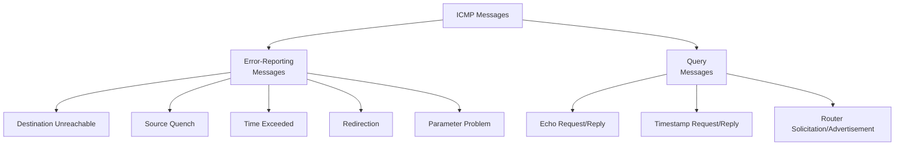
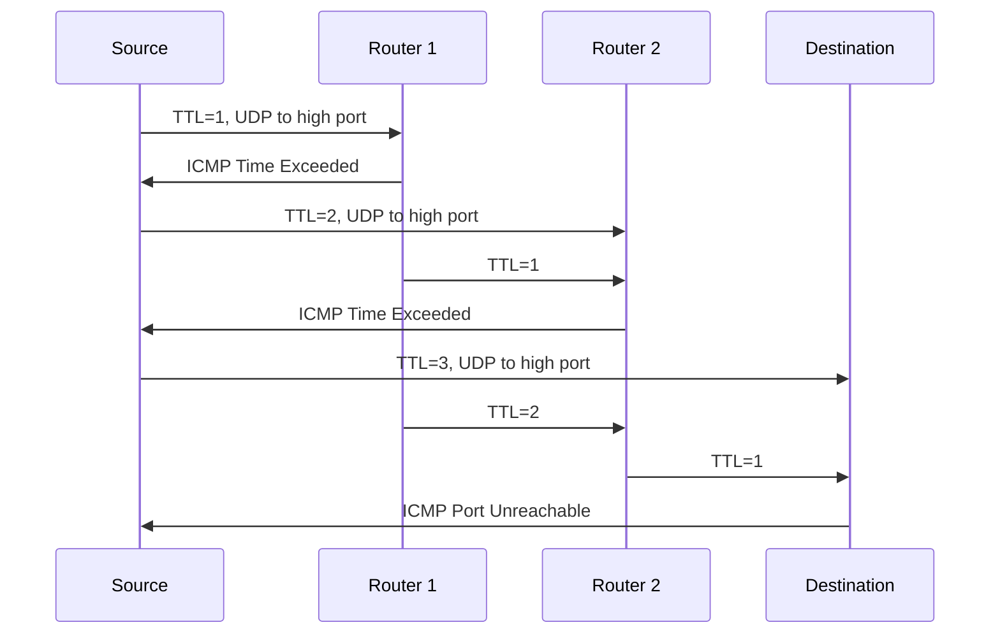

# Chapter 09 — 인터넷 제어 메시지 프로토콜 버전 4 (ICMPv4)

> **최종 수정일:** 2026-03-21

---

## 목차

- [1. 개요](#1-개요)
  - [1.1 ICMP가 필요한 이유](#11-icmp가-필요한-이유)
  - [1.2 TCP/IP에서 ICMP의 위치](#12-tcpip에서-icmp의-위치)
  - [1.3 ICMP 캡슐화](#13-icmp-캡슐화)
- [2. ICMP 메시지](#2-icmp-메시지)
  - [2.1 메시지 범주](#21-메시지-범주)
  - [2.2 오류 보고 메시지](#22-오류-보고-메시지)
  - [2.3 질의 메시지](#23-질의-메시지)
- [3. 오류 보고 메시지 상세](#3-오류-보고-메시지-상세)
  - [3.1 목적지 도달 불가](#31-목적지-도달-불가)
  - [3.2 출발지 억제 (사용 중단)](#32-출발지-억제-사용-중단)
  - [3.3 시간 초과](#33-시간-초과)
  - [3.4 리다이렉션](#34-리다이렉션)
  - [3.5 파라미터 문제](#35-파라미터-문제)
- [4. 질의 메시지 상세](#4-질의-메시지-상세)
  - [4.1 에코 요청 및 응답](#41-에코-요청-및-응답)
  - [4.2 타임스탬프 요청 및 응답](#42-타임스탬프-요청-및-응답)
  - [4.3 라우터 요청 및 광고](#43-라우터-요청-및-광고)
- [5. ICMP 응용](#5-icmp-응용)
  - [5.1 Ping](#51-ping)
  - [5.2 Traceroute](#52-traceroute)
- [6. ICMP 보안 고려사항](#6-icmp-보안-고려사항)
- [요약](#요약)
- [부록](#부록)

---

## 1. 개요

### 1.1 ICMP가 필요한 이유

IP는 여러 한계를 가진 **비신뢰적이고 비연결형**인 데이터그램 전달 프로토콜이다:
- **오류 제어 없이** 최선형 전달 서비스
- **오류 보고** 및 오류 수정 메커니즘 없음
- 호스트 및 관리 질의를 위한 **메커니즘 없음**

**ICMP는 위의 결함을 보완하기 위해 설계되었다.** 그러나 ICMP는 오류를 수정하지 않고 단순히 보고만 한다. 오류 수정은 상위 계층 프로토콜에 맡긴다.

### 1.2 TCP/IP에서 ICMP의 위치

ICMP는 IP와 함께 **네트워크 계층**에서 동작한다:

```
+---+------+--------+
|IGMP| ICMP |   IP   |   ARP
+---+------+--------+
```

- ICMP는 네트워크 계층 프로토콜로 간주됨
- 그러나 그 메시지는 IP 데이터그램 내에 캡슐화됨 (상위 계층 프로토콜처럼)
- ICMP는 IP를 신뢰적으로 만들지 않으며, 문제에 대한 피드백만 제공

### 1.3 ICMP 캡슐화

ICMP 메시지는 IP 데이터그램 내에 캡슐화된다:

```
+----------+----------+-----------+
| Frame    | IP       | ICMP      |
| Header   | Header   | Message   |
+----------+----------+-----------+
             |
             +-- Protocol field = 1 (ICMP)
```

IP 데이터그램의 **Protocol 필드** 값은 IP 데이터가 ICMP 메시지임을 나타내는 **1**이다.

> **핵심 포인트:** ICMP는 IP 데이터그램 내에 운반되지만(프로토콜 번호 1) 전송 계층 프로토콜이 아닌 네트워크 계층 프로토콜로 간주된다.

---

## 2. ICMP 메시지

### 2.1 메시지 범주

ICMP 메시지는 두 가지 큰 범주로 나뉜다:



**일반적인 ICMP 메시지 형식:**

```
+-+-+-+-+-+-+-+-+-+-+-+-+-+-+-+-+-+-+-+-+-+-+-+-+-+-+-+-+-+-+-+-+
|     Type      |     Code      |         Checksum              |
+-+-+-+-+-+-+-+-+-+-+-+-+-+-+-+-+-+-+-+-+-+-+-+-+-+-+-+-+-+-+-+-+
|                   Rest of Header (varies)                     |
+-+-+-+-+-+-+-+-+-+-+-+-+-+-+-+-+-+-+-+-+-+-+-+-+-+-+-+-+-+-+-+-+
|                   Data Section (varies)                        |
+-+-+-+-+-+-+-+-+-+-+-+-+-+-+-+-+-+-+-+-+-+-+-+-+-+-+-+-+-+-+-+-+
```

### 2.2 오류 보고 메시지

**오류 보고 메시지**는 라우터나 호스트가 IP 패킷을 처리할 때 만나는 문제를 보고한다.

**오류 보고 메시지에 대한 중요 규칙:**
- ICMP 오류 메시지에 대한 ICMP 오류 메시지는 생성되지 않음 (무한 루프 방지)
- 멀티캐스트 목적지를 가진 데이터그램에 대해 ICMP 오류 메시지 생성 안 됨
- 브로드캐스트 목적지를 가진 데이터그램에 대해 ICMP 오류 메시지 생성 안 됨
- 출발지 주소가 0.0.0.0인 데이터그램에 대해 ICMP 오류 메시지 생성 안 됨
- 단편화된 데이터그램의 경우 첫 번째 단편에 대해서만 ICMP 오류가 생성됨

오류 메시지의 데이터 부분에는 항상 다음이 포함된다:
- 원본 데이터그램의 **IP 헤더**
- 원본 데이터그램의 **첫 8바이트 데이터** (보통 TCP/UDP 헤더의 포트 번호를 포함)

### 2.3 질의 메시지

**질의 메시지**는 쌍(요청과 응답)으로 발생한다. 호스트나 네트워크 관리자가 라우터 또는 다른 호스트로부터 특정 정보를 얻을 수 있게 한다. 호스트는 네트워크의 라우터를 발견하고 학습할 수 있으며, 라우터는 노드의 메시지 리다이렉트를 도울 수 있다.

---

## 3. 오류 보고 메시지 상세

### 3.1 목적지 도달 불가

| Type | Code | 의미 |
|------|------|---------|
| 3 | 0 | 네트워크 도달 불가 |
| 3 | 1 | 호스트 도달 불가 |
| 3 | 2 | 프로토콜 도달 불가 |
| 3 | 3 | 포트 도달 불가 |
| 3 | 4 | 단편화 필요하나 DF 플래그 설정됨 |
| 3 | 5 | 출발지 경로 실패 |

**Code 3 (포트 도달 불가)**은 다음과 같은 경우에 흔히 발생한다:
- UDP 포트에 수신 대기 중인 프로세스가 없음
- 포트 스캔 시 자주 발생

**Code 4 (단편화 필요)**는 다음에 중요하다:
- 경로 MTU 탐색
- DF 플래그가 설정되어 라우터가 단편화할 수 없을 때 생성됨

### 3.2 출발지 억제 (사용 중단)

- Type 4, Code 0
- 원래 흐름/혼잡 제어에 사용됨
- 라우터가 혼잡으로 인해 데이터그램을 폐기할 때 이를 전송할 수 있었음
- **RFC 6633에 의해 사용 중단** -- 비효율적이고 잠재적으로 해로운 것으로 간주
- 현대의 혼잡 제어는 TCP 메커니즘(ECN, 슬로우 스타트)을 사용

### 3.3 시간 초과

| Type | Code | 의미 |
|------|------|---------|
| 11 | 0 | 전송 중 TTL 만료 |
| 11 | 1 | 단편 재조립 시간 초과 |

**Code 0 (TTL 만료):**
- 라우터가 TTL을 0으로 감소시킬 때 생성됨
- **traceroute** 동작의 핵심

**Code 1 (재조립 시간 초과):**
- 데이터그램의 모든 단편이 재조립 타이머 내에 도착하지 않을 때 생성됨
- 목적지가 수신된 모든 단편을 폐기

### 3.4 리다이렉션

- Type 5
- 라우터가 호스트에게 특정 목적지에 대해 **더 나은 경로가 존재함**을 알리기 위해 전송
- 호스트가 새로운 다음 홉으로 라우팅 테이블을 업데이트

| Code | 의미 |
|------|---------|
| 0 | 네트워크를 위한 리다이렉트 |
| 1 | 호스트를 위한 리다이렉트 |
| 2 | TOS와 네트워크를 위한 리다이렉트 |
| 3 | TOS와 호스트를 위한 리다이렉트 |

### 3.5 파라미터 문제

- Type 12
- 데이터그램 헤더에 **모호하거나 누락된** 값이 포함되어 있을 때 전송
- 포인터 필드가 문제가 감지된 바이트 위치를 표시

---

## 4. 질의 메시지 상세

### 4.1 에코 요청 및 응답

| 메시지 | Type | Code |
|---------|------|------|
| Echo Request | 8 | 0 |
| Echo Reply | 0 | 0 |

- **ping** 유틸리티에서 도달 가능성을 테스트하는 데 사용
- 에코 요청에 식별자와 시퀀스 번호가 포함됨
- 에코 응답은 동일한 데이터를 반환해야 함

### 4.2 타임스탬프 요청 및 응답

| 메시지 | Type | Code |
|---------|------|------|
| Timestamp Request | 13 | 0 |
| Timestamp Reply | 14 | 0 |

- 두 장비 간의 왕복 시간을 측정하는 데 사용
- 세 개의 타임스탬프를 포함: originate, receive, transmit
- 타임스탬프는 UTC 자정 이후 밀리초 단위

### 4.3 라우터 요청 및 광고

| 메시지 | Type | Code |
|---------|------|------|
| Router Solicitation | 10 | 0 |
| Router Advertisement | 9 | 0 |

- 호스트가 네트워크의 라우터를 발견하기 위해 요청을 전송
- 라우터가 주기적으로 자신의 존재를 광고

---

## 5. ICMP 응용

### 5.1 Ping

**Ping** (Packet Internet Groper)은 ICMP Echo Request와 Echo Reply를 사용하여 다음을 수행한다:
- 호스트가 도달 가능한지 테스트
- 왕복 시간(RTT) 측정
- 패킷 손실 확인

```
$ ping 192.168.1.1
PING 192.168.1.1: 56 data bytes
64 bytes from 192.168.1.1: icmp_seq=0 ttl=64 time=0.456 ms
64 bytes from 192.168.1.1: icmp_seq=1 ttl=64 time=0.389 ms
64 bytes from 192.168.1.1: icmp_seq=2 ttl=64 time=0.412 ms
```

### 5.2 Traceroute

**Traceroute**는 TTL과 ICMP Time Exceeded 메시지를 활용하여 패킷이 목적지까지 거치는 경로를 발견한다:



1. 출발지가 TTL을 증가시키며(1부터 시작) 패킷을 전송
2. TTL을 0으로 감소시킨 각 라우터가 ICMP Time Exceeded를 회신
3. 목적지는 ICMP Port Unreachable로 응답 (대상 포트가 사용되지 않으므로)
4. 출발지가 각 라우터의 IP 주소와 RTT를 기록

```
$ traceroute 8.8.8.8
 1  gateway (192.168.1.1)  0.456 ms  0.389 ms  0.412 ms
 2  isp-router (10.0.0.1)  5.234 ms  5.189 ms  5.211 ms
 3  8.8.8.8  10.567 ms  10.489 ms  10.512 ms
```

---

## 6. ICMP 보안 고려사항

| 위협 | 설명 | 완화 방법 |
|--------|-------------|------------|
| Ping Flood | ICMP Echo Request로 대상을 압도 | ICMP 속도 제한 |
| Smurf Attack | 위조된 출발지(피해자 IP)로 브로드캐스트 ping | 지향 브로드캐스트 비활성화 |
| Ping of Death | 버퍼 오버플로를 유발하는 초과 크기 ICMP 패킷 | 최신 OS 패치 |
| ICMP Redirect Attack | 트래픽을 우회시키기 위해 위조된 리다이렉트 메시지 | 호스트에서 ICMP 리다이렉트 비활성화 |
| ICMP Tunneling | ICMP Echo 데이터 필드를 사용한 은닉 채널 | 심층 패킷 검사 |

> **핵심 포인트:** ICMP는 네트워크 진단에 필수적이지만, 많은 조직에서 공격 표면을 줄이기 위해 방화벽에서 ICMP를 필터링한다. 그러나 ICMP를 완전히 차단하면 경로 MTU 탐색과 네트워크 문제 해결이 중단될 수 있다.

---

## 요약

| 개념 | 핵심 포인트 |
|---------|-----------|
| ICMP 목적 | IP의 오류 보고 및 질의 메커니즘 부족을 보완 |
| 캡슐화 | ICMP 메시지는 IP 데이터그램 내에 있음 (protocol = 1) |
| 오류 메시지 | 문제를 보고하지만 수정하지는 않음 |
| 목적지 도달 불가 | 네트워크, 호스트, 프로토콜, 포트 또는 단편화 문제 |
| 시간 초과 | TTL 만료 (traceroute에서 사용) 또는 재조립 시간 초과 |
| 리다이렉션 | 라우터가 호스트에게 더 나은 경로를 알림 |
| Echo Request/Reply | ping에서 도달 가능성을 테스트하는 데 사용 |
| Ping | 호스트 도달 가능성을 테스트하고 RTT를 측정 |
| Traceroute | TTL 값을 증가시켜 경로를 발견 |

---

## 부록

### A. ICMP Type 요약 표

| Type | 메시지 | 범주 |
|------|---------|----------|
| 0 | Echo Reply | 질의 |
| 3 | Destination Unreachable | 오류 |
| 4 | Source Quench (사용 중단) | 오류 |
| 5 | Redirect | 오류 |
| 8 | Echo Request | 질의 |
| 9 | Router Advertisement | 질의 |
| 10 | Router Solicitation | 질의 |
| 11 | Time Exceeded | 오류 |
| 12 | Parameter Problem | 오류 |
| 13 | Timestamp Request | 질의 |
| 14 | Timestamp Reply | 질의 |

### B. 특정 패킷에 대해 ICMP 오류 메시지가 생성되지 않는 이유

이는 다음을 방지한다:
- **무한 루프**: 오류 메시지에 대한 오류 메시지
- **브로드캐스트 폭풍**: 멀티캐스트/브로드캐스트 패킷으로부터 오류 메시지가 네트워크를 범람
- **증폭 공격**: 위조된 출발지 주소가 ICMP 응답의 홍수를 생성
