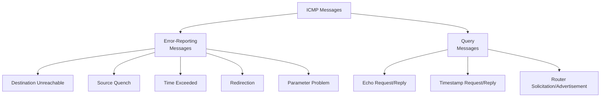
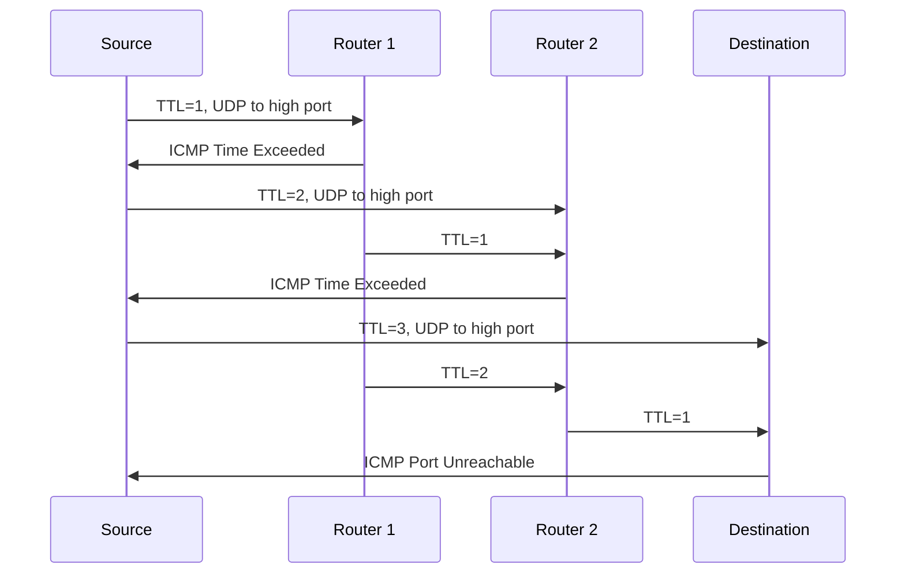

# Chapter 09 -- Internet Control Message Protocol Version 4 (ICMPv4)

> **Last Updated:** 2026-03-21

---

## Table of Contents

- [1. Introduction](#1-introduction)
  - [1.1 Why ICMP is Needed](#11-why-icmp-is-needed)
  - [1.2 ICMP Position in TCP/IP](#12-icmp-position-in-tcpip)
  - [1.3 ICMP Encapsulation](#13-icmp-encapsulation)
- [2. ICMP Messages](#2-icmp-messages)
  - [2.1 Message Categories](#21-message-categories)
  - [2.2 Error-Reporting Messages](#22-error-reporting-messages)
  - [2.3 Query Messages](#23-query-messages)
- [3. Error-Reporting Messages in Detail](#3-error-reporting-messages-in-detail)
  - [3.1 Destination Unreachable](#31-destination-unreachable)
  - [3.2 Source Quench (Deprecated)](#32-source-quench-deprecated)
  - [3.3 Time Exceeded](#33-time-exceeded)
  - [3.4 Redirection](#34-redirection)
  - [3.5 Parameter Problem](#35-parameter-problem)
- [4. Query Messages in Detail](#4-query-messages-in-detail)
  - [4.1 Echo Request and Reply](#41-echo-request-and-reply)
  - [4.2 Timestamp Request and Reply](#42-timestamp-request-and-reply)
  - [4.3 Router Solicitation and Advertisement](#43-router-solicitation-and-advertisement)
- [5. ICMP Applications](#5-icmp-applications)
  - [5.1 Ping](#51-ping)
  - [5.2 Traceroute](#52-traceroute)
- [6. ICMP Security Considerations](#6-icmp-security-considerations)
- [Summary](#summary)
- [Appendix](#appendix)

---

## 1. Introduction

### 1.1 Why ICMP is Needed

IP is an **unreliable and connectionless** datagram delivery protocol with several limitations:
- Best-effort delivery service with **no error control**
- **No error-reporting** and error-correcting mechanism
- **No mechanism** for host and management queries

**ICMP has been designed to compensate for the above deficiencies.** However, ICMP does not correct errors -- it simply reports them. Error correction is left to the higher-layer protocols.

### 1.2 ICMP Position in TCP/IP

ICMP operates at the **network layer**, alongside IP:

```
+---+------+--------+
|IGMP| ICMP |   IP   |   ARP
+---+------+--------+
```

- ICMP is considered a network-layer protocol
- However, its messages are encapsulated within IP datagrams (like a higher-layer protocol)
- ICMP does not make IP reliable; it just provides feedback about problems

### 1.3 ICMP Encapsulation

ICMP messages are encapsulated inside IP datagrams:

```
+----------+----------+-----------+
| Frame    | IP       | ICMP      |
| Header   | Header   | Message   |
+----------+----------+-----------+
             |
             +-- Protocol field = 1 (ICMP)
```

The value of the **protocol field** in the IP datagram is **1** to indicate that the IP data is an ICMP message.

> **Key Point:** ICMP is carried within IP datagrams (protocol number 1) but is considered a network-layer protocol, not a transport-layer protocol.

---

## 2. ICMP Messages

### 2.1 Message Categories

ICMP messages are divided into two broad categories:



**General ICMP message format:**

```
+-+-+-+-+-+-+-+-+-+-+-+-+-+-+-+-+-+-+-+-+-+-+-+-+-+-+-+-+-+-+-+-+
|     Type      |     Code      |         Checksum              |
+-+-+-+-+-+-+-+-+-+-+-+-+-+-+-+-+-+-+-+-+-+-+-+-+-+-+-+-+-+-+-+-+
|                   Rest of Header (varies)                     |
+-+-+-+-+-+-+-+-+-+-+-+-+-+-+-+-+-+-+-+-+-+-+-+-+-+-+-+-+-+-+-+-+
|                   Data Section (varies)                        |
+-+-+-+-+-+-+-+-+-+-+-+-+-+-+-+-+-+-+-+-+-+-+-+-+-+-+-+-+-+-+-+-+
```

### 2.2 Error-Reporting Messages

**Error-reporting messages** report problems that a router or host may encounter when it processes an IP packet.

**Important rules for error-reporting messages:**
- No ICMP error message is generated for an ICMP error message (prevents infinite loops)
- No ICMP error message for a datagram with a multicast destination
- No ICMP error message for a datagram with a broadcast destination
- No ICMP error message for a datagram with source address 0.0.0.0
- For fragmented datagrams, ICMP error is generated only for the first fragment

The data section of an error message always includes:
- The **IP header** of the original datagram
- The **first 8 bytes of data** from the original datagram (usually contains port numbers from TCP/UDP header)

### 2.3 Query Messages

**Query messages** occur in pairs (request and reply). They help a host or a network manager get specific information from a router or another host. Hosts can discover and learn about routers on their network, and routers can help a node redirect its messages.

---

## 3. Error-Reporting Messages in Detail

### 3.1 Destination Unreachable

| Type | Code | Meaning |
|------|------|---------|
| 3 | 0 | Network unreachable |
| 3 | 1 | Host unreachable |
| 3 | 2 | Protocol unreachable |
| 3 | 3 | Port unreachable |
| 3 | 4 | Fragmentation needed but DF flag set |
| 3 | 5 | Source route failed |

**Code 3 (Port Unreachable)** is commonly seen when:
- UDP port has no listening process
- Often triggered during port scans

**Code 4 (Fragmentation Needed)** is important for:
- Path MTU Discovery
- Generated when a router cannot fragment because DF flag is set

### 3.2 Source Quench (Deprecated)

- Type 4, Code 0
- Originally used for flow/congestion control
- A router could send this when discarding datagrams due to congestion
- **Deprecated by RFC 6633** -- considered ineffective and potentially harmful
- Modern congestion control uses TCP mechanisms (ECN, slow start)

### 3.3 Time Exceeded

| Type | Code | Meaning |
|------|------|---------|
| 11 | 0 | TTL expired in transit |
| 11 | 1 | Fragment reassembly time exceeded |

**Code 0 (TTL expired):**
- Generated when a router decrements TTL to 0
- Fundamental to the operation of **traceroute**

**Code 1 (Reassembly timeout):**
- Generated when all fragments of a datagram do not arrive within the reassembly timer
- The destination discards all received fragments

### 3.4 Redirection

- Type 5
- Sent by a router to inform a host that a **better route exists** for a particular destination
- The host updates its routing table with the new next-hop

| Code | Meaning |
|------|---------|
| 0 | Redirect for network |
| 1 | Redirect for host |
| 2 | Redirect for TOS and network |
| 3 | Redirect for TOS and host |

### 3.5 Parameter Problem

- Type 12
- Sent when a datagram header contains an **ambiguous or missing** value
- The pointer field indicates the byte location where the problem was detected

---

## 4. Query Messages in Detail

### 4.1 Echo Request and Reply

| Message | Type | Code |
|---------|------|------|
| Echo Request | 8 | 0 |
| Echo Reply | 0 | 0 |

- Used by the **ping** utility to test reachability
- The echo request contains an identifier and sequence number
- The echo reply must return the same data

### 4.2 Timestamp Request and Reply

| Message | Type | Code |
|---------|------|------|
| Timestamp Request | 13 | 0 |
| Timestamp Reply | 14 | 0 |

- Used to determine round-trip time between two machines
- Contains three timestamps: originate, receive, and transmit
- Timestamps are in milliseconds since midnight UTC

### 4.3 Router Solicitation and Advertisement

| Message | Type | Code |
|---------|------|------|
| Router Solicitation | 10 | 0 |
| Router Advertisement | 9 | 0 |

- Hosts send solicitations to discover routers on the network
- Routers periodically advertise their presence

---

## 5. ICMP Applications

### 5.1 Ping

**Ping** (Packet Internet Groper) uses ICMP Echo Request and Echo Reply to:
- Test whether a host is reachable
- Measure round-trip time (RTT)
- Check for packet loss

```
$ ping 192.168.1.1
PING 192.168.1.1: 56 data bytes
64 bytes from 192.168.1.1: icmp_seq=0 ttl=64 time=0.456 ms
64 bytes from 192.168.1.1: icmp_seq=1 ttl=64 time=0.389 ms
64 bytes from 192.168.1.1: icmp_seq=2 ttl=64 time=0.412 ms
```

### 5.2 Traceroute

**Traceroute** discovers the path packets take to a destination by exploiting TTL and ICMP Time Exceeded messages:



1. Source sends packets with incrementing TTL (starting at 1)
2. Each router that decrements TTL to 0 sends back ICMP Time Exceeded
3. The destination responds with ICMP Port Unreachable (since the target port is unused)
4. Source records each router's IP address and RTT

```
$ traceroute 8.8.8.8
 1  gateway (192.168.1.1)  0.456 ms  0.389 ms  0.412 ms
 2  isp-router (10.0.0.1)  5.234 ms  5.189 ms  5.211 ms
 3  8.8.8.8  10.567 ms  10.489 ms  10.512 ms
```

---

## 6. ICMP Security Considerations

| Threat | Description | Mitigation |
|--------|-------------|------------|
| Ping Flood | Overwhelm target with ICMP Echo Requests | Rate-limit ICMP |
| Smurf Attack | Broadcast ping with spoofed source (victim's IP) | Disable directed broadcast |
| Ping of Death | Oversized ICMP packet causing buffer overflow | Modern OS patches |
| ICMP Redirect Attack | Forge redirect messages to reroute traffic | Disable ICMP redirects on hosts |
| ICMP Tunneling | Covert channel using ICMP Echo data field | Deep packet inspection |

> **Key Point:** While ICMP is essential for network diagnostics, many organizations filter ICMP at their firewalls to reduce attack surface. However, completely blocking ICMP can break Path MTU Discovery and network troubleshooting.

---

## Summary

| Concept | Key Point |
|---------|-----------|
| ICMP Purpose | Compensates for IP's lack of error reporting and query mechanisms |
| Encapsulation | ICMP messages are inside IP datagrams (protocol = 1) |
| Error Messages | Report problems but do not correct them |
| Destination Unreachable | Network, host, protocol, port, or fragmentation issues |
| Time Exceeded | TTL expired (used by traceroute) or reassembly timeout |
| Redirect | Router informs host of a better route |
| Echo Request/Reply | Used by ping to test reachability |
| Ping | Tests host reachability and measures RTT |
| Traceroute | Discovers path using incrementing TTL values |

---

## Appendix

### A. ICMP Type Summary Table

| Type | Message | Category |
|------|---------|----------|
| 0 | Echo Reply | Query |
| 3 | Destination Unreachable | Error |
| 4 | Source Quench (deprecated) | Error |
| 5 | Redirect | Error |
| 8 | Echo Request | Query |
| 9 | Router Advertisement | Query |
| 10 | Router Solicitation | Query |
| 11 | Time Exceeded | Error |
| 12 | Parameter Problem | Error |
| 13 | Timestamp Request | Query |
| 14 | Timestamp Reply | Query |

### B. Why ICMP Error Messages Are Not Generated for Certain Packets

This prevents:
- **Infinite loops**: Error message about an error message
- **Broadcast storms**: Error messages flooding the network from multicast/broadcast packets
- **Amplification attacks**: Spoofed source addresses generating floods of ICMP replies
