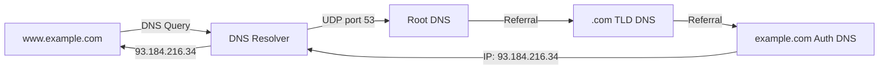

# Chapter 14 — 사용자 데이터그램 프로토콜 (UDP)

> **최종 수정일:** 2026-03-21

---

## 목차

- [1. 개요](#1-개요)
- [2. 사용자 데이터그램](#2-사용자-데이터그램)
  - [2.1 UDP 헤더 형식](#21-udp-헤더-형식)
  - [2.2 헤더 필드](#22-헤더-필드)
- [3. UDP 서비스](#3-udp-서비스)
  - [3.1 프로세스 간 통신](#31-프로세스-간-통신)
  - [3.2 비연결형 서비스](#32-비연결형-서비스)
  - [3.3 흐름 제어](#33-흐름-제어)
  - [3.4 오류 제어](#34-오류-제어)
  - [3.5 혼잡 제어](#35-혼잡-제어)
  - [3.6 캡슐화와 역캡슐화](#36-캡슐화와-역캡슐화)
  - [3.7 다중화와 역다중화](#37-다중화와-역다중화)
- [4. 체크섬 계산](#4-체크섬-계산)
  - [4.1 의사 헤더](#41-의사-헤더)
  - [4.2 계산 예제](#42-계산-예제)
- [5. UDP 응용](#5-udp-응용)
  - [5.1 DNS](#51-dns)
- [요약](#요약)
- [부록](#부록)

---

## 1. 개요

**UDP (User Datagram Protocol)**는 응용 계층과 IP 계층 사이에 위치하며 응용 프로그램과 네트워크 작업 사이의 중개자 역할을 한다.

주요 특성:
- **프로세스 간** 통신 (포트 번호 사용)
- **비연결형**: 연결 설정이나 해제 없음
- **비신뢰적**: 매우 제한된 오류 검사 (체크섬만)
- **단순**: 최소한의 오버헤드, 최대한의 효율성
- 프로세스가 **작은 메시지**를 보내려 하고 **신뢰성에 대해 크게 신경 쓰지 않는** 경우 UDP를 사용할 수 있음

```
+-------------------+
| Application Layer |  SMTP, FTP, DNS, SNMP, DHCP
+-------------------+
| Transport Layer   |  SCTP | TCP | UDP
+---+-------+-------+
|IGMP|ICMP |   IP   |  ARP
+---+-------+-------+
| Data Link Layer   |
+-------------------+
| Physical Layer    |
+-------------------+
```

> **핵심 포인트:** UDP는 최소한의 전송 서비스를 제공한다 — 선택적 오류 검출과 함께 한 프로세스에서 다른 프로세스로 데이터를 전달하는 데 충분한 만큼만. 신뢰성을 속도와 단순성으로 교환한다.

---

## 2. 사용자 데이터그램

### 2.1 UDP 헤더 형식

UDP 사용자 데이터그램은 고정 **8바이트 헤더**와 가변 길이 데이터로 구성된다:

```
+------ 8 to 65,535 bytes total ------+
| Header (8 bytes) |      Data        |
+------------------+------------------+

 0                   1                   2                   3
 0 1 2 3 4 5 6 7 8 9 0 1 2 3 4 5 6 7 8 9 0 1 2 3 4 5 6 7 8 9 0 1
+-+-+-+-+-+-+-+-+-+-+-+-+-+-+-+-+-+-+-+-+-+-+-+-+-+-+-+-+-+-+-+-+
|       Source Port Number      |    Destination Port Number    |
+-+-+-+-+-+-+-+-+-+-+-+-+-+-+-+-+-+-+-+-+-+-+-+-+-+-+-+-+-+-+-+-+
|          Total Length         |           Checksum            |
+-+-+-+-+-+-+-+-+-+-+-+-+-+-+-+-+-+-+-+-+-+-+-+-+-+-+-+-+-+-+-+-+
```

### 2.2 헤더 필드

| 필드 | 크기 | 설명 |
|-------|------|-------------|
| Source Port Number | 16비트 | 출발지 호스트의 프로세스가 사용하는 포트 |
| Destination Port Number | 16비트 | 목적지 호스트의 프로세스가 사용하는 포트 |
| Total Length | 16비트 | 사용자 데이터그램(헤더 + 데이터)의 전체 길이(바이트) |
| Checksum | 16비트 | 오류 검출 (IPv4에서는 선택 사항, IPv6에서는 필수) |

- **최소 길이**: 8바이트 (헤더만, 데이터 없음)
- **최대 길이**: 65,535바이트 (16비트 길이 필드에 의해 제한)
- 실제로는 65,535 - 20 (IP 헤더) - 8 (UDP 헤더) = 65,507바이트로 제한

---

## 3. UDP 서비스

### 3.1 프로세스 간 통신

UDP는 송수신 프로세스를 식별하기 위해 포트 번호를 사용한다:
- IP 주소가 **컴퓨터**(호스트)를 선택
- 포트 번호가 해당 컴퓨터의 **프로세스**를 선택

```
+-----------+                         +-----------+
| Process A |                         | Process B |
| Port 52000|                         | Port 53   |
+-----------+                         +-----------+
     |                                     |
+----+----+                           +----+----+
|   UDP   |                           |   UDP   |
+---------+                           +---------+
     |          (Internet)                 |
+----+----+ ---- routers ---- +------+----+
|   IP    |                   |    IP     |
+---------+                   +-----------+
```

**UDP에서 사용하는 Well-known 포트:**

| 포트 | 프로토콜 | 설명 |
|------|----------|-------------|
| 7 | Echo | 수신된 데이터그램을 에코 |
| 9 | Discard | 수신된 모든 데이터그램을 폐기 |
| 13 | Daytime | 날짜와 시간을 반환 |
| 17 | Quote | 오늘의 명언을 반환 |
| 53 | Domain | 도메인 네임 서비스 (DNS) |
| 67 | BOOTP Server | 부트스트랩 프로토콜 서버 |
| 68 | BOOTP Client | 부트스트랩 프로토콜 클라이언트 |
| 69 | TFTP | 간이 파일 전송 프로토콜 |
| 111 | RPC | 원격 프로시저 호출 |
| 123 | NTP | 네트워크 시간 프로토콜 |
| 161 | SNMP | 간이 네트워크 관리 프로토콜 |
| 162 | SNMP (trap) | SNMP 트랩 메시지 |

### 3.2 비연결형 서비스

- UDP는 **비연결형 서비스**를 제공
- UDP가 보내는 각 사용자 데이터그램은 **독립적인 데이터그램**
- 각 사용자 데이터그램은 **서로 다른 경로**로 이동할 수 있음
- 데이터그램이 순서가 바뀌거나, 중복되거나, 전혀 도착하지 않을 수 있음
- 동일 출발지의 연속된 데이터그램 간에 관계가 없음

### 3.3 흐름 제어

- UDP에는 **흐름 제어가 없으며** 따라서 **윈도우 메커니즘도 없음**
- 수신자가 들어오는 메시지로 인해 **오버플로**될 수 있음
- 수신자는 초과 데이터그램을 조용히 폐기할 수 있음

### 3.4 오류 제어

- 체크섬을 제외한 **오류 제어 메커니즘이 없음**
- 수신자가 체크섬을 통해 오류를 검출하면 사용자 데이터그램은 **조용히 폐기**됨
- 재전송, 확인 응답, 순서 지정 없음
- 응용 프로그램에 오류 제어가 필요하면 응용 계층에서 구현해야 함

### 3.5 혼잡 제어

- UDP는 비연결형 프로토콜
- **혼잡 제어를 제공하지 않음**
- UDP 응용 프로그램은 어떠한 속도 조절 메커니즘 없이 네트워크를 범람시킬 수 있음
- 이것이 UDP 기반 응용(비디오 스트리밍, 게임)이 자체적으로 속도 제어를 구현해야 하는 이유

### 3.6 캡슐화와 역캡슐화

**캡슐화** (송신측):
1. 응용 프로그램이 데이터와 소켓 주소를 UDP에 전달
2. UDP가 헤더를 추가 (출발지 포트, 목적지 포트, 길이, 체크섬)
3. UDP가 데이터그램을 IP 계층에 전달

**역캡슐화** (수신측):
1. IP가 데이터그램을 UDP에 전달 (프로토콜 번호 17로 식별)
2. UDP가 체크섬을 검증
3. UDP가 목적지 포트를 사용하여 올바른 프로세스에 데이터를 전달

### 3.7 다중화와 역다중화

```
Sender side (Multiplexing):        Receiver side (Demultiplexing):
  App1  App2  App3                   App1  App2  App3
   \    |    /                        /    |    \
    \   |   /                        /     |     \
   +----------+                   +----------+
   |   UDP    |                   |   UDP    |
   |  MUX     |                   |  DEMUX   |
   +----------+                   +----------+
       |                               |
   datagram datagram datagram     datagram datagram datagram
```

- **다중화**: 여러 응용 프로세스가 단일 UDP를 공유
- **역다중화**: UDP가 목적지 포트 번호를 사용하여 올바른 프로세스에 전달

---

## 4. 체크섬 계산

### 4.1 의사 헤더

UDP 체크섬 계산에는 계산 목적으로만 앞에 추가되는 **의사 헤더(Pseudoheader)**가 포함된다 (전송되지는 않음):

```
+-+-+-+-+-+-+-+-+-+-+-+-+-+-+-+-+-+-+-+-+-+-+-+-+-+-+-+-+-+-+-+-+
|                 32-bit Source IP Address                       |  Pseudo-
+-+-+-+-+-+-+-+-+-+-+-+-+-+-+-+-+-+-+-+-+-+-+-+-+-+-+-+-+-+-+-+-+  header
|              32-bit Destination IP Address                     |
+-+-+-+-+-+-+-+-+-+-+-+-+-+-+-+-+-+-+-+-+-+-+-+-+-+-+-+-+-+-+-+-+
|   All 0s    | 8-bit Protocol |    16-bit UDP Total Length     |
+-+-+-+-+-+-+-+-+-+-+-+-+-+-+-+-+-+-+-+-+-+-+-+-+-+-+-+-+-+-+-+-+
|       Source Port Address     |   Destination Port Address    |  UDP
+-+-+-+-+-+-+-+-+-+-+-+-+-+-+-+-+-+-+-+-+-+-+-+-+-+-+-+-+-+-+-+-+  Header
|       UDP Total Length        |          Checksum             |
+-+-+-+-+-+-+-+-+-+-+-+-+-+-+-+-+-+-+-+-+-+-+-+-+-+-+-+-+-+-+-+-+
|                         Data                                  |
|            (Padding added to make multiple of 16 bits)        |
+-+-+-+-+-+-+-+-+-+-+-+-+-+-+-+-+-+-+-+-+-+-+-+-+-+-+-+-+-+-+-+-+
```

의사 헤더는 데이터그램이 올바른 목적지에 도달했는지 확인한다 (IP 및 프로토콜 검증).

### 4.2 계산 예제

주어진 조건: src=153.18.8.105, dst=171.2.14.10, protocol=17, data="TESTING"

```
Pseudoheader:
  153.18  = 10011001 00010010
  8.105   = 00001000 01101001
  171.2   = 10101011 00000010
  14.10   = 00001110 00001010
  0 + 17  = 00000000 00010001
  0 + 15  = 00000000 00001111

UDP Header:
  1087    = 00000100 00111111
  13      = 00000000 00001101
  15      = 00000000 00001111
  0 (chk) = 00000000 00000000

Data:
  T,E     = 01010100 01000101
  S,T     = 01010011 01010100
  I,N     = 01001001 01001110
  G,0(pad)= 01000111 00000000

Sum      = 10010110 11101011
Checksum = 01101001 00010100 (one's complement)
```

---

## 5. UDP 응용

### 5.1 DNS

*DNS에 관한 학생 발표 자료에서 통합*

**도메인 네임 시스템(DNS)**은 UDP를 사용하는 가장 중요한 응용 중 하나이다:

DNS는 사람이 읽을 수 있는 도메인 이름을 IP 주소로 변환한다:



**DNS 계층 구조:**

```
            . (root)
           / | \
        .com .org .kr
        /       \
   google.com   example.com
   /    \
  www  mail
```

**DNS가 UDP를 사용하는 이유:**
- DNS 질의/응답은 일반적으로 작음 (< 512바이트)
- UDP가 더 빠름 (연결 설정 오버헤드 없음)
- DNS는 간헐적인 패킷 손실을 감내할 수 있음 (재전송하면 됨)
- 존 전송 및 큰 응답 (> 512바이트)의 경우 DNS는 TCP를 사용

**DNS 레코드 유형:**

| 유형 | 설명 | 예시 |
|------|-------------|---------|
| A | IPv4 주소 | www.example.com -> 93.184.216.34 |
| AAAA | IPv6 주소 | www.example.com -> 2606:2800:220:1:... |
| CNAME | 정식 이름 (별칭) | www -> web-server.example.com |
| MX | 메일 교환기 | example.com -> mail.example.com |
| NS | 네임 서버 | example.com -> ns1.example.com |
| PTR | 역방향 조회 | 34.216.184.93 -> www.example.com |
| SOA | 권한 시작 | 존 설정 |
| TXT | 텍스트 레코드 | 이메일 검증을 위한 SPF, DKIM |

---

## 요약

| 개념 | 핵심 포인트 |
|---------|-----------|
| UDP | 비연결형, 비신뢰적, 최소 오버헤드 전송 프로토콜 |
| 헤더 | 8바이트: 출발지 포트, 목적지 포트, 길이, 체크섬 |
| 흐름 제어 없음 | 윈도우 메커니즘 없음; 수신자가 오버플로될 수 있음 |
| 오류 제어 없음 | 체크섬만; 손상된 데이터그램을 조용히 폐기 |
| 혼잡 제어 없음 | 응용 프로그램이 자체적으로 조절해야 함 |
| 체크섬 | 의사 헤더 포함 (IP 주소 + 프로토콜 + 길이) |
| 다중화 | 포트 번호로 여러 프로세스가 UDP를 공유 가능 |
| DNS | 주요 UDP 응용; 도메인 이름을 IP 주소로 변환 |

---

## 부록

### A. UDP vs. TCP 비교

| 특징 | UDP | TCP |
|---------|-----|-----|
| 연결 | 비연결형 | 연결 지향형 |
| 신뢰성 | 비신뢰적 | 신뢰적 |
| 순서 | 비순서 | 순서 보장 |
| 속도 | 빠름 | 느림 |
| 헤더 크기 | 8바이트 | 20-60바이트 |
| 흐름 제어 | 없음 | 슬라이딩 윈도우 |
| 혼잡 제어 | 없음 | 슬로우 스타트, 혼잡 회피 |
| 오버헤드 | 최소 | 높음 |
| 사용 사례 | DNS, 스트리밍, 게임, VoIP | HTTP, FTP, SMTP, SSH |

### B. UDP를 사용해야 하는 경우

- 실시간 응용 (비디오/오디오 스트리밍, VoIP)
- 단순한 질의-응답 프로토콜 (DNS, SNMP)
- 브로드캐스팅/멀티캐스팅
- 응용 계층에서 자체적으로 신뢰성을 구현하는 응용
- 신뢰성보다 속도가 중요한 상황
- 제한된 자원을 가진 IoT 센서

### C. UDP 기반 프로토콜

| 프로토콜 | 포트 | 목적 |
|----------|------|---------|
| DNS | 53 | 도메인 이름 해석 |
| DHCP | 67/68 | IP 주소 할당 |
| TFTP | 69 | 간이 파일 전송 |
| SNMP | 161/162 | 네트워크 관리 |
| NTP | 123 | 시간 동기화 |
| RIP | 520 | 라우팅 (거리 벡터) |
| QUIC | 443 | 최신 HTTP/3 전송 (UDP 기반) |
