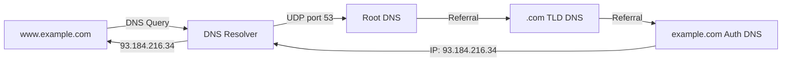

# Chapter 14 — User Datagram Protocol (UDP)

> **Last Updated:** 2026-03-21

---

## Table of Contents

- [1. Introduction](#1-introduction)
- [2. User Datagram](#2-user-datagram)
  - [2.1 UDP Header Format](#21-udp-header-format)
  - [2.2 Header Fields](#22-header-fields)
- [3. UDP Services](#3-udp-services)
  - [3.1 Process-to-Process Communication](#31-process-to-process-communication)
  - [3.2 Connectionless Service](#32-connectionless-service)
  - [3.3 Flow Control](#33-flow-control)
  - [3.4 Error Control](#34-error-control)
  - [3.5 Congestion Control](#35-congestion-control)
  - [3.6 Encapsulation and Decapsulation](#36-encapsulation-and-decapsulation)
  - [3.7 Multiplexing and Demultiplexing](#37-multiplexing-and-demultiplexing)
- [4. Checksum Calculation](#4-checksum-calculation)
  - [4.1 Pseudoheader](#41-pseudoheader)
  - [4.2 Calculation Example](#42-calculation-example)
- [5. UDP Applications](#5-udp-applications)
  - [5.1 DNS](#51-dns)
- [Summary](#summary)
- [Appendix](#appendix)

---

## 1. Introduction

**UDP (User Datagram Protocol)** lies between the application layer and the IP layer and serves as the intermediary between the application programs and the network operations.

Key characteristics:
- **Process-to-process** communication (using port numbers)
- **Connectionless**: No connection setup or teardown
- **Unreliable**: Very limited error checking (checksum only)
- **Simple**: Minimum overhead, maximum efficiency
- If a process wants to send a **small message** and **does not care much about reliability**, it can use UDP

```
+-------------------+
| Application Layer |  SMTP, FTP, DNS, SNMP, DHCP
+-------------------+
| Transport Layer   |  SCTP | TCP | UDP
+---+-------+-------+
|IGMP|ICMP |   IP   |  ARP
+---+-------+-------+
| Data Link Layer   |
+-------------------+
| Physical Layer    |
+-------------------+
```

> **Key Point:** UDP provides a minimal transport service -- just enough to deliver data from one process to another with optional error detection. It trades reliability for speed and simplicity.

---

## 2. User Datagram

### 2.1 UDP Header Format

A UDP user datagram has a fixed **8-byte header** plus variable-length data:

```
+------ 8 to 65,535 bytes total ------+
| Header (8 bytes) |      Data        |
+------------------+------------------+

 0                   1                   2                   3
 0 1 2 3 4 5 6 7 8 9 0 1 2 3 4 5 6 7 8 9 0 1 2 3 4 5 6 7 8 9 0 1
+-+-+-+-+-+-+-+-+-+-+-+-+-+-+-+-+-+-+-+-+-+-+-+-+-+-+-+-+-+-+-+-+
|       Source Port Number      |    Destination Port Number    |
+-+-+-+-+-+-+-+-+-+-+-+-+-+-+-+-+-+-+-+-+-+-+-+-+-+-+-+-+-+-+-+-+
|          Total Length         |           Checksum            |
+-+-+-+-+-+-+-+-+-+-+-+-+-+-+-+-+-+-+-+-+-+-+-+-+-+-+-+-+-+-+-+-+
```

### 2.2 Header Fields

| Field | Size | Description |
|-------|------|-------------|
| Source Port Number | 16 bits | Port used by the process on the source host |
| Destination Port Number | 16 bits | Port used by the process on the destination host |
| Total Length | 16 bits | Total length of user datagram (header + data) in bytes |
| Checksum | 16 bits | Error detection (optional in IPv4, mandatory in IPv6) |

- **Minimum length**: 8 bytes (header only, no data)
- **Maximum length**: 65,535 bytes (limited by the 16-bit length field)
- In practice, limited to 65,535 - 20 (IP header) - 8 (UDP header) = 65,507 bytes

---

## 3. UDP Services

### 3.1 Process-to-Process Communication

UDP uses port numbers to identify sending and receiving processes:
- The IP address selects the **computer** (host)
- The port number selects the **process** on that computer

```
+-----------+                         +-----------+
| Process A |                         | Process B |
| Port 52000|                         | Port 53   |
+-----------+                         +-----------+
     |                                     |
+----+----+                           +----+----+
|   UDP   |                           |   UDP   |
+---------+                           +---------+
     |          (Internet)                 |
+----+----+ ---- routers ---- +------+----+
|   IP    |                   |    IP     |
+---------+                   +-----------+
```

**Well-known ports used with UDP:**

| Port | Protocol | Description |
|------|----------|-------------|
| 7 | Echo | Echoes received datagram |
| 9 | Discard | Discards any received datagram |
| 13 | Daytime | Returns date and time |
| 17 | Quote | Returns a quote of the day |
| 53 | Domain | Domain Name Service (DNS) |
| 67 | BOOTP Server | Bootstrap Protocol server |
| 68 | BOOTP Client | Bootstrap Protocol client |
| 69 | TFTP | Trivial File Transfer Protocol |
| 111 | RPC | Remote Procedure Call |
| 123 | NTP | Network Time Protocol |
| 161 | SNMP | Simple Network Management Protocol |
| 162 | SNMP (trap) | SNMP trap messages |

### 3.2 Connectionless Service

- UDP provides a **connectionless service**
- Each user datagram sent by UDP is an **independent datagram**
- Each user datagram can travel on a **different path**
- Datagrams may arrive out of order, duplicated, or not at all
- No relationship between successive datagrams from the same source

### 3.3 Flow Control

- UDP has **no flow control** and hence **no window mechanism**
- The receiver may **overflow** with incoming messages
- The receiver can silently discard excess datagrams

### 3.4 Error Control

- There is **no error control mechanism** in UDP except for the checksum
- When the receiver detects an error through the checksum, the user datagram is **silently discarded**
- No retransmission, no acknowledgment, no sequencing
- If the application needs error control, it must implement it at the application layer

### 3.5 Congestion Control

- UDP is a connectionless protocol
- It **does not provide congestion control**
- UDP applications can flood the network without any throttling mechanism
- This is why UDP-based applications (video streaming, gaming) must implement their own rate control

### 3.6 Encapsulation and Decapsulation

**Encapsulation** at the sender:
1. Application passes data and socket addresses to UDP
2. UDP adds header (source port, destination port, length, checksum)
3. UDP passes datagram to IP layer

**Decapsulation** at the receiver:
1. IP passes datagram to UDP (identified by protocol number 17)
2. UDP verifies checksum
3. UDP uses destination port to deliver data to the correct process

### 3.7 Multiplexing and Demultiplexing

```
Sender side (Multiplexing):        Receiver side (Demultiplexing):
  App1  App2  App3                   App1  App2  App3
   \    |    /                        /    |    \
    \   |   /                        /     |     \
   +----------+                   +----------+
   |   UDP    |                   |   UDP    |
   |  MUX     |                   |  DEMUX   |
   +----------+                   +----------+
       |                               |
   datagram datagram datagram     datagram datagram datagram
```

- **Multiplexing**: Multiple application processes share a single UDP
- **Demultiplexing**: UDP uses destination port number to deliver to the correct process

---

## 4. Checksum Calculation

### 4.1 Pseudoheader

UDP checksum calculation includes a **pseudoheader** that is prepended for calculation purposes only (not transmitted):

```
+-+-+-+-+-+-+-+-+-+-+-+-+-+-+-+-+-+-+-+-+-+-+-+-+-+-+-+-+-+-+-+-+
|                 32-bit Source IP Address                       |  Pseudo-
+-+-+-+-+-+-+-+-+-+-+-+-+-+-+-+-+-+-+-+-+-+-+-+-+-+-+-+-+-+-+-+-+  header
|              32-bit Destination IP Address                     |
+-+-+-+-+-+-+-+-+-+-+-+-+-+-+-+-+-+-+-+-+-+-+-+-+-+-+-+-+-+-+-+-+
|   All 0s    | 8-bit Protocol |    16-bit UDP Total Length     |
+-+-+-+-+-+-+-+-+-+-+-+-+-+-+-+-+-+-+-+-+-+-+-+-+-+-+-+-+-+-+-+-+
|       Source Port Address     |   Destination Port Address    |  UDP
+-+-+-+-+-+-+-+-+-+-+-+-+-+-+-+-+-+-+-+-+-+-+-+-+-+-+-+-+-+-+-+-+  Header
|       UDP Total Length        |          Checksum             |
+-+-+-+-+-+-+-+-+-+-+-+-+-+-+-+-+-+-+-+-+-+-+-+-+-+-+-+-+-+-+-+-+
|                         Data                                  |
|            (Padding added to make multiple of 16 bits)        |
+-+-+-+-+-+-+-+-+-+-+-+-+-+-+-+-+-+-+-+-+-+-+-+-+-+-+-+-+-+-+-+-+
```

The pseudoheader ensures the datagram has reached the correct destination (IP and protocol verification).

### 4.2 Calculation Example

Given: src=153.18.8.105, dst=171.2.14.10, protocol=17, data="TESTING"

```
Pseudoheader:
  153.18  = 10011001 00010010
  8.105   = 00001000 01101001
  171.2   = 10101011 00000010
  14.10   = 00001110 00001010
  0 + 17  = 00000000 00010001
  0 + 15  = 00000000 00001111

UDP Header:
  1087    = 00000100 00111111
  13      = 00000000 00001101
  15      = 00000000 00001111
  0 (chk) = 00000000 00000000

Data:
  T,E     = 01010100 01000101
  S,T     = 01010011 01010100
  I,N     = 01001001 01001110
  G,0(pad)= 01000111 00000000

Sum      = 10010110 11101011
Checksum = 01101001 00010100 (one's complement)
```

---

## 5. UDP Applications

### 5.1 DNS

*Integrated from student presentation materials on DNS*

**Domain Name System (DNS)** is one of the most important applications using UDP:

DNS translates human-readable domain names to IP addresses:



**DNS Hierarchy:**

```
            . (root)
           / | \
        .com .org .kr
        /       \
   google.com   example.com
   /    \
  www  mail
```

**Why DNS uses UDP:**
- DNS queries/responses are typically small (< 512 bytes)
- UDP is faster (no connection setup overhead)
- DNS can tolerate occasional packet loss (just resend)
- For zone transfers and large responses (> 512 bytes), DNS uses TCP

**DNS Record Types:**

| Type | Description | Example |
|------|-------------|---------|
| A | IPv4 address | www.example.com -> 93.184.216.34 |
| AAAA | IPv6 address | www.example.com -> 2606:2800:220:1:... |
| CNAME | Canonical name (alias) | www -> web-server.example.com |
| MX | Mail exchanger | example.com -> mail.example.com |
| NS | Name server | example.com -> ns1.example.com |
| PTR | Reverse lookup | 34.216.184.93 -> www.example.com |
| SOA | Start of authority | Zone configuration |
| TXT | Text record | SPF, DKIM for email verification |

---

## Summary

| Concept | Key Point |
|---------|-----------|
| UDP | Connectionless, unreliable, minimal overhead transport protocol |
| Header | 8 bytes: src port, dst port, length, checksum |
| No Flow Control | No window mechanism; receiver may overflow |
| No Error Control | Only checksum; silently discards corrupted datagrams |
| No Congestion Control | Applications must self-regulate |
| Checksum | Includes pseudoheader (IP addresses + protocol + length) |
| Multiplexing | Port numbers allow multiple processes to share UDP |
| DNS | Primary UDP application; translates domain names to IP addresses |

---

## Appendix

### A. UDP vs. TCP Comparison

| Feature | UDP | TCP |
|---------|-----|-----|
| Connection | Connectionless | Connection-oriented |
| Reliability | Unreliable | Reliable |
| Ordering | Unordered | Ordered |
| Speed | Faster | Slower |
| Header Size | 8 bytes | 20-60 bytes |
| Flow Control | None | Sliding window |
| Congestion Control | None | Slow start, congestion avoidance |
| Overhead | Minimal | Higher |
| Use Cases | DNS, streaming, gaming, VoIP | HTTP, FTP, SMTP, SSH |

### B. When to Use UDP

- Real-time applications (video/audio streaming, VoIP)
- Simple query-response protocols (DNS, SNMP)
- Broadcasting/multicasting
- Applications that implement their own reliability at the application layer
- Situations where speed is more important than reliability
- IoT sensors with constrained resources

### C. UDP-Based Protocols

| Protocol | Port | Purpose |
|----------|------|---------|
| DNS | 53 | Domain name resolution |
| DHCP | 67/68 | IP address assignment |
| TFTP | 69 | Simple file transfer |
| SNMP | 161/162 | Network management |
| NTP | 123 | Time synchronization |
| RIP | 520 | Routing (distance-vector) |
| QUIC | 443 | Modern HTTP/3 transport (UDP-based) |
