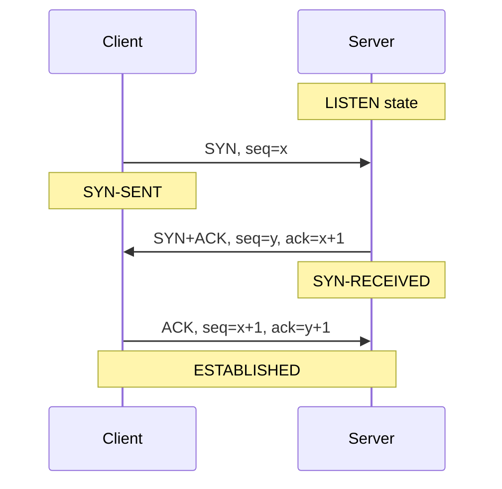
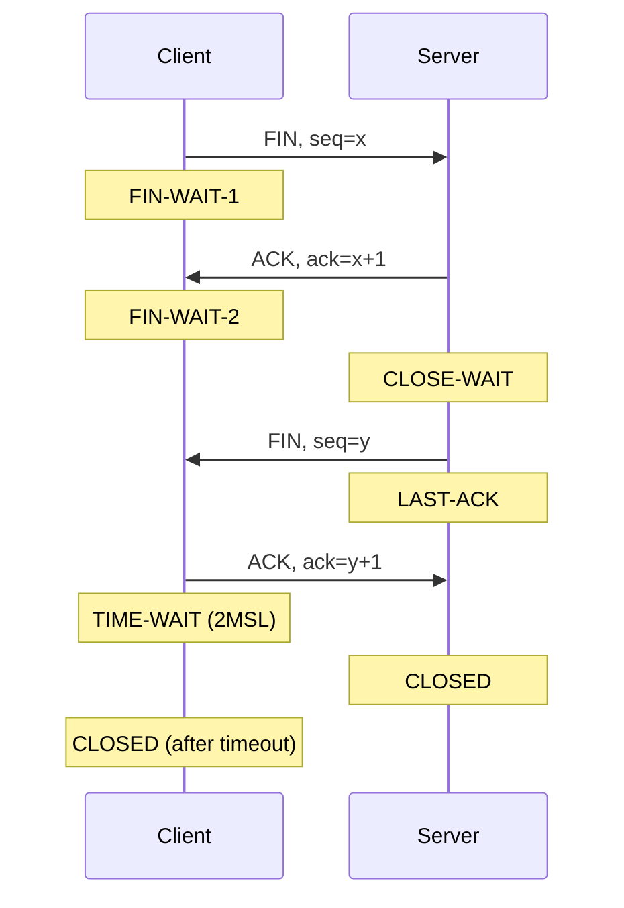
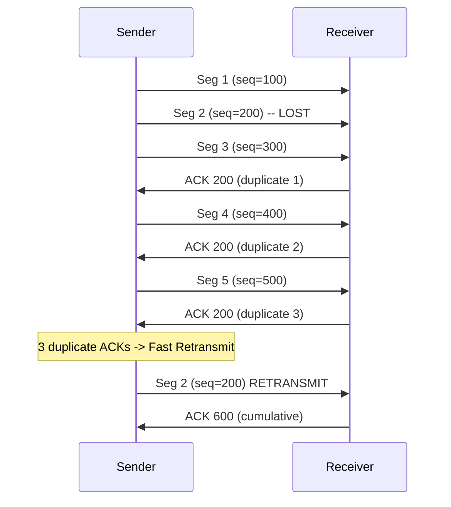
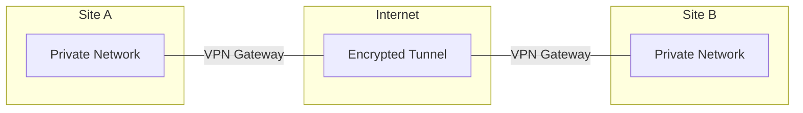

# Chapter 15 — 전송 제어 프로토콜 (TCP)

> **최종 수정일:** 2026-04-01
>
> Forouzan, TCP/IP Protocol Suite 4th Ed. Ch 15

> **선수 지식**: [컴퓨터네트워크] UDP와 전송 계층 (제13-14장).
>
> **학습 목표**:
> 1. TCP 연결 설정(3-way handshake)과 종료를 설명할 수 있다
> 2. TCP 흐름 제어와 슬라이딩 윈도우 메커니즘을 설명할 수 있다
> 3. TCP 혼잡 제어 알고리즘을 분석할 수 있다

---

## 목차

- [1. TCP 서비스](#1-tcp-서비스)
  - [1.1 스트림 전달](#11-스트림-전달)
  - [1.2 송신 및 수신 버퍼](#12-송신-및-수신-버퍼)
  - [1.3 세그먼트](#13-세그먼트)
  - [1.4 전이중 서비스](#14-전이중-서비스)
  - [1.5 연결 지향형 서비스](#15-연결-지향형-서비스)
  - [1.6 신뢰적 서비스](#16-신뢰적-서비스)
- [2. TCP 세그먼트 형식](#2-tcp-세그먼트-형식)
  - [2.1 헤더 필드](#21-헤더-필드)
  - [2.2 제어 플래그](#22-제어-플래그)
- [3. TCP 번호 체계](#3-tcp-번호-체계)
  - [3.1 바이트 번호](#31-바이트-번호)
  - [3.2 순서 번호](#32-순서-번호)
  - [3.3 확인 응답 번호](#33-확인-응답-번호)
- [4. TCP 연결 관리](#4-tcp-연결-관리)
  - [4.1 3-Way Handshake (연결 설정)](#41-3-way-handshake-연결-설정)
  - [4.2 데이터 전송](#42-데이터-전송)
  - [4.3 4-Way Handshake (연결 종료)](#43-4-way-handshake-연결-종료)
  - [4.4 반 닫기(Half-Close)](#44-반-닫기half-close)
- [5. TCP 흐름 제어](#5-tcp-흐름-제어)
  - [5.1 TCP에서의 슬라이딩 윈도우](#51-tcp에서의-슬라이딩-윈도우)
  - [5.2 윈도우 크기 조정](#52-윈도우-크기-조정)
- [6. TCP 오류 제어](#6-tcp-오류-제어)
  - [6.1 재전송](#61-재전송)
  - [6.2 빠른 재전송](#62-빠른-재전송)
- [7. TCP 혼잡 제어](#7-tcp-혼잡-제어)
  - [7.1 슬로우 스타트](#71-슬로우-스타트)
  - [7.2 혼잡 회피](#72-혼잡-회피)
  - [7.3 빠른 회복](#73-빠른-회복)
- [8. TCP vs. UDP 통신](#8-tcp-vs-udp-통신)
- [9. VPN과 터널링](#9-vpn과-터널링)
  - [9.1 VPN 개요](#91-vpn-개요)
  - [9.2 터널링](#92-터널링)
  - [9.3 VPN 프로토콜](#93-vpn-프로토콜)
- [요약](#요약)
- [부록](#부록)

---

<br>

## 1. TCP 서비스

**TCP (Transmission Control Protocol)** 는 응용 계층과 네트워크 계층 사이에 위치하며, 응용 프로그램과 네트워크 작업 사이의 중개자 역할을 한다.

### 1.1 스트림 전달

TCP는 **스트림 지향 프로토콜** 이다:
- 송신 프로세스가 데이터를 **바이트 스트림** 으로 전달할 수 있게 함
- 수신 프로세스가 데이터를 **바이트 스트림** 으로 받을 수 있게 함
- TCP는 송신자와 수신자 사이에 연속적인 스트림이 있는 것처럼 보이게 함

```
Sending              Stream of bytes              Receiving
process  -------> [==================] -------> process
  |                                                |
  TCP                                            TCP
```

### 1.2 송신 및 수신 버퍼

송신 프로세스와 수신 프로세스가 **서로 다른 속도** 로 데이터를 생산하고 소비할 수 있으므로 TCP는 저장을 위한 **버퍼** 가 필요하다:

**송신 버퍼:**
- 응용 프로세스로부터 바이트 스트림으로 데이터를 수신
- 데이터를 적절한 **세그먼트** 로 만들어 네트워크에 전송

**수신 버퍼:**
- 네트워크로부터 세그먼트를 수신
- 세그먼트를 데이터로 재조립하고 응용 프로세스에 바이트 스트림으로 전달

```
Sending process                              Receiving process
      |                                            |
  +---v--------+                          +--------v---+
  |   Buffer   |                          |   Buffer   |
  |  [Sent|    |  Segment   Segment       |   [Not |   |
  |      Not   |  [H|||||]  [H|||||] -->  |    read|   |
  |      sent] |                          |        ]   |
  +---+--------+                          +--------+---+
  Next byte    Next byte              Next byte    Next byte
  to send      to write               to receive   to read
```

### 1.3 세그먼트

IP 계층은 바이트 스트림이 아닌 **패킷** 단위로 데이터를 전송해야 한다. 전송 계층에서 TCP는 여러 바이트를 묶어 **세그먼트** 라는 패킷으로 구성한다.

- 각 세그먼트는 헤더(20-60바이트)와 데이터를 가짐
- 세그먼트는 전송을 위해 IP 데이터그램에 캡슐화됨

### 1.4 전이중 서비스

TCP는 **전이중(Full-Duplex)** 통신을 제공한다:
- 데이터가 양방향으로 동시에 흐를 수 있음
- 각 방향은 고유한 순서 번호와 확인 응답을 가짐
- **피기배킹(Piggybacking)**: ACK 정보가 반대 방향으로 이동하는 데이터 세그먼트에 첨부됨

### 1.5 연결 지향형 서비스

TCP는 **연결 지향형** 프로토콜이다:
- 데이터 전송 전에 **가상 연결**(물리적 연결이 아님)이 설정되어야 함
- 세 단계: 연결 설정, 데이터 전송, 연결 종료
- 양쪽 끝점이 연결에 동의해야 함

### 1.6 신뢰적 서비스

TCP는 **신뢰적** 전달을 제공한다:
- 수신 확인을 위해 **확인 응답 패킷(ACK)** 을 사용
- 손실되거나 손상된 세그먼트를 재전송
- 순서 보장된 전달을 보증

---

<br>

## 2. TCP 세그먼트 형식

### 2.1 헤더 필드

```
 0                   1                   2                   3
 0 1 2 3 4 5 6 7 8 9 0 1 2 3 4 5 6 7 8 9 0 1 2 3 4 5 6 7 8 9 0 1
+-+-+-+-+-+-+-+-+-+-+-+-+-+-+-+-+-+-+-+-+-+-+-+-+-+-+-+-+-+-+-+-+
|          Source Port          |       Destination Port        |
+-+-+-+-+-+-+-+-+-+-+-+-+-+-+-+-+-+-+-+-+-+-+-+-+-+-+-+-+-+-+-+-+
|                        Sequence Number                        |
+-+-+-+-+-+-+-+-+-+-+-+-+-+-+-+-+-+-+-+-+-+-+-+-+-+-+-+-+-+-+-+-+
|                    Acknowledgment Number                      |
+-+-+-+-+-+-+-+-+-+-+-+-+-+-+-+-+-+-+-+-+-+-+-+-+-+-+-+-+-+-+-+-+
| Offset| Rsrvd |U|A|P|R|S|F|           Window Size            |
+-+-+-+-+-+-+-+-+-+-+-+-+-+-+-+-+-+-+-+-+-+-+-+-+-+-+-+-+-+-+-+-+
|           Checksum            |        Urgent Pointer         |
+-+-+-+-+-+-+-+-+-+-+-+-+-+-+-+-+-+-+-+-+-+-+-+-+-+-+-+-+-+-+-+-+
|                    Options + Padding (0-40 bytes)             |
+-+-+-+-+-+-+-+-+-+-+-+-+-+-+-+-+-+-+-+-+-+-+-+-+-+-+-+-+-+-+-+-+
```

| 필드 | 크기 | 설명 |
|-------|------|-------------|
| Source Port | 16비트 | 송신 프로세스의 포트 번호 |
| Destination Port | 16비트 | 수신 프로세스의 포트 번호 |
| Sequence Number | 32비트 | 세그먼트의 첫 번째 데이터 바이트의 바이트 번호 |
| Acknowledgment Number | 32비트 | 상대방으로부터 기대하는 다음 바이트 번호 |
| Data Offset (HLEN) | 4비트 | 4바이트 워드 단위의 헤더 길이 |
| Reserved | 6비트 | 향후 사용을 위해 예약 |
| Control Flags | 6비트 | URG, ACK, PSH, RST, SYN, FIN |
| Window Size | 16비트 | 수신자의 사용 가능한 버퍼 공간 (바이트) |
| Checksum | 16비트 | 오류 검출 (필수, 의사 헤더 포함) |
| Urgent Pointer | 16비트 | 긴급 데이터의 끝을 가리킴 (URG=1일 때 유효) |

### 2.2 제어 플래그

| 플래그 | 이름 | 설명 |
|------|------|-------------|
| URG | Urgent | 긴급 포인터 필드가 유효함 |
| ACK | Acknowledgment | 확인 응답 번호 필드가 유효함 |
| PSH | Push | 응용에 즉시 전달 요청 |
| RST | Reset | 연결 리셋 |
| SYN | Synchronize | 연결 시작 (순서 번호 동기화) |
| FIN | Finish | 송신자의 데이터 전송 완료 (연결 종료) |

---

<br>

## 3. TCP 번호 체계

TCP는 데이터 링크 계층에서처럼 패킷 순서 번호가 아닌 **순서 번호** 와 **확인 응답 번호** 를 사용하여 세그먼트를 추적한다.

### 3.1 바이트 번호

TCP가 프로세스로부터 데이터의 바이트를 받으면 송신 버퍼에 저장하고 **번호를 매긴다**:
- 번호는 **무작위로 생성된** 숫자(0~2^32 - 1)로 시작
- 이 무작위 초기 순서 번호(ISN)는 공격과 이전 연결과의 혼동을 방지

### 3.2 순서 번호

세그먼트의 **순서 번호 필드** 값은 해당 세그먼트에 포함된 **첫 번째 데이터 바이트** 에 할당된 번호를 정의한다.

예시:
- ISN = 1000, 첫 번째 세그먼트는 100바이트
- 세그먼트 1: seq = 1000 (바이트 1000-1099)
- 세그먼트 2: seq = 1100 (바이트 1100-1199)
- 세그먼트 3: seq = 1200 (바이트 1200-1299)

### 3.3 확인 응답 번호

세그먼트의 **확인 응답 필드** 값은 상대방이 **받기를 기대하는 다음 바이트의 번호** 를 정의한다.

> **핵심 포인트:** 확인 응답 번호는 **누적적** 이다. ACK = 1200은 "1199까지의 모든 바이트를 수신했으니 다음에 바이트 1200을 보내달라"는 의미이다.

---

<br>

## 4. TCP 연결 관리

### 4.1 3-Way Handshake (연결 설정)



1. **SYN**: 클라이언트가 초기 순서 번호 x와 함께 SYN 세그먼트를 전송
2. **SYN+ACK**: 서버가 자신의 순서 번호 y와 함께 SYN+ACK로 응답, x+1을 확인
3. **ACK**: 클라이언트가 ack=y+1로 확인 응답

SYN 플래그는 데이터를 운반하지 않더라도 하나의 순서 번호를 소비하므로 ACK는 x+1과 y+1이 된다.

### 4.2 데이터 전송

연결 설정 후 데이터가 양방향으로 흐른다:
- 각 세그먼트는 순서 번호와 (보통) 확인 응답 번호를 운반
- 피기배킹을 통해 데이터 세그먼트에 ACK를 포함 가능
- 윈도우 크기 필드가 흐름 제어 정보를 제공

### 4.3 4-Way Handshake (연결 종료)



1. **FIN**: 클라이언트가 FIN 세그먼트를 전송 (더 이상 보낼 데이터 없음)
2. **ACK**: 서버가 FIN을 확인
3. **FIN**: 서버가 전송을 마치면 자체 FIN을 전송
4. **ACK**: 클라이언트가 서버의 FIN을 확인하고 TIME-WAIT 상태에 진입

**TIME-WAIT 상태**: 클라이언트가 닫기 전 2 x MSL (Maximum Segment Lifetime)동안 대기한다. 이는 다음을 보장한다:
- 최종 ACK가 서버에 도달함
- 이 연결의 오래된 세그먼트가 새 연결이 동일한 포트를 사용하기 전에 만료됨

### 4.4 반 닫기(Half-Close)

TCP는 한쪽이 전송을 중지하면서도 여전히 수신할 수 있는 **반 닫기** 를 지원한다:
- FIN을 보낸 후에도 호스트는 여전히 데이터를 수신할 수 있음
- 클라이언트가 모든 데이터 전송을 완료했지만 결과를 수신해야 할 때 유용

---

<br>

## 5. TCP 흐름 제어

### 5.1 TCP에서의 슬라이딩 윈도우

TCP는 흐름 제어를 위해 **슬라이딩 윈도우** 프로토콜을 사용한다:

- 윈도우 크기는 **수신자의 사용 가능한 버퍼 공간**(rwnd)에 의해 결정됨
- 수신자가 모든 ACK 세그먼트에 윈도우 크기를 광고
- 송신자는 `min(cwnd, rwnd)` 바이트의 미확인 데이터를 전송 가능

```
     Sent and ACKed | Sent, not ACKed | Can send | Cannot send
     [=============] [===============] [========] [............]
                     |<--- Window ---->|
```

### 5.2 윈도우 크기 조정

- 수신자가 버퍼가 가득 차면 윈도우를 **축소** 할 수 있음 (0까지도)
- **제로 윈도우**: 수신자가 윈도우 크기를 0으로 설정하여 송신자를 중지시킴
- **윈도우 프로브**: 송신자가 윈도우가 다시 열렸는지 확인하기 위해 주기적으로 1바이트 프로브를 전송
- **어리석은 윈도우 증후군(Silly Window Syndrome)**: 작은 세그먼트가 전송되는 문제; Nagle 알고리즘(송신자)과 Clark의 해결책(수신자)으로 해결

---

<br>

## 6. TCP 오류 제어

### 6.1 재전송

TCP는 다음과 같은 경우에 세그먼트를 재전송한다:
- **재전송 타이머 만료**: 타임아웃 기간 내에 ACK가 수신되지 않은 경우
- **RTO (Retransmission Timeout)**: RTT 측정에 기반하여 동적으로 계산됨

RTO 계산:
```
SRTT = (1 - alpha) * SRTT + alpha * RTT_sample     (Smoothed RTT)
RTTVAR = (1 - beta) * RTTVAR + beta * |SRTT - RTT_sample|
RTO = SRTT + 4 * RTTVAR
```

### 6.2 빠른 재전송

타이머 만료를 기다리는 대신:
- 송신자가 **세 개의 중복 ACK**(동일 순서 번호에 대해 총 4개의 ACK)를 수신하면 손실된 세그먼트를 즉시 재전송
- RTO 타임아웃을 기다리는 것보다 빠름



---

<br>

## 7. TCP 혼잡 제어

### 7.1 슬로우 스타트

연결이 시작되거나 타임아웃 이후:
1. **cwnd = 1 MSS** (Maximum Segment Size)로 설정
2. ACK가 수신될 때마다 cwnd += 1 MSS
3. cwnd가 **지수적으로** 증가 (1, 2, 4, 8, 16, ...)
4. cwnd가 **ssthresh** (슬로우 스타트 임계값)에 도달할 때까지 계속

### 7.2 혼잡 회피

cwnd >= ssthresh 이후:
1. 각 왕복 시간마다 cwnd += 1 MSS
2. cwnd가 **선형적으로** 증가 (가법적 증가)
3. 패킷 손실이 감지되면 (타임아웃):
   - ssthresh = cwnd / 2로 설정
   - cwnd = 1 MSS로 설정
   - 슬로우 스타트로 복귀

### 7.3 빠른 회복

**3개의 중복 ACK**(타임아웃이 아닌)에 의해 손실이 감지된 경우:
1. ssthresh = cwnd / 2로 설정
2. cwnd = ssthresh + 3 MSS로 설정
3. 혼잡 회피로 직접 진입 (슬로우 스타트 건너뜀)

```
cwnd
 ^
 |              /\
 |             /  \     /------
 |            /    \   /
 |           /      \ / congestion
 |          /        |  avoidance
 |         / slow    |
 |        /  start   | fast
 |       /           | recovery
 |      /            |
 |     /             |
 |    /              |
 |   /               |
 +--/----------------+-------> Time
    ssthresh    loss detected
```

> **핵심 포인트:** TCP 혼잡 제어는 AIMD (Additive Increase, Multiplicative Decrease)를 사용하여 사용 가능한 대역폭을 탐색하면서 혼잡 시 빠르게 후퇴한다.

---

<br>

## 8. TCP vs. UDP 통신

| 특징 | TCP | UDP |
|---------|-----|-----|
| 데이터 단위 | 세그먼트 | 데이터그램 |
| 연결 | 연결 지향형 | 비연결형 |
| 신뢰성 | 신뢰적 (ACK, 재전송) | 비신뢰적 |
| 순서 | 순서 보장 전달 | 순서 보장 없음 |
| 흐름 제어 | 슬라이딩 윈도우 | 없음 |
| 혼잡 제어 | 슬로우 스타트, AIMD | 없음 |
| 속도 | 느림 (오버헤드) | 빠름 |
| 헤더 | 20-60바이트 | 8바이트 |
| 다중화 | 스트림 기반 | 메시지 기반 |

---

<br>

## 9. VPN과 터널링

*VPN과 터널링에 관한 학생 발표 자료에서 통합*

### 9.1 VPN 개요

**가상 사설 네트워크(VPN)** 는 공용 네트워크(인터넷 등)를 통해 안전하고 암호화된 연결을 제공한다:



**VPN의 이점:**
- **기밀성**: 암호화가 도청으로부터 데이터를 보호
- **인증**: 통신 당사자의 신원을 검증
- **무결성**: 전송 중 데이터가 수정되지 않았음을 보장
- **비용 절감**: 전용 사설 회선 대신 공용 인터넷을 사용

### 9.2 터널링

**터널링** 은 한 프로토콜의 패킷을 다른 프로토콜 내에 캡슐화한다:

```
Original packet: [IP Header | TCP | Data]
                           |
                   Encapsulation
                           |
Tunneled packet:  [New IP Hdr | Tunnel Hdr | IP Header | TCP | Data]
                  |<---- Outer ---->|<------- Inner (original) ------>|
```

**터널링의 종류:**
- **IP-in-IP**: IP를 IP 내에 단순 캡슐화 (RFC 2003)
- **GRE (Generic Routing Encapsulation)**: 모든 프로토콜을 IP에 터널링
- **L2TP (Layer 2 Tunneling Protocol)**: 계층 2 프레임을 IP를 통해 터널링
- **IPsec Tunnel Mode**: 인증이 포함된 암호화 터널

### 9.3 VPN 프로토콜

| 프로토콜 | 계층 | 암호화 | 인증 |
|----------|-------|-----------|----------------|
| PPTP | 데이터 링크 | MPPE | MS-CHAPv2 |
| L2TP/IPsec | 데이터 링크 + 네트워크 | AES, 3DES | 인증서, PSK |
| IPsec | 네트워크 | AES, 3DES | IKE, 인증서 |
| SSL/TLS VPN | 전송 | AES, ChaCha20 | 인증서 |
| WireGuard | 네트워크 | ChaCha20-Poly1305 | Curve25519 키 |
| OpenVPN | 응용 | AES, Blowfish | 인증서, PSK |

**IPsec 모드:**
- **전송 모드(Transport Mode)**: 페이로드만 암호화됨; 원본 IP 헤더는 보임
- **터널 모드(Tunnel Mode)**: 전체 원본 패킷이 암호화되어 새 IP 패킷에 캡슐화됨

---

<br>

## 요약

| 개념 | 핵심 포인트 |
|---------|-----------|
| TCP | 연결 지향형, 신뢰적, 스트림 지향 전송 프로토콜 |
| 스트림 전달 | 데이터를 개별 메시지가 아닌 연속적인 바이트 스트림으로 처리 |
| 버퍼 | 송수신 버퍼가 속도 불일치를 처리 |
| 세그먼트 | TCP가 바이트를 전송을 위한 세그먼트로 그룹화 |
| 3-Way Handshake | SYN, SYN+ACK, ACK로 연결 설정 |
| 4-Way Handshake | FIN, ACK, FIN, ACK로 연결 종료 |
| 순서/ACK 번호 | 바이트 수준 추적; 누적 확인 응답 |
| 슬라이딩 윈도우 | 윈도우 크기 광고를 통한 수신자 제어 흐름 제어 |
| 혼잡 제어 | 슬로우 스타트, 혼잡 회피, 빠른 재전송/회복 |
| VPN | 안전한 통신을 위한 공용 네트워크 상의 암호화 터널 |

---

<br>

## 부록

### A. TCP 상태 다이어그램 (간략화)

```
CLOSED ---(active open, send SYN)---> SYN-SENT
SYN-SENT ---(receive SYN+ACK, send ACK)---> ESTABLISHED
ESTABLISHED ---(send FIN)---> FIN-WAIT-1
FIN-WAIT-1 ---(receive ACK)---> FIN-WAIT-2
FIN-WAIT-2 ---(receive FIN, send ACK)---> TIME-WAIT
TIME-WAIT ---(2MSL timeout)---> CLOSED

CLOSED ---(passive open)---> LISTEN
LISTEN ---(receive SYN, send SYN+ACK)---> SYN-RECEIVED
SYN-RECEIVED ---(receive ACK)---> ESTABLISHED
ESTABLISHED ---(receive FIN, send ACK)---> CLOSE-WAIT
CLOSE-WAIT ---(send FIN)---> LAST-ACK
LAST-ACK ---(receive ACK)---> CLOSED
```

### B. 최대 세그먼트 크기 (MSS)

- MSS는 3-way handshake 중 TCP 옵션을 통해 협상됨
- 기본 MSS = 536바이트 (지정되지 않은 경우)
- 일반적인 Ethernet MSS = 1460바이트 (1500 MTU - 20 IP 헤더 - 20 TCP 헤더)
- MSS는 TCP/IP 헤더를 포함하지 않음

### C. TCP 옵션

| 옵션 | Kind | 설명 |
|--------|------|-------------|
| MSS | 2 | 최대 세그먼트 크기 |
| Window Scale | 3 | 윈도우를 65,535바이트 이상으로 허용 |
| SACK Permitted | 4 | 선택적 확인 응답 허용 |
| SACK | 5 | 선택적 확인 응답 블록 |
| Timestamps | 8 | RTT 측정 및 PAWS |
