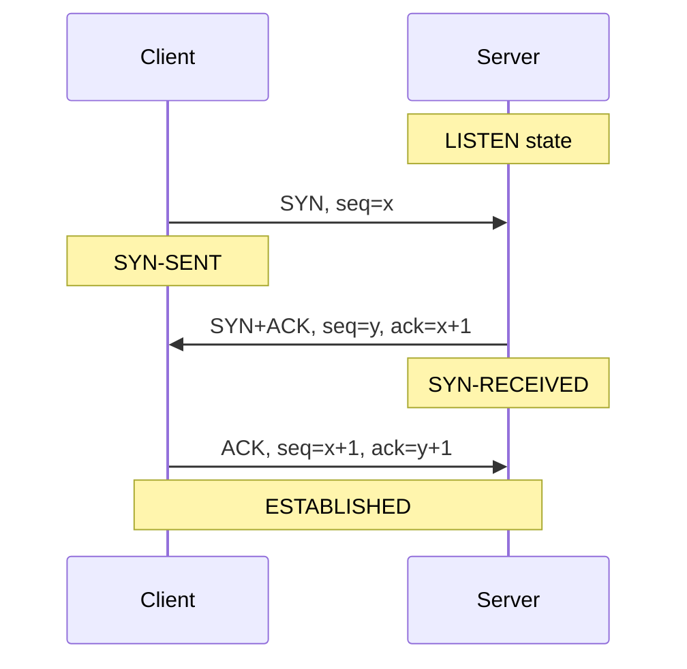
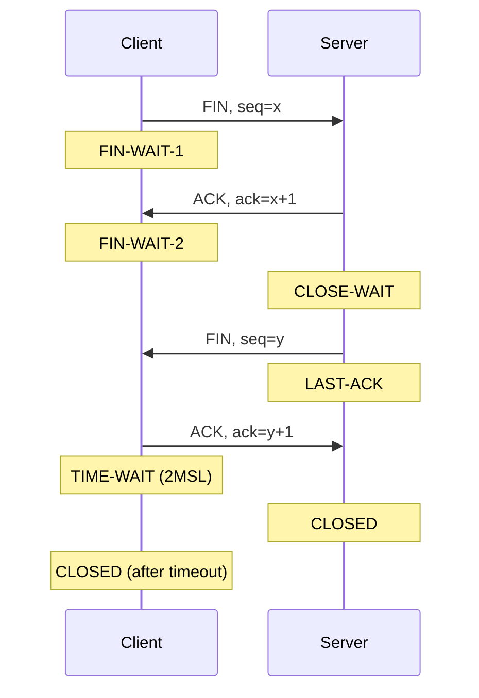
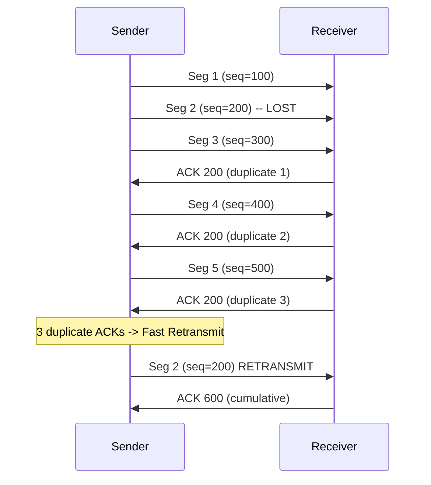
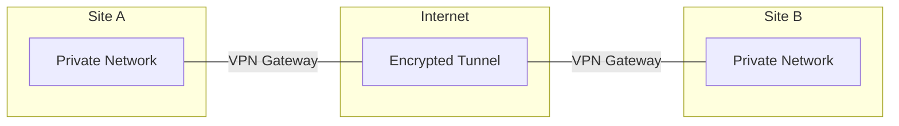

# Chapter 15 — Transmission Control Protocol (TCP)

> **Last Updated:** 2026-04-01
>
> Forouzan, TCP/IP Protocol Suite 4th Ed. Ch 15

> **Prerequisites**: [Computer Networks] UDP and transport layer (Ch 13-14).
>
> **Learning Objectives**:
> 1. Explain TCP connection establishment (three-way handshake) and termination
> 2. Describe TCP flow control and sliding window mechanism
> 3. Analyze TCP congestion control algorithms

---

## Table of Contents

- [1. TCP Services](#1-tcp-services)
  - [1.1 Stream Delivery](#11-stream-delivery)
  - [1.2 Sending and Receiving Buffers](#12-sending-and-receiving-buffers)
  - [1.3 Segments](#13-segments)
  - [1.4 Full-Duplex Service](#14-full-duplex-service)
  - [1.5 Connection-Oriented Service](#15-connection-oriented-service)
  - [1.6 Reliable Service](#16-reliable-service)
- [2. TCP Segment Format](#2-tcp-segment-format)
  - [2.1 Header Fields](#21-header-fields)
  - [2.2 Control Flags](#22-control-flags)
- [3. TCP Numbering System](#3-tcp-numbering-system)
  - [3.1 Byte Numbers](#31-byte-numbers)
  - [3.2 Sequence Number](#32-sequence-number)
  - [3.3 Acknowledgment Number](#33-acknowledgment-number)
- [4. TCP Connection Management](#4-tcp-connection-management)
  - [4.1 Three-Way Handshake (Connection Establishment)](#41-three-way-handshake-connection-establishment)
  - [4.2 Data Transfer](#42-data-transfer)
  - [4.3 Four-Way Handshake (Connection Termination)](#43-four-way-handshake-connection-termination)
  - [4.4 Half-Close](#44-half-close)
- [5. TCP Flow Control](#5-tcp-flow-control)
  - [5.1 Sliding Window in TCP](#51-sliding-window-in-tcp)
  - [5.2 Window Size Adjustment](#52-window-size-adjustment)
- [6. TCP Error Control](#6-tcp-error-control)
  - [6.1 Retransmission](#61-retransmission)
  - [6.2 Fast Retransmit](#62-fast-retransmit)
- [7. TCP Congestion Control](#7-tcp-congestion-control)
  - [7.1 Slow Start](#71-slow-start)
  - [7.2 Congestion Avoidance](#72-congestion-avoidance)
  - [7.3 Fast Recovery](#73-fast-recovery)
- [8. TCP vs. UDP Communication](#8-tcp-vs-udp-communication)
- [9. VPN and Tunneling](#9-vpn-and-tunneling)
  - [9.1 VPN Overview](#91-vpn-overview)
  - [9.2 Tunneling](#92-tunneling)
  - [9.3 VPN Protocols](#93-vpn-protocols)
- [Summary](#summary)
- [Appendix](#appendix)

---

<br>

## 1. TCP Services

**TCP (Transmission Control Protocol)** lies between the application layer and the network layer, and serves as the intermediary between the application programs and the network operations.

### 1.1 Stream Delivery

TCP is a **stream-oriented protocol**:
- Allows the sending process to deliver data as a **stream of bytes**
- Allows the receiving process to obtain data as a **stream of bytes**
- TCP creates an illusion of a continuous stream between sender and receiver

```
Sending              Stream of bytes              Receiving
process  -------> [==================] -------> process
  |                                                |
  TCP                                            TCP
```

### 1.2 Sending and Receiving Buffers

Since the sending and receiving processes may produce and consume data at **different speeds**, TCP needs **buffers** for storage:

**Sending Buffer:**
- Receives data as a stream of bytes from the application process
- Makes data into appropriate **segments** and transfers to the network

**Receiving Buffer:**
- Receives segments from the network
- Reassembles segments to data and sends data as a stream of bytes to the application process

```
Sending process                              Receiving process
      |                                            |
  +---v--------+                          +--------v---+
  |   Buffer   |                          |   Buffer   |
  |  [Sent|    |  Segment   Segment       |   [Not |   |
  |      Not   |  [H|||||]  [H|||||] -->  |    read|   |
  |      sent] |                          |        ]   |
  +---+--------+                          +--------+---+
  Next byte    Next byte              Next byte    Next byte
  to send      to write               to receive   to read
```

### 1.3 Segments

The IP layer needs to send data in **packets**, not as a stream of bytes. At the transport layer, TCP groups a number of bytes together into a packet called a **segment**.

- Each segment has a header (20-60 bytes) plus data
- Segments are encapsulated in IP datagrams for transmission

### 1.4 Full-Duplex Service

TCP provides **full-duplex** communication:
- Data can flow in both directions simultaneously
- Each direction has its own sequence numbers and acknowledgments
- **Piggybacking**: ACK information is attached to data segments traveling in the opposite direction

### 1.5 Connection-Oriented Service

TCP is a **connection-oriented** protocol:
- A **virtual connection** (not physical) must be established before data transfer
- Three phases: connection establishment, data transfer, connection termination
- Both endpoints must agree to the connection

### 1.6 Reliable Service

TCP provides **reliable** delivery:
- Uses **acknowledgment packets** (ACK) to confirm receipt
- Retransmits lost or corrupted segments
- Guarantees in-order delivery

---

<br>

## 2. TCP Segment Format

### 2.1 Header Fields

```
 0                   1                   2                   3
 0 1 2 3 4 5 6 7 8 9 0 1 2 3 4 5 6 7 8 9 0 1 2 3 4 5 6 7 8 9 0 1
+-+-+-+-+-+-+-+-+-+-+-+-+-+-+-+-+-+-+-+-+-+-+-+-+-+-+-+-+-+-+-+-+
|          Source Port          |       Destination Port        |
+-+-+-+-+-+-+-+-+-+-+-+-+-+-+-+-+-+-+-+-+-+-+-+-+-+-+-+-+-+-+-+-+
|                        Sequence Number                        |
+-+-+-+-+-+-+-+-+-+-+-+-+-+-+-+-+-+-+-+-+-+-+-+-+-+-+-+-+-+-+-+-+
|                    Acknowledgment Number                      |
+-+-+-+-+-+-+-+-+-+-+-+-+-+-+-+-+-+-+-+-+-+-+-+-+-+-+-+-+-+-+-+-+
| Offset| Rsrvd |U|A|P|R|S|F|           Window Size            |
+-+-+-+-+-+-+-+-+-+-+-+-+-+-+-+-+-+-+-+-+-+-+-+-+-+-+-+-+-+-+-+-+
|           Checksum            |        Urgent Pointer         |
+-+-+-+-+-+-+-+-+-+-+-+-+-+-+-+-+-+-+-+-+-+-+-+-+-+-+-+-+-+-+-+-+
|                    Options + Padding (0-40 bytes)             |
+-+-+-+-+-+-+-+-+-+-+-+-+-+-+-+-+-+-+-+-+-+-+-+-+-+-+-+-+-+-+-+-+
```

| Field | Size | Description |
|-------|------|-------------|
| Source Port | 16 bits | Sending process port number |
| Destination Port | 16 bits | Receiving process port number |
| Sequence Number | 32 bits | Byte number of first data byte in segment |
| Acknowledgment Number | 32 bits | Next byte number expected from other side |
| Data Offset (HLEN) | 4 bits | Header length in 4-byte words |
| Reserved | 6 bits | Reserved for future use |
| Control Flags | 6 bits | URG, ACK, PSH, RST, SYN, FIN |
| Window Size | 16 bits | Receiver's available buffer space (in bytes) |
| Checksum | 16 bits | Error detection (mandatory, includes pseudoheader) |
| Urgent Pointer | 16 bits | Points to urgent data end (valid when URG=1) |

### 2.2 Control Flags

| Flag | Name | Description |
|------|------|-------------|
| URG | Urgent | Urgent pointer field is valid |
| ACK | Acknowledgment | Acknowledgment number field is valid |
| PSH | Push | Request immediate delivery to application |
| RST | Reset | Reset the connection |
| SYN | Synchronize | Initiate connection (synchronize sequence numbers) |
| FIN | Finish | No more data from sender (close connection) |

---

<br>

## 3. TCP Numbering System

TCP keeps track of segments using **sequence numbers** and **acknowledgment numbers**, not packet sequence numbers (as in the data link layer).

### 3.1 Byte Numbers

When TCP receives bytes of data from the process, it stores them in the sending buffer and **numbers them**:
- Numbering starts with a **randomly generated** number (0 to 2^32 - 1)
- This random initial sequence number (ISN) prevents attacks and confusion with old connections

### 3.2 Sequence Number

The value in the **sequence number field** of a segment defines the number assigned **to the first data byte** contained in that segment.

Example:
- ISN = 1000, first segment has 100 bytes
- Segment 1: seq = 1000 (bytes 1000-1099)
- Segment 2: seq = 1100 (bytes 1100-1199)
- Segment 3: seq = 1200 (bytes 1200-1299)

### 3.3 Acknowledgment Number

The value of the **acknowledgment field** in a segment defines the **number of the next byte a party expects to receive**.

> **Key Point:** The acknowledgment number is **cumulative**. ACK = 1200 means "I have received all bytes up to 1199, send me byte 1200 next."

---

<br>

## 4. TCP Connection Management

### 4.1 Three-Way Handshake (Connection Establishment)



1. **SYN**: Client sends SYN segment with initial sequence number x
2. **SYN+ACK**: Server responds with SYN+ACK, its own sequence number y, acknowledging x+1
3. **ACK**: Client acknowledges with ack=y+1

The SYN flag consumes one sequence number (even though it carries no data), so the ACK is x+1 and y+1.

### 4.2 Data Transfer

After connection establishment, data flows in both directions:
- Each segment carries a sequence number and (usually) an acknowledgment number
- Piggybacking allows ACK to be included in data segments
- The window size field provides flow control information

### 4.3 Four-Way Handshake (Connection Termination)



1. **FIN**: Client sends FIN segment (no more data to send)
2. **ACK**: Server acknowledges the FIN
3. **FIN**: Server sends its own FIN when done sending
4. **ACK**: Client acknowledges server's FIN, enters TIME-WAIT state

**TIME-WAIT state**: Client waits for 2 x MSL (Maximum Segment Lifetime) before closing. This ensures:
- The final ACK reaches the server
- Old segments from this connection expire before a new connection uses the same ports

### 4.4 Half-Close

TCP supports **half-close**, where one side can stop sending while still receiving:
- After sending FIN, a host can still receive data
- Useful when a client has finished sending all data but needs to receive results

---

<br>

## 5. TCP Flow Control

### 5.1 Sliding Window in TCP

TCP uses a **sliding window** protocol for flow control:

- The window size is determined by the **receiver's available buffer space** (rwnd)
- The receiver advertises its window size in every ACK segment
- The sender can send up to `min(cwnd, rwnd)` bytes of unacknowledged data

```
     Sent and ACKed | Sent, not ACKed | Can send | Cannot send
     [=============] [===============] [========] [............]
                     |<--- Window ---->|
```

### 5.2 Window Size Adjustment

- Receiver can **shrink** the window (even to 0) when its buffer fills up
- **Zero window**: Receiver sets window size to 0, stopping the sender
- **Window probe**: Sender periodically sends 1-byte probes to check if the window has reopened
- **Silly window syndrome**: Problem where tiny segments are sent; solved by Nagle's algorithm (sender) and Clark's solution (receiver)

---

<br>

## 6. TCP Error Control

### 6.1 Retransmission

TCP retransmits a segment when:
- **Retransmission timer expires**: If no ACK is received within the timeout period
- **RTO (Retransmission Timeout)**: Calculated dynamically based on RTT measurements

RTO calculation:
```
SRTT = (1 - alpha) * SRTT + alpha * RTT_sample     (Smoothed RTT)
RTTVAR = (1 - beta) * RTTVAR + beta * |SRTT - RTT_sample|
RTO = SRTT + 4 * RTTVAR
```

### 6.2 Fast Retransmit

Instead of waiting for the timer to expire:
- If the sender receives **three duplicate ACKs** (4 ACKs total for the same sequence number), it retransmits the lost segment immediately
- This is faster than waiting for the RTO timeout



---

<br>

## 7. TCP Congestion Control

### 7.1 Slow Start

When a connection begins or after a timeout:
1. Set **cwnd = 1 MSS** (Maximum Segment Size)
2. For each ACK received, cwnd += 1 MSS
3. cwnd grows **exponentially** (1, 2, 4, 8, 16, ...)
4. Continue until cwnd reaches **ssthresh** (slow start threshold)

### 7.2 Congestion Avoidance

After cwnd >= ssthresh:
1. For each round-trip, cwnd += 1 MSS
2. cwnd grows **linearly** (additive increase)
3. If packet loss detected (timeout):
   - Set ssthresh = cwnd / 2
   - Set cwnd = 1 MSS
   - Return to slow start

### 7.3 Fast Recovery

When loss is detected by **3 duplicate ACKs** (not timeout):
1. Set ssthresh = cwnd / 2
2. Set cwnd = ssthresh + 3 MSS
3. Enter congestion avoidance directly (skip slow start)

```
cwnd
 ^
 |              /\
 |             /  \     /------
 |            /    \   /
 |           /      \ / congestion
 |          /        |  avoidance
 |         / slow    |
 |        /  start   | fast
 |       /           | recovery
 |      /            |
 |     /             |
 |    /              |
 |   /               |
 +--/----------------+-------> Time
    ssthresh    loss detected
```

> **Key Point:** TCP congestion control uses AIMD (Additive Increase, Multiplicative Decrease) to probe for available bandwidth while quickly backing off during congestion.

---

<br>

## 8. TCP vs. UDP Communication

| Feature | TCP | UDP |
|---------|-----|-----|
| Data unit | Segment | Datagram |
| Connection | Connection-oriented | Connectionless |
| Reliability | Reliable (ACK, retransmit) | Unreliable |
| Ordering | In-order delivery | No ordering |
| Flow control | Sliding window | None |
| Congestion control | Slow start, AIMD | None |
| Speed | Slower (overhead) | Faster |
| Header | 20-60 bytes | 8 bytes |
| Multiplexing | Stream-based | Message-based |

---

<br>

## 9. VPN and Tunneling

*Integrated from student presentation materials on VPN and Tunneling*

### 9.1 VPN Overview

A **Virtual Private Network (VPN)** provides a secure, encrypted connection over a public network (like the Internet):



**VPN Benefits:**
- **Confidentiality**: Encryption protects data from eavesdropping
- **Authentication**: Verifies identity of communicating parties
- **Integrity**: Ensures data has not been modified in transit
- **Cost savings**: Uses public Internet instead of dedicated private lines

### 9.2 Tunneling

**Tunneling** encapsulates one protocol's packets inside another protocol:

```
Original packet: [IP Header | TCP | Data]
                           |
                   Encapsulation
                           |
Tunneled packet:  [New IP Hdr | Tunnel Hdr | IP Header | TCP | Data]
                  |<---- Outer ---->|<------- Inner (original) ------>|
```

**Types of tunneling:**
- **IP-in-IP**: Simple encapsulation of IP within IP (RFC 2003)
- **GRE (Generic Routing Encapsulation)**: Tunneling any protocol in IP
- **L2TP (Layer 2 Tunneling Protocol)**: Layer 2 frames tunneled over IP
- **IPsec Tunnel Mode**: Encrypted tunnel with authentication

### 9.3 VPN Protocols

| Protocol | Layer | Encryption | Authentication |
|----------|-------|-----------|----------------|
| PPTP | Data Link | MPPE | MS-CHAPv2 |
| L2TP/IPsec | Data Link + Network | AES, 3DES | Certificate, PSK |
| IPsec | Network | AES, 3DES | IKE, Certificate |
| SSL/TLS VPN | Transport | AES, ChaCha20 | Certificate |
| WireGuard | Network | ChaCha20-Poly1305 | Curve25519 keys |
| OpenVPN | Application | AES, Blowfish | Certificate, PSK |

**IPsec modes:**
- **Transport Mode**: Only the payload is encrypted; original IP header is visible
- **Tunnel Mode**: Entire original packet is encrypted and encapsulated in a new IP packet

---

<br>

## Summary

| Concept | Key Point |
|---------|-----------|
| TCP | Connection-oriented, reliable, stream-oriented transport protocol |
| Stream Delivery | Data treated as a continuous stream of bytes, not individual messages |
| Buffers | Sending and receiving buffers handle speed mismatches |
| Segments | TCP groups bytes into segments for transmission |
| Three-Way Handshake | SYN, SYN+ACK, ACK for connection establishment |
| Four-Way Handshake | FIN, ACK, FIN, ACK for connection termination |
| Sequence/ACK Numbers | Byte-level tracking; cumulative acknowledgments |
| Sliding Window | Receiver-controlled flow control via window size advertisement |
| Congestion Control | Slow start, congestion avoidance, fast retransmit/recovery |
| VPN | Encrypted tunnel over public network for secure communication |

---

<br>

## Appendix

### A. TCP State Diagram (Simplified)

```
CLOSED ---(active open, send SYN)---> SYN-SENT
SYN-SENT ---(receive SYN+ACK, send ACK)---> ESTABLISHED
ESTABLISHED ---(send FIN)---> FIN-WAIT-1
FIN-WAIT-1 ---(receive ACK)---> FIN-WAIT-2
FIN-WAIT-2 ---(receive FIN, send ACK)---> TIME-WAIT
TIME-WAIT ---(2MSL timeout)---> CLOSED

CLOSED ---(passive open)---> LISTEN
LISTEN ---(receive SYN, send SYN+ACK)---> SYN-RECEIVED
SYN-RECEIVED ---(receive ACK)---> ESTABLISHED
ESTABLISHED ---(receive FIN, send ACK)---> CLOSE-WAIT
CLOSE-WAIT ---(send FIN)---> LAST-ACK
LAST-ACK ---(receive ACK)---> CLOSED
```

### B. Maximum Segment Size (MSS)

- MSS is negotiated during the three-way handshake via TCP options
- Default MSS = 536 bytes (if not specified)
- Typical Ethernet MSS = 1460 bytes (1500 MTU - 20 IP header - 20 TCP header)
- MSS does not include the TCP/IP headers

### C. TCP Options

| Option | Kind | Description |
|--------|------|-------------|
| MSS | 2 | Maximum Segment Size |
| Window Scale | 3 | Allows window > 65,535 bytes |
| SACK Permitted | 4 | Selective Acknowledgment allowed |
| SACK | 5 | Selective Acknowledgment blocks |
| Timestamps | 8 | RTT measurement and PAWS |
